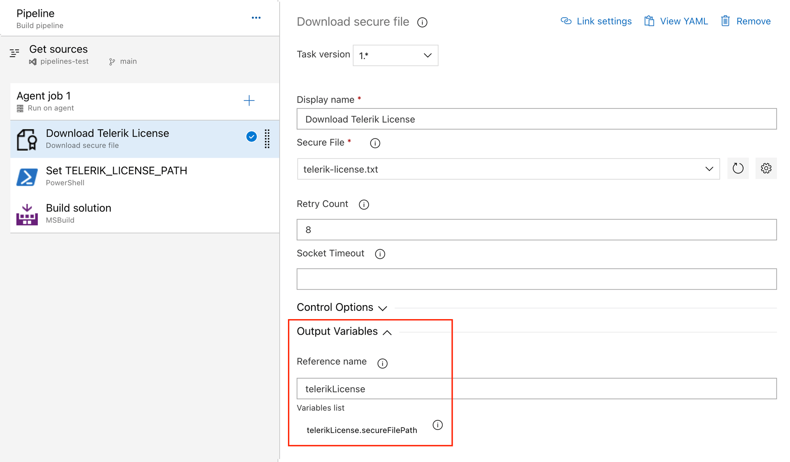
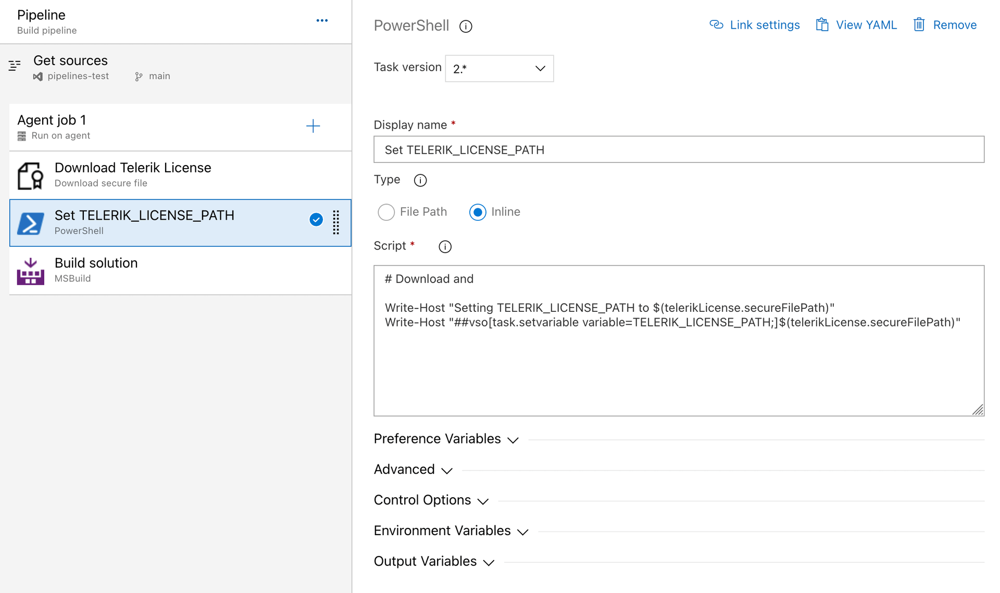

# Adding the License Key to CI/CD Services

This article describes how to set up and activate your Telerik Reporting license across a few popular CI/CD services by using **deployment** keys.

Deployment keys are a dedicated type of license key for build pipelines. They are tied to a specific application and the set of products that the application uses. 

> important Deployment keys cannot be used for application development.

> tip When working with CI/CD platforms, always add the `Telerik.Licensing` NuGet package as a project dependency. This package activates Telerik Reporting at build time by using the provided license key.

To activate your license in a CI/CD environment:

1. Navigate to the [Deployment Keys](https://www.telerik.com/account/downloads/deployment-keys) page.
2. Click **Add Application**. In the form that opens:
	- Add the application name.
	- Select the type of application—public or private.
	- Select the set of products used in the application.
3. Copy the key value and store it securely.
4. [Create an environment variable](#creating-an-environment-variable) named **TELERIK_LICENSE** and set it to the obtained key value. 

Alternatively, the key can be stored in a `telerik-license.txt` file, for example when using the [Azure Secure files approach](#using-secure-files-on-azure-devops).

## Creating an Environment Variable

The recommended approach for providing your license key to the `Telerik.Licensing` NuGet package is to use environment variables.

Each CI/CD platform has a different process for setting environment variables, and this article lists only some of the most popular examples.

> If your CI/CD service is not listed in this article, don’t hesitate to contact Telerik technical support.

### GitHub Actions

1. Create a new [Repository Secret](https://docs.github.com/en/actions/reference/encrypted-secrets#creating-encrypted-secrets-for-a-repository) or an [Organization Secret](https://docs.github.com/en/actions/reference/encrypted-secrets#creating-encrypted-secrets-for-an-organization).
1. Set the name of the secret to `TELERIK_LICENSE` and paste the contents of the license file as a value.
1. After running `npm install` or `yarn`, add a build step to activate the license:

	{{source=CodeSnippets\Blazor\Docs\yaml\licensing.yaml region=LicensingGitHubActions}}

### Azure Pipelines (YAML)

1. Create a new [secret variable](https://learn.microsoft.com/en-us/azure/devops/pipelines/process/variables?view=azure-devops&tabs=yaml%2Cbatch#secret-variables) named `TELERIK_LICENSE`.
1. Paste the contents of the license key file as a value.

> note Always consider the _Variable size limit_—if you are using a [Variable Group](https://learn.microsoft.com/en-us/azure/devops/pipelines/library/variable-groups?view=azure-devops&tabs=azure-pipelines-ui%2Cyaml), the license key will typically exceed the character limit for the variable values. The only way to have a long value in the Variable Group is to [link it from Azure Key Vault](https://learn.microsoft.com/en-us/azure/devops/pipelines/library/link-variable-groups-to-key-vaults?view=azure-devops). If you cannot use a Key Vault, then use a normal pipeline variable instead (see above) or the [Secure files approach](#using-secure-files-on-azure-devops).

## Using Secure Files on Azure DevOps

[Secure files](https://learn.microsoft.com/en-us/azure/devops/pipelines/library/secure-files?view=azure-devops) are an alternative approach for sharing the license key file in Azure Pipelines that does not have the size limitations of environment variables.

You have two options for the file-based approach. Set the `TELERIK_LICENSE_PATH` variable or add a file named `telerik-license.txt` to the project directory or parent directory.

> note Make sure you’re referencing `Telerik.Licensing v1.4.10` or later.

### YAML Pipeline

With a YAML pipeline, you can use the [DownloadSecureFile@1](https://learn.microsoft.com/en-us/azure/devops/pipelines/tasks/reference/download-secure-file-v1?view=azure-pipelines) task, then use `$(name.secureFilePath)` to reference it. For example:

{{source=CodeSnippets\Blazor\Docs\yaml\licensing.yaml region=LicensingYamlPipeline}}

### Classic Pipeline

With a classic pipeline, use the “Download secure file” task and a PowerShell script to set `TELERIK_LICENSE_PATH` to the secure file path.

1. Add a "Download secure file" task and set the output variable's name to `telerikLicense`.

	

1. Add a PowerShell task and set the `TELERIK_LICENSE_PATH` variable to the `secureFilePath` property of the output variable:

  

The script to set the environment variable is quoted below:

```powershell
Write-Host "Setting TELERIK_LICENSE_PATH to $(telerikLicense.secureFilePath)"
Write-Host "##vso[task.setvariable variable=TELERIK_LICENSE_PATH;]$(telerikLicense.secureFilePath)"
```

Alternatively, copy the file into the repository directory:

```powershell
echo "Copying $(telerikLicense.secureFilePath) to $(Build.Repository.LocalPath)/telerik-license.txt"
Copy-Item -Path $(telerikLicense.secureFilePath) -Destination "$(Build.Repository.LocalPath)/telerik-license.txt" -Force
```

### Using TelerikLicensing.Register method

As of version **1.6.7**, [Telerik.Licensing](https://www.nuget.org/packages/Telerik.Licensing) offers the parameterless `TelerikLicensing.Register()` method and the `TelerikLicensing.Register(…script key…)` methods allowing the developers to validate the Telerik license when running in [AWS Lambda](https://docs.aws.amazon.com/lambda/latest/dg/welcome.html) functions, plugins, or [class libraries](https://learn.microsoft.com/en-us/dotnet/standard/class-libraries) that use Telerik Reporting consumed by any third-party software.

Invoke the `Register` method in the body of the function where Telerik Reporting code will be executed. This way, the Telerik license will be validated, and the watermark should not be printed (for licensed users) in the generated document:

{{source=CodeSnippets\Blazor\Docs\AddLicenseKey.cs region=Using_TelerikLicensing_Register_method}}

## See Also

- [License Activation Errors and Warnings](slug:license-errors-and-warnings)
- [Setting Up Your License Key](slug:license-key)
- [Frequently Asked Questions about Your Telerik Reporting License Key](slug:license-frequently-asked-questions)
