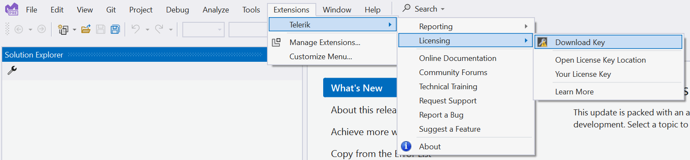

# Setting Up Your Telerik Reporting License Key

Telerik Reporting requires activation through a license key—for both trial and commercial versions of the product. This article describes how to download your personal license key and use it to activate Telerik Reporting.

An invalid license results in [errors and warnings](), such as watermarks and banners during build, test, and publish.

> This document applies to Telerik Reporting version [2025 Q1 (19.0.25.211)](https://www.telerik.com/support/whats-new/reporting/release-history/progress-telerik-reporting-2025-q1-19-0-25-211) and later. Earlier versions do not require activation.

## Downloading the License Key

To download a license key for Telerik Reporting, you must have either a commercial license or a trial license. If you are new to Telerik Reporting, sign up for a [free trial](https://www.telerik.com/try/reporting) first, and then follow the steps below.

You can use tools that download your license key file [automatically](#downloading-automatically), or you can download it [manually](#downloading-manually).

### Downloading Automatically

The two tools that automatically download your Telerik license key file are the [Progress Control Panel](#using-the-progress-control-panel) and the [Visual Studio extensions](#using-the-visual-studio-extensions) for Telerik Reporting. These tools download and store your license key in your system's home directory. This makes it available for all projects you develop on your local machine.

#### Using the Progress Control Panel

To install your Telerik License key by using the [Progress Control Panel](https://docs.telerik.com/controlpanel/introduction), start the application. It automatically downloads the `telerik-license.txt` license key file to your home directory:

- On Windows: `%AppData%\Telerik` or `C:\Users\[windows_username]\%AppData%\Roaming\Telerik`.
- On Mac/Linux: `~/.telerik/`.

#### Using the Visual Studio Extensions

To install your Telerik License key by using the Visual Studio extensions for Telerik Reporting:

1. Open Visual Studio.

1. Go to **Extensions** > **Telerik** > **Licensing** and select **Download Key**.

   

The extensions for Telerik Reporting are installed by default when using the MSI installer. If they are missing, you may have used another [installation method]() or deselected them during the setup.

### Downloading Manually

1. Go to the [License Keys](https://www.telerik.com/account/your-licenses/license-keys) page in your Telerik account.
1. Click the **Download License Key** button.

   

1. Copy the [downloaded](#downloading-the-license-key) `telerik-license.txt` license key file to your home directory. This makes the license key available to all projects that you develop on your computer:

   - For Windows: `%AppData%\Telerik\telerik-license.txt`
   - For Mac/Linux: `~/.telerik/telerik-license.txt`
   - Alternatively, copy the `telerik-license.txt` license key file to the root folder of your project. This makes the license key available only to this project. Do not commit the file to source control as this is your personal license key.

## Activating Telerik Reporting Automatically

By default, the activation of the Telerik Reporting library is automatic when your license key file is already downloaded and the Visual Studio project has access to `www.nuget.org`.

If the automatic product activation fails, and you see licensing-related error messages, you need to [activate the product manually](#activating-telerik-reporting-manually).

## Activating Telerik Reporting Manually

If Telerik Reporting cannot be activated automatically:

1. Make sure the [license key file](#downloading-the-license-key) is available on your system.

1. Add the `Telerik.Licensing` package from [NuGet.org](https://www.nuget.org/) as a project dependency:

   - For **.NET projects**, edit the `.csproj` and add the following line:

     ```XML
     <PackageReference Include="Telerik.Licensing" Version="*" />
     ```

   - For older **.NET Framework projects**:

     1. Add package reference to the `packages.config` file:

        ```XML
        <package id="Telerik.Licensing" version="1.*" targetFramework="net4*" />
        ```

     1. Update the `.csproj` file with the DLL reference:

        ```XML
        <Reference Include="Telerik.Licensing.Runtime, Version=1.*, Culture=neutral, PublicKeyToken=*, processorArchitecture=MSIL">
        	<HintPath>..\..\packages\Telerik.Licensing\lib\net4*\Telerik.Licensing.Runtime.dll</HintPath>
        </Reference>
        ```

When you build the project, the `Telerik.Licensing` NuGet package locates the license file and uses it to activate Telerik Reporting.

> If your project doesn’t use NuGet packages, see [Adding a License Key to Projects without NuGet References](#adding-a-license-key-to-projects-without-nuget-references).

## Adding a License Key to Projects without NuGet References

> caution Telerik strongly recommends the use of the `Telerik.Reporting` NuGet package whenever possible&mdash;it will add all required dependencies, such as `Telerik.Licensing`. Only include the license key as a code snippet (demonstrated in this section) when NuGet packages are not an option.

If you cannot use NuGet packages in your project, add the license as a code snippet:

1. Go to the [License Keys](https://www.telerik.com/account/your-licenses/license-keys) page in your Telerik account.
1. Click **View Script Keys**.
1. From the dropdown, select **Progress® Telerik® Reporting**.
1. Copy the C# code snippet into a new file, for example, `TelerikLicense.cs`.
1. Add the `TelerikLicense.cs` file to your project.
1. Add an assembly reference to `Telerik.Licensing.Runtime.dll`.

> Do not publish the license key code snippet in publicly accessible repositories. This is your personal license key.

## Updating Your License Key

Whenever you purchase a new Telerik Reporting license or renew an existing one, always [download](#downloading-the-license-key) and install a new license key.

The new license key includes information about all previous license purchases. This process is referred to as a license key update.

Once you have the new license key, use it to [activate Telerik Reporting](#activating-telerik-reporting-automatically).

## See Also

- [License Activation Errors and Warnings]()
- [Adding the License Key to CI Services]())
- [Frequently Asked Questions about Your Telerik Reporting License Key]()
- [Upgrading Q1 2025 Trial to Q2 2025 Licensed Version]()
- [Licensing before 2025]()
