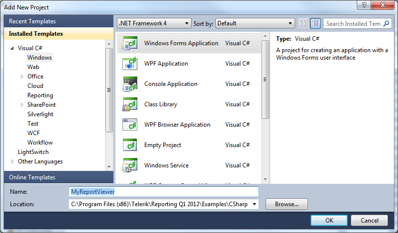
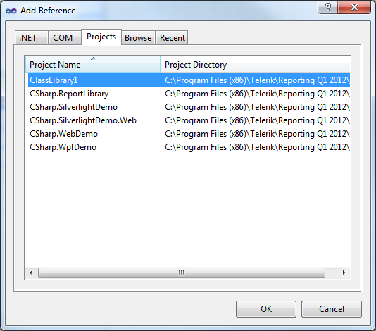
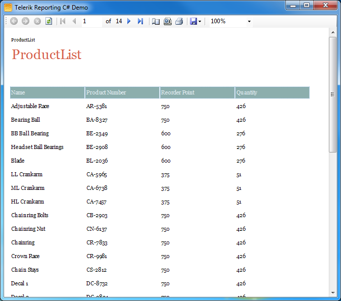

# Displaying Reports in WinForms Report Viewer


## 

You can design reports in:         

* Visual Studio Report Designer: The result is a class (type) inheriting *Telerik.Reporting.Report* ;             

* Standalone Report Designer: The result is a TRDX|TRDP file containing a serialiesed *Telerik.Reporting.Report*  object;             

* In code: The result is an instance of *Telerik.Reporting.Report* ,               that is created at run-time or it is a result from modifying an already designed report;             

* In a text/XML editor: the result is a *Telerik.Reporting.Report*  object represented in XML,               the same as the content of a TRDX file produced by the Standalone Report Designer;             

You need to specify how the report is created to let the Reporting engine know how to process it.           For the purpose you need to use a [Report Source object]().           Report sources can be server-side or client-side, which is determined by the processing instance           (a Telerik Reporting Viewer or a ReportProcessor instance).         

>important Reports are always processed and rendered on the server machine.

Once you have a properly configured Report Source, you can use it for a Telerik Report Viewer           or to [process a report programmatically]().           For displaying a Report in a Report Viewer see the list of available Telerik Reporting viewers in           [Using Telerik Reporting in Applications]().         

## Example

__How to display a report in the Windows Forms Report Viewer:__ 

1. Prerequisite: Create a Telerik Report by using the Report Designer integrated in Visual Studio -               [How To: Use the Report Wizard to create a Band Report]().             

1. Select __File | New | Project__  from the Visual Studio File menu.  Select the __Windows Application__                project, give it a name and location. Verify that the targeted .NET framework version is .NET4+, Full profile as Client profile is not supported.               Click the OK button to close the dialog.               

  

1. Right-click the project References and select __Add Reference__  from the context menu.               Select the reference for the               ClassLibrary containing your report from the list on the               __Projects__  tab. Note: If the class library resides               in another solution you will need to use the Browse tab and navigate to the               assembly containing the report.               

  

1. Add report viewer to the form as explained in [WinForms ReportViewer: Manual Setup]() topic.             

1. From the ToolBox drag a Telerik ReportViewer control to the Windows form.

1. Rebuild the Windows Forms project.

1. In the Properties Window for the report viewer, open the __ReportSource__  dialog, select               __Instance Report Source__  and select the report we created in the class library.             

   >note Once an instance report                 is selected, notice that a component representing the report appears in                 the tray below Windows form designer. The component allows you to                 access the properties of the report in your report viewing application,                 providing access to report parameters, styles and page                 settings.               

1. Add a call to the RefreshReport() method of the viewer in the form Load event:             

    
      ````C#
private void MainForm_Load(object sender, System.EventArgs e)
{
    this.reportViewer1.RefreshReport();
}
````
````VB.NET
Private Sub MainForm_Load(ByVal sender As System.Object, ByVal e As System.EventArgs) Handles MyBase.Load
     Me.reportViewer1.RefreshReport()
End Sub
````

1. Copy the connection string which you saved in the application configuration file (app.config) of the report class               library, to the configuration file of your windows forms project. By default there is               no app.config so you can create a new one from Add -> New Item.             

1. Right-click the Windows report viewing application and               select __Set as Startup Project__  from the context               menu.             

1. Press __F5__  to run the report.                

  
