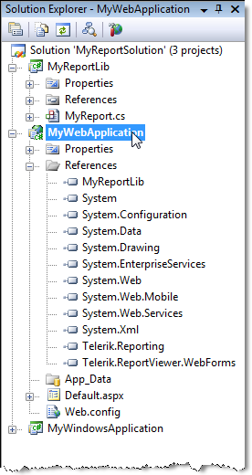

# Visual Studio Solution Structure

In this topic we will discuss how to create reports in a Class Library project

## Requirements

Your system must have the following installed to use this tutorial:         

* Microsoft SQL Server             

* AdventureWorks database.               If you have a running local instance of MS SQL Server the AdventureWorks database is installed with Telerik Reporting.               Additionally the sample database can be found and manually installed from                [http://msftdbprodsamples.codeplex.com](http://msftdbprodsamples.codeplex.com) 

* Visual Studio. For more information on the supported editions see:                [Telerik Reporting System Requirements](http://www.telerik.com/products/reporting/system-requirements) If you don't have a required Visual Studio edition you can use the tutorial [Creating the Demo Report]().             

* Telerik Reporting installation. If you still don't have Telerik Reporting installation go to the [Installation]() topic.             

## Visual Studio Solution Structure

In case you choose to use the Visual Studio Report Designer and store your reports as.NET classes, the most efficient way to structure your           reporting solution is to first create a class library that contains your reports.           Then you can reference that class library in applications that view the reports.           You can have any number of Windows or Web viewing applications which are re-using the same class library.           This solution structure decouples your program logic from the report and its data.         

In the example solution below "MyReportSolution" there are three projects.         

* "MyReportLib" is the class library that contains Telerik Reporting items.  In this case the project contains only a single item "MyReport.cs".

* "MyWebApplication" is an ASP.NET application that displays the report.  Notice the "MyReportLib" entry in the References for the project.

* "MyWindowsApplication" is a Windows forms application that also references "MyReportLib".
>caption Example solution

  

  

## Create a Report Library with a report definition.

To create report you start by creating a report library           to contain your report and a web, windows or Silverlight application to display the report.           Generally it's possible to put the report definition and viewer in the           same application but this route is not recommended.         

1. Select __File | New | Project__ from               the Visual Studio File menu.  Select the __Telerik Report Library__             project, give it a name and location. Verify that the targeted.NET Framework version is.NET4+, Full profile as Client profile is not supported.               Click the OK button to close the dialog.             

1. The __Choose Report Type__ dialog opens. Select the report type, enter a name for the report               class and click the __OK__ button to close the dialog.             

1. The appropriate Report Wizard will appear automatically to               help you select data and design your report quickly. For more information see [How to use the Report Wizard to create a Band Report]().

