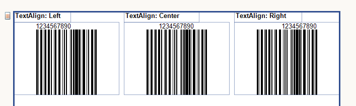
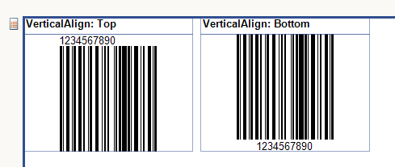

# Specifications of the One-dimensional Barcode Items

One-dimensional (1D) barcodes are made up of lines and spaces of various widths that create specific patterns.

The following table describes the specific characteristics of the barcodes per type.

## Common Settings

One-dimensional Barcodes support the `ShowText` common setting. When [`ShowText`](/api/Telerik.Reporting.Barcodes.Encoder1D#Telerik_Reporting_Barcodes_Encoder1D_ShowText) is set to `true`, the Barcode shows the text together with the bars.

When the text is displayed, you can also align it horizontally by using the `TextAlign` property of the [`Style`](/api/Telerik.Reporting.ReportItemBase#Telerik_Reporting_ReportItemBase_Style) object.



You can also use the `VerticalAlign` property of the [`Style`](/api/Telerik.Reporting.ReportItemBase#Telerik_Reporting_ReportItemBase_Style) object to align the Barcode vertically.



## Code 128 Encoding Mode Control

Code 128 is a high-density barcode symbology that supports three character subsets (A, B, and C). The Barcode report item automatically selects the optimal encoding, but certain applications may require explicit control over which subset is used.

### Understanding Code 128 Subsets

Code 128 uses three subsets optimized for different types of data:

| Subset | Characters Supported | Best For |
|--------|---------------------|----------|
| **Code A** | Uppercase letters (A-Z), digits (0-9), punctuation, ASCII control characters (NUL-US) | Uppercase text, control characters |
| **Code B** | Uppercase letters (A-Z), lowercase letters (a-z), digits (0-9), punctuation | Mixed-case text |
| **Code C** | Numeric pairs only (00-99) | Long numeric sequences (encodes 2 digits per symbol) |

### Automatic Encoding (Default)

By default, the Barcode report item uses an intelligent algorithm that:

1. Analyzes the input string
1. Selects the optimal subset for each segment
1. Switches between subsets to produce the shortest barcode

For example, the string `"NUTMUF57156950013302"` is automatically encoded as:
- **Code A** for `"NUTMUF"` (uppercase letters)
- **Code C** for `"57156950013302"` (numeric pairs for shorter output)

> When both Code A and Code B can encode a character (e.g., uppercase letters, digits, punctuation), the automatic algorithm prefers Code A.

### Explicit Encoding

Some barcode scanners or industry systems require a specific encoding mode. Use explicit control characters to override the automatic selection.

#### Control Characters

Insert these Unicode characters in your string to force a specific encoding mode:

| Control Character | Unicode | Hex | Decimal | Purpose |
|-------------------|---------|-----|---------|---------|
| **Start/Switch A** | `\u00FC` | FC | 252 | Force Code 128A encoding |
| **Start/Switch B** | `\u00FD` | FD | 253 | Force Code 128B encoding |
| **Start/Switch C** | `\u00FE` | FE | 254 | Force Code 128C encoding |

These characters are not included in the barcode output—they are instructions that control how the following characters are encoded.

#### How It Works

The control character forces encoding mode for all subsequent characters until:
- Another control character is encountered, OR
- The automatic algorithm takes over (when characters can't be encoded in the forced mode)

The Barcode item automatically emits the correct barcode symbol based on position:
- **Start Code** (103/104/105) if at the beginning of the barcode
- **Switch Code** (101/100/99) if mid-barcode

You don't need to worry about this distinction—just use the same control character regardless of position.

#### Examples

##### Force Code B Instead of Code A

By default, uppercase letters use Code A. To force Code B:

````CSharp
// Automatic: encodes "NUTMUF" as Code A, digits as Code C
barcode.Value = "NUTMUF57156950013302";

// Explicit: encodes "NUTMUF" as Code B, digits as Code C  
barcode.Value = "\u00FD" + "NUTMUF" + "\u00FE" + "57156950013302";
````

##### Force Code A Explicitly

````CSharp
// Explicit Code A for letters, then Code C for digits
barcode.Value = "\u00FC" + "NUTMUF" + "\u00FE" + "57156950013302";
````

##### Multiple Mode Switches

````CSharp
// Code B → Code C → Code B
barcode.Value = "\u00FD" + "Order" + "\u00FE" + "123456" + "\u00FD" + "Complete";
````

##### Mixed Case Text (Code B Required)

````CSharp
// Code B is required for lowercase letters
barcode.Value = "\u00FD" + "Hello World";
````

##### Pure Numeric (Code C)

````CSharp
// Force Code C for maximum compression of numeric data
barcode.Value = "\u00FE" + "1234567890";
````

> **Important:** Code C requires an even number of digits. If you have an odd number, the last digit cannot be encoded in Code C.

#### When to Use Explicit Encoding

Use explicit control characters when:

- **Scanner compatibility:** Your barcode scanner or system requires a specific encoding mode
- **System interoperability:** You need to match barcodes generated by another system exactly
- **Industry standards:** Specific standards require a particular encoding sequence
- **Testing:** Verifying barcode output matches expected encoding

For most use cases, the automatic encoding produces optimal, valid barcodes and explicit control is not necessary.

### Visual Comparison

The same data encoded differently produces different (but equally valid) barcodes:

| Input | Encoding | Barcode Symbols |
|-------|----------|-----------------|
| `NUTMUF57...` | Auto (A→C) | `[StartA][N][U][T][M][U][F][SwitchC][57][15]...` |
| `ýNUTMUFþ57...` | Explicit (B→C) | `[StartB][N][U][T][M][U][F][SwitchC][57][15]...` |
| `üNUTMUFþ57...` | Explicit (A→C) | `[StartA][N][U][T][M][U][F][SwitchC][57][15]...` |

All three produce valid, scannable barcodes. The difference is in the Start symbol (StartA=103 vs StartB=104).

### Troubleshooting

#### Barcode won't scan

- Verify the control characters are correct Unicode values
- Ensure Code C segments have an even number of digits
- Check that characters are valid for the forced encoding mode

#### Barcode is too large

- Use Code C for long numeric sequences (halves the symbol count)
- Let automatic encoding optimize for shorter output
- Reduce the data length if possible

#### Characters not encoding correctly

- Code A cannot encode lowercase letters (a-z)
- Code B cannot encode ASCII control characters (below space)
- Code C can only encode digit pairs and a few special characters

## GS1-128 Specifics

GS1-128 is a special case of Code128. The only difference between GS1-128 and Code 128 is that GS1-128 inserts the FNC1 control character at the beginning of the barcode to conform to the GS1-128 specification.

If you have a multi-part GS1-128 barcode that requires the FNC1 control character as a delimiter between the different parts, you have to insert it manually.

````C#
this.Barcode1.Value = "1234" + "\u00F7" + "5678";
````
````VB.NET
Me.Barcode1.Value = "1234" & ChrW(&HF7) & "5678"
````


## See Also

* [1D Barcode Overview]()
* [(API) Telerik.Reporting.Barcode](/api/Telerik.Reporting.Barcode)
* [(API) Telerik.Reporting.Barcodes.Encoder1D](/api/Telerik.Reporting.Barcodes.Encoder1D)
* [(API) ShowText](/api/Telerik.Reporting.Barcodes.Encoder1D#Telerik_Reporting_Barcodes_Encoder1D_ShowText)
