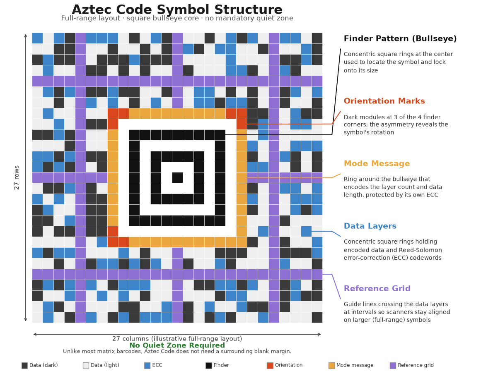

# Configuring the Aztec Code Barcode in Reports

> The Aztec Code Barcode is introduced in [Telerik Reporting 2026 Q3 (20.2.26.812)](https://www.telerik.com/support/whats-new/reporting/release-history/progress-telerik-reporting-2026-q3-(20-2-26-812)).

[Aztec Code](https://en.wikipedia.org/wiki/Aztec_Code) is a two-dimensional matrix barcode named for the resemblance of its central finder pattern to an Aztec pyramid seen from above. It does not require a surrounding quiet zone, which makes it well suited for tight print layouts such as transportation and event tickets.

Telerik Reporting implements the Aztec Code encoder through the [AztecEncoder](/api/telerik.reporting.barcodes.aztecencoder) class and supports the rendering extensions&mdash;PDF, Image, HTML (the Barcode renders as SVG), XAML, DOCX, and RTF.

Unlike barcodes that rely on separate finder and alignment patterns positioned around the data area, Aztec Code centers a single bullseye finder pattern in the middle of the symbol, with the encoded data arranged in concentric square rings around it. This layout keeps the symbol compact and allows it to be read reliably even without a surrounding quiet zone.

## Structure

The Aztec Code symbol consists of the following elements:

- **Bullseye finder pattern**&mdash;A set of concentric square rings at the center of the symbol used by the scanner to locate the symbol and determine its orientation.
- **Orientation marks**&mdash;Small marks at three of the four corners of the finder pattern that let the decoder detect the rotation of the symbol.
- **Mode message**&mdash;A ring of modules surrounding the finder pattern that encodes the symbol size (layer count) and the length of the data message, protected by its own error correction.
- **Data layers**&mdash;Concentric square rings of modules surrounding the mode message that carry the actual encoded data together with Reed-Solomon error correction codewords.
- **Reference grid**&mdash;For full-range symbols with more than a few layers, reference grid lines cross the data layers at regular intervals to keep the scanner aligned when reading larger symbols.

Aztec Code symbols come in two families, [configurable through the `SymbolType` property](#symboltype):

- **Compact symbols**&mdash;Use a smaller, single-ring bullseye finder pattern and support 1 to 4 layers. They are more space-efficient for small payloads.
- **Full-range symbols**&mdash;Use a larger finder pattern with orientation marks and support 1 to 32 layers, allowing for significantly larger payloads.

## Settings

The Aztec Code barcode provides several settings you can use to fine-tune its behavior.

### SymbolType

The [`SymbolType`](/api/telerik.reporting.barcodes.aztecencoder#telerik_reporting_barcodes_aztecencoder_symboltype) property determines the Aztec symbol family to use during encoding. Set this property to one of the following [AztecSymbolType](/api/telerik.reporting.barcodes.aztecsymboltype) enum values:

- `Automatic` (default)&mdash;Automatically selects the smallest fitting symbol, choosing between the compact and full-range families based on the amount of data to encode.
- `Compact`&mdash;Restricts encoding to compact symbols, which support 1 through 4 layers.
- `FullRange`&mdash;Restricts encoding to full-range symbols, which support 1 through 32 layers.

### Layers

The [`Layers`](/api/telerik.reporting.barcodes.aztecencoder#telerik_reporting_barcodes_aztecencoder_layers) property sets the Aztec layer count, which determines the size and data capacity of the symbol.

- The default value is `0`, which enables automatic sizing&mdash;the encoder selects the smallest layer count within the selected [`SymbolType`](#symboltype) that fits the encoded data.
- Compact symbols support setting `Layers` to a value from 1 through 4.
- Full-range symbols support setting `Layers` to a value from 1 through 32.
- When you fix a positive layer count, the resulting symbol size determines the actual amount of error-correction redundancy available. Providing data that does not fit within the specified layer count produces an error during report processing.

### ErrorCorrectionPercent

The [`ErrorCorrectionPercent`](/api/telerik.reporting.barcodes.aztecencoder#telerik_reporting_barcodes_aztecencoder_errorcorrectionpercent) property gets or sets the minimum percentage of error-correction bits to add to the encoded payload. The default value is `33`, meaning at least a third of the symbol's capacity is reserved for error correction.

The generated symbol changes only when the requested minimum percentage requires a larger Aztec symbol than the data alone would need. Increasing `ErrorCorrectionPercent` improves the symbol's resilience to print defects or damage at the cost of a larger symbol.

## See Also

* [2D Barcodes Overview](slug:2d_barcodes_overview)
* [QR Code Barcode](slug:telerikreporting/designing-reports/report-structure/barcode/barcode-types/2d-barcodes/qr-code/overview)
* [Data Matrix Barcode](slug:telerikreporting/designing-reports/report-structure/barcode/barcode-types/2d-barcodes/data-matrix/overview)
* [PDF417 Barcode](slug:telerikreporting/designing-reports/report-structure/barcode/barcode-types/2d-barcodes/pdf417/overview)
* [Configuring the MaxiCode Barcode in Reports](slug:barcode-maxicode-overview)
* [Getting Started with the Barcode Report Item](slug:barcode_item_get_started)
