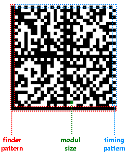

# Using the Data Matrix Barcode Item

The Data Matrix barcode is a two-dimensional type of code used widely in industry for marking small parts and items due to its high data density and reliability.

Data Matrix consists of dark and light square cells that form a matrix. The produced code can be square or rectangular and can have size up to 144x144 for square codes, or 16x48 for rectangular codes.

To provide better readability, the Data Matrix code includes error correction algorithm, allowing to reconstruct up to 30% of damaged code image.

## Structure

The following image shows the structure of the Data Matrix barcode.

* __Finder pattern__&mdash;The L-shaped lines at the bottom and left of the code are called "finder pattern". It is used by the readers for orientation and adjustment, and to correct distortion.

* __Module size__&mdash;The smallest cell in the code graphical representation. For better readability, it is recommended that the module size is at least 2x2 printed dots.

* __Timing pattern__&mdash;The lines at the top and right of the code are called "timing pattern". It provides information about the barcode size.

* __Data area__&mdash;The area surrounded by the finding pattern and timing pattern. Contains the modules that encode the barcode contents.

## Size

The size of the Data Matrix code depends on the module size, length, and type of its contents. The contents type determines if the encoded value contains only numerical characters or includes ASCII or Unicode characters.

The following table shows the correlation between the content type, content length, and matrix size.

| Count of numerical characters | Count of ASCII characters | Matrix size |
| ------ | ------ | ------ |
|6|3|10x10|
|10|6|12x12|
|16|10|14x14|
|24|16|16x16|
|36|25|18x18|
|44|31|20x20|
|60|43|22x22|
|72|52|24x24|
|88|64|26x26|
|124|91|32x32|

## Settings

The Data Matrix barcode provides a number of settings you can use to fine-tune its behavior.

### Contents Encoding

`Encodation` determines the type of contents encoded by the Data Matrix. Choosing a proper encodation imposes validation rules, but reduces the barcode size and improves its readability.

The following list shows the supported encodations and provides information about their restrictions and data-storing requirements:

* __ASCII__&mdash;Allowed characters include double-digit numeric values and all values from the ASCII table. The double-digit numerics use four bits. The ASCII values in the 0-127 range use eight bits. The ASCII values in 128-255 range use 16 bits.

* __C40__&mdash;Used primarily for upper-case alphanumeric values. The upper-case alphanumeric characters use 5.33 bits. The lower-case and special characters use 10.66 bits.

* __Text__&mdash;Used primarily for lower-case alphanumeric values. The lower-case alphanumeric characters use 5.33 bits. The upper-case and special characters use 10.66 bits.

* __X12__&mdash;Uses the characters from the [ANSI X12 EDI data set](https://edi3.dicentral.com/ansi-x12). Each character takes 5.33 bits.

* __EDIFACT__&mdash;Used to encode ASCII values in the 32-94 range. Each character takes six bits.

* __Base256__&mdash;Used to encode characters in the whole ASCII range. Each character takes eight bits.

* __AsciiGS1__&mdash;Used to encode FNC1 characters in the ASCII range.

### Symbol Size

`SymbolSize` sets the symbol size and shape of the generated barcode. You can automatically determine it by using `SquareAuto` or `RectangleAuto`, or explicitly set it like `Square32x32` or `Rectangle16x48`.

### Text Encoding

`TextEncoding` determines the character encoding that is used to encode the barcode contents. By default, `TextEncoding` is set to UTF-8, which uses more bits per character and may increase the size of the barcode image.

### Settings Examples

The following examples demonstrate how to configure the settings of the Data Matrix.

{{source=CodeSnippets\CS\API\Telerik\Reporting\BarcodeSnippets.cs region=Barcode_DataMatrixEncoder_Settings}}
{{source=CodeSnippets\VB\API\Telerik\Reporting\BarcodeSnippets.vb region=Barcode_DataMatrixEncoder_Settings}}

