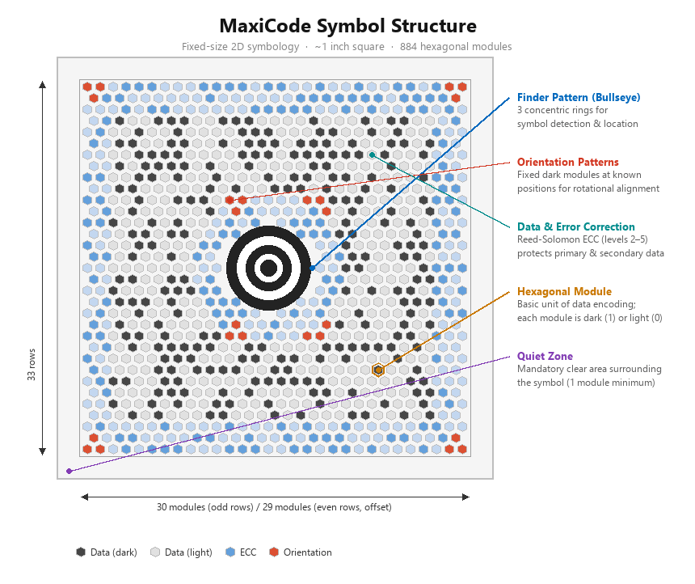

# Configuring the  MaxiCode Barcode in Reports

> The MaxiCode Barcode is introduced in [Telerik Reporting 2026 Q1 (20.0.26.424)](https://www.telerik.com/products/reporting/documentation/upgrade/2026/2026-q1-20-0-26-424).

[MaxiCode](https://en.wikipedia.org/wiki/MaxiCode) is a fixed-size two-dimensional barcode originally created by the United Parcel Service (UPS) for automated package sorting and tracking. The symbology is defined by the [ISO/IEC 16023 international standard](https://www.iso.org/standard/29835.html).

Telerik Reporting implements the MaxiCode encoder through the MaxiCodeEncoder class and supports all rendering extensions&mdash;PDF, Image, HTML/SVG, XAML, DOCX, and RTF.

Unlike most 2D barcodes that use square modules, MaxiCode uses a 33×30 hexagonal grid of offset rows arranged around a central bull's-eye finder pattern. This design makes the barcode readable by high-speed scanners even on curved or irregular surfaces. A MaxiCode symbol is always 1 inch wide by 1 inch tall and contains 884 hexagonal modules organized in 33 rows.

## Structure

The MaxiCode symbol consists of the following elements:

- **Bull's-eye finder pattern**&mdash;The concentric circular pattern at the center of the symbol. It consists of three concentric circles (rings) used by the scanner to locate and orient the symbol. The finder pattern is the most recognizable feature of MaxiCode.
- **Hexagonal modules**&mdash;The data-carrying elements are arranged in a grid of 33 rows of alternating length. Even rows contain 30 modules and odd rows contain 29 modules, for a total of 884 modules.
- **Orientation patterns**&mdash;A set of fixed modules located around the bull's-eye. These modules help the decoder determine the correct rotation of the symbol.
- **Data and error correction**&mdash;The remaining modules encode the actual data together with Reed-Solomon error correction codewords. The error correction allows a scanner to recover the encoded data even if part of the symbol is damaged.
- **Quiet zone**&mdash;A blank margin that surrounds the barcode on all sides. The specification requires a quiet zone of at least one module width.

## Encoding Modes

MaxiCode defines six encoding modes. Each mode targets a specific use case and imposes its own rules on the encoded data. The following list describes the supported modes:

- **Mode 2**&mdash;Used for structured carrier messages in the United States. Encodes a primary message that contains a ZIP code (up to nine digits), country code, and class of service, plus a secondary message with additional shipment data. This mode is the most common in the package-delivery industry.
- **Mode 3**&mdash;Used for structured carrier messages outside the United States. Encodes a primary message that contains an alphanumeric postal code (up to six characters), country code, and class of service, plus a secondary message with additional shipment data.
- **Mode 4**&mdash;Used for general-purpose data encoding. Accepts any data without the structured carrier fields of Modes 2 and 3. Use this mode when the barcode does not represent a shipment label.
- **Mode 5**&mdash;Similar to Mode 4 but provides a higher level of error correction at the expense of reduced data capacity. Use this mode when the symbol is likely to sustain damage.
- **Mode 6**&mdash;Used for programming the barcode reader hardware. This mode is reserved for device configuration and is rarely used in report generation.

> note Modes 2 and 3 encode a structured carrier message. These modes require a primary message that contains a postal code, a country code, and a class-of-service value.

## Settings

The MaxiCode barcode provides several settings you can use to fine-tune its behavior.

### Mode

The `Mode` property determines the encoding mode of the MaxiCode symbol. Set this property to one of the MaxiCodeMode enum values described in the [Encoding Modes](#encoding-modes) section. The default value is `Mode4`, which allows general-purpose data encoding.

### Structured Carrier Data (Modes 2 and 3)

When you set the `Mode` property to `Mode2` or `Mode3`, the encoder expects a structured carrier message. Provide the following properties to configure the primary message:

- `PostalCode`&mdash;The destination postal code. In _Mode 2_, the postal code must be a __numeric value of up to nine digits__. In _Mode 3_, the postal code can be an __alphanumeric value of up to six characters__.
- `CountryCode`&mdash;A __three-digit numeric__ code that identifies the destination country according to the [ISO 3166](https://www.iso.org/iso-3166-country-codes.html) standard.
- `ClassOfService`&mdash;A __three-digit numeric__ code that identifies the service class for the shipment.

The secondary message is populated from the `Value` property of the barcode item and can contain up to 84 characters in Mode 2 or Mode 3.

> important When you use Mode 2 or Mode 3, you must provide valid values for `PostalCode`, `CountryCode`, and `ClassOfService`. Omitting these values or providing invalid data produces an error during report processing.

### Error Correction

MaxiCode uses internally [Reed-Solomon error correction](https://en.wikipedia.org/wiki/Reed%E2%80%93Solomon_error_correction) over _GF(64), polynomial 0x43_. The level of error correction is determined by the selected mode:

- Modes 2, 3, and 4 use a standard error correction level that allows recovery of the symbol even when up to 25% of the modules are damaged.
- Mode 5 uses an enhanced error correction level that allows recovery of up to 50% of the modules at the cost of reduced data capacity.

The error correction level is not configurable separately. To increase reliability, switch from Mode 4 to Mode 5.

## Data Capacity

The data capacity of a MaxiCode symbol depends on the selected encoding mode and the type of data. The following table lists the approximate capacity for each mode:

| Mode | Primary message | Secondary message (numeric) | Secondary message (alphanumeric) |
| ---- | --------------- | --------------------------- | -------------------------------- |
| 2 | ZIP + country + service | 138 characters | 93 characters |
| 3 | Postal code + country + service | 138 characters | 93 characters |
| 4 | N/A | 138 characters | 93 characters |
| 5 | N/A | 77 characters | 47 characters |

> note The actual capacity may vary depending on the character set and the data compaction algorithm that the encoder applies automatically.

## See Also

* [2D Barcodes Overview](slug:2d_barcodes_overview)
* [QR Code Barcode](slug:telerikreporting/designing-reports/report-structure/barcode/barcode-types/2d-barcodes/qr-code/overview)
* [Data Matrix Barcode](slug:telerikreporting/designing-reports/report-structure/barcode/barcode-types/2d-barcodes/data-matrix/overview)
* [PDF417 Barcode](slug:telerikreporting/designing-reports/report-structure/barcode/barcode-types/2d-barcodes/pdf417/overview)
* [Getting Started with the Barcode Report Item](slug:barcode_item_get_started)
