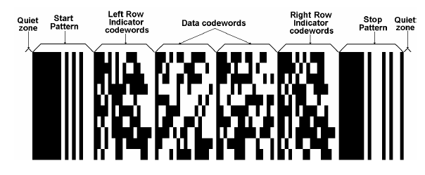
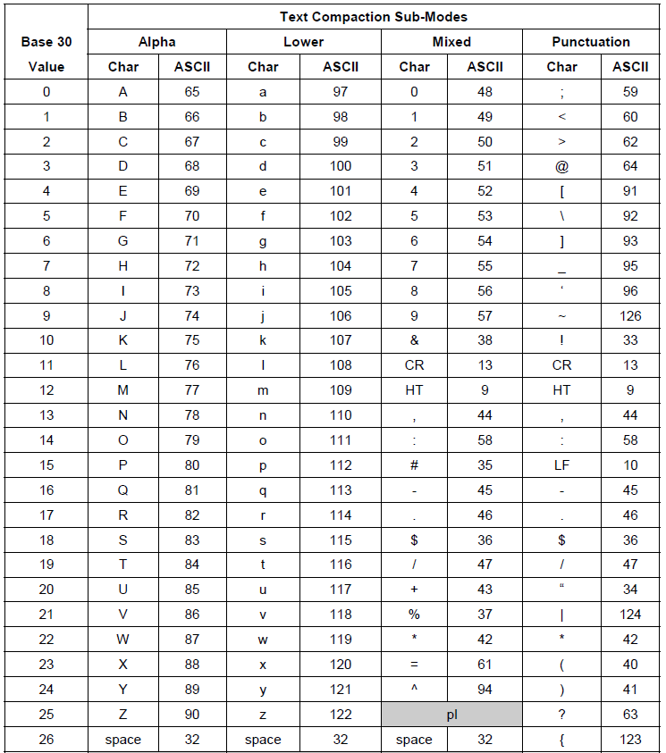
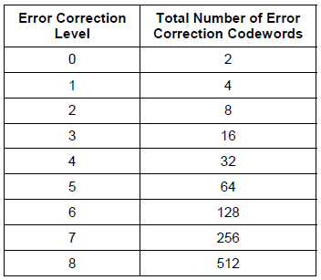

# Configuring Barcode PDF417 in Reports

PDF417 is a stacked linear barcode symbol format used in a variety of applications, primarily transport, identification cards, and inventory management.

PDF stands for Portable Data File. The 417 signifies that each pattern in the code consists of 4 bars and spaces, and that each pattern is 17 units long. The code is divided into rows and columns, which accommodate all the encoded data, the error correction code words, as well as any additional format information, such as start and stop sequences.

The PDF417 symbology was invented by Dr. Ynjiun P. Wang at Symbol Technologies in 1991 (Wang 1993). It is represented by ISO standard 15438.

## Structure

The following image shows the structure of the PDF417 barcode.

* The __Data codewords__ are located in the middle section of the barcode and include the following sections:

	* The length indicator cluster (each cluster contains 17 modules), which signifies the total length of the data code words.
	* The actual data, which represents the data entered by the user initially, encoded.
	* The error correction cluster(s), which help the decoder in recovering any data from the code.
	* Padding cluster(s)&mdash;Since a rectangular matrix is allocated for the data code words, it may become necessary to pad the data, and add one or more clusters to fill any gaps in the available matrix.

* The __Left Row Indicator__ codewords, as well as the __Right Row Indicator__ codewords help the decoder locate each row. Essentially, the row indicators represent an encoding of the row number.

* The __Start__ and __Stop__ patterns are present on each row in the PDF417. The signal when the data and row indicators start and end. Each start/stop cluster is identical for each row.

* Additionally, minimum two modules on each side of the PDF417 barcode are dedicated to the quiet zone. They provide space and separate the barcode from other visual elements on the page, allowing the reader to more reliably detect it.

# Settings

The PDF417 barcode provides a number of settings you can use to fine-tune its behavior.

> Depending on the mode and error correction levels, any invalid character, entered by the user, as well as any characters, which surpass the maximum number of symbols, which can be accommodated, will be discarded.

### Encoding Mode

The encoding mode is an enumeration, which determines the types of symbols, which will be accepted by the barcode, as well as the algorithm by which they will be encoded internally.

The enumeration has the following values:

* __Auto__&mdash;Specifies no particular encoding mode. This means that the barcode control will determine internally how to encode each particular symbol according to the ISO specification.

* __Byte__&mdash;The Byte Compaction mode enables a sequence of eight-bit bytes to be encoded into a sequence of codewords. It is accomplished by a Base 256 to Base 900 conversion, which achieves a compaction ratio of six bytes to five codewords. Characters with ASCII codes from 0 to 255 are acceptable.

	The following table lists all the characters and their values.

	

* __Numeric__&mdash;The numeric mode allows you to encode numeric symbols only [0-9]. Any other characters are discarded.

* __Text__&mdash;The text mode allows you to encode text characters, such as upper and lowercase letters, as well as digits, punctuation, and some additional characters.

	The following table lists the complete set of __Text__ characters.

	

### Error Correction Level

The error correction level is an integer value from zero to eight. This value determines how many error correction clusters will be added to the rendered data.

The table below lists the values for each level of error correction.

### Rows and Columns

Internally, PDF417 renders in columns and rows. These rows and columns create a grid, which in turn accommodates all the modules of encoded data. The maximum number of columns in the code is 30, whereas the maximum number of rows is 90.

Depending on the scenario, this internal behavior may influence the readability of the control. To address this, the barcode exposes the `Rows` and `Columns` properties, which allow you to pre-determine the number of rows and columns in the rendered PDF417 code. For example, when you have limited width, you can increase the number of rows.

Note that `Rows` and `Columns` are related to the data, which needs to be encoded. If there is too much data, more rows or columns will be added. If there is insufficient data, not all rows or columns will be used.

### Settings Examples

{{source=CodeSnippets\CS\API\Telerik\Reporting\BarcodeSnippets.cs region=Barcode_PDF417Encoder_Settings}}
{{source=CodeSnippets\VB\API\Telerik\Reporting\BarcodeSnippets.vb region=Barcode_PDF417Encoder_Settings}}

