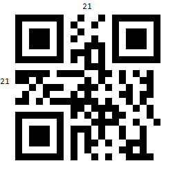
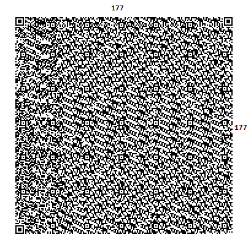
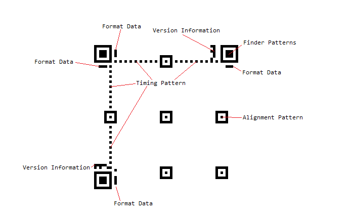
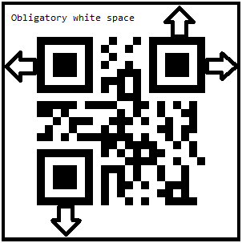

# Configuring the Barcode QR Code in Reports

The QR code is abbreviated from "Quick Response Code" and is the trademark for a type of matrix barcode first designed for the automotive industry in Japan. The QR Code system has become popular outside the automotive industry due to its fast readability and greater storage capacity compared to standard UPC barcodes.

A QR code consists of black modules (square dots) arranged in a square grid on a white background, which can be read by an imaging device (such as a camera) and processed by using the Reed–Solomon error correction until the image can be appropriately interpreted. The required data are then extracted from patterns present in both horizontal and vertical components of the image.

To efficiently store data, a QR code uses the numeric, alphanumeric, byte/binary, and kanji standardized encoding modes.

## Versions

The QR code is available in 40 versions, from 21 by 21 modules to 177 by 177 modules, increasing in steps of four modules per side. Higher versions encode larger amounts of data.

The following image shows the QR Code version one.

The following image shows the QR Code version 40.

## Structure

Disregarding the data, which consists of the actual encoded data, along with the error correction bits, the structure of the code includes the following module groups:

* __Finder Pattern__&mdash;The finder pattern is a concentric square of alternating colors, located in all corners of the symbol except the bottom right. They are used by decoders to establish orientation. The center is a 3x3 black square and is surrounded by a one-module-thick white box, which is surrounded by a one-module-thick black box, making the full pattern 7x7 modules.
* __Alignment Pattern__&mdash;The alignment pattern is only included in the rendered QR code in version two and above. Its purpose is to allow the decoder to scan a skewed image, and convert it to a virtual grid of black and white modules, representing the encoded data. The alignment pattern is made of concentric squares, much like the finder patterns, with the center being a single black module.
* __Timing Pattern__&mdash;The timing pattern is an alternating stripe of black and white modules, starting at the lower left corner of the upper right Finder Pattern, going horizontally to the upper left finder pattern, and then going vertically to the lower left finder pattern.
* __Format Data__&mdash;The format data is information about the Masking rule used in the QR Code along with the error correction level. When the data in the QR code is encoded, some of the modules are inverted by a predefined rule to improve readability and ensure that there are no big clusters of same-colored modules.

	This process is called masking, and the masking information is included in the format data to alert the decoder that certain modules have been inverted. The format data is encoded in 15 bits. One full copy of the format data is located around the upper left finder pattern. A second copy, divided into seven and eight bits, is located next to the other two finder patterns.

* __Version Data__&mdash;The version data includes information on which version the QR code is. This data is encoded into 18 modules, in a six-by-three matrix. Two copies of the version data matrix are included in the QR code: one next to the upper right finder pattern, and the other next to the lower left one.
* __Blank Space__&mdash;Additionally, each QR code contains an obligatory four-modules-wide white space area in its periphery.

	

* __Data__&mdash;The data occupies all modules that are not occupied by any of the formatting data segments mentioned above. If the data is smaller than the capacity of the remaining modules, it is padded to ensure that all modules are used. Additionally, the data consists of the actual encoded data, entered by the user, and the error correction bits, calculated on that data.

## Settings

The QR Code barcode provides several settings you can use to fine-tune its behavior.

### Version

The `Version` is an integer value in the range from __1__ to __40__, representing the desired barcode version. If `Version` is not set, the encoder internally calculates the lowest possible version and uses it instead.

### Error Correction Level

The QR Code provides the `L` (Low), `M` (Medium), `Q` (Quartile), and `H` (High) possible values. These values allow for 7%, 15%, 25%, and 30% recovery of symbol code words. Additionally, choosing a higher version of error correction dedicates a larger portion of modules for error correction. This means that if two QR codes are the same size, the one with a lower error correction level will be able to accommodate more data.

### Mode

`Mode` provides the `Alphanumeric`, `Numeric`, `Byte`, and `Kanji` values. Essentially, this determines the sets of acceptable symbols, for example, numbers or characters.

### Extended Channel Interpretation

The Extended Channel Interpretation (ECI) allows you to encode characters from different character sets. For example, choosing an ECI equal to 8859-7 will allow for encoding characters from the Latin/Greek alphabet. Note that the ECI setting is only respected when `Mode` is set to `Byte`.

### FNC1

The `FNC1` mode is used for messages containing data formatted either following the UCC/EAN Application Identifiers standard or under a specific industry standard previously agreed with AIM International.

### Application Indicator

`ApplicationIndicator` allows you to apply additional data to the FNC1 data. Note that this is only applicable with the `FNC1Mode.FNC1SecondPosition`. Additionally, the acceptable data for this property is in the [a-z], [A-Z], and [00-99] range.

Essentially, both the `FNC1` property and the `ApplicationIndicator` data are applied to the raw data encoded in the control, allowing for special formatting.

### Settings Examples

{{source=CodeSnippets\CS\API\Telerik\Reporting\BarcodeSnippets.cs region=Barcode_QRCodeEncoder_Settings}}
{{source=CodeSnippets\VB\API\Telerik\Reporting\BarcodeSnippets.vb region=Barcode_QRCodeEncoder_Settings}}

