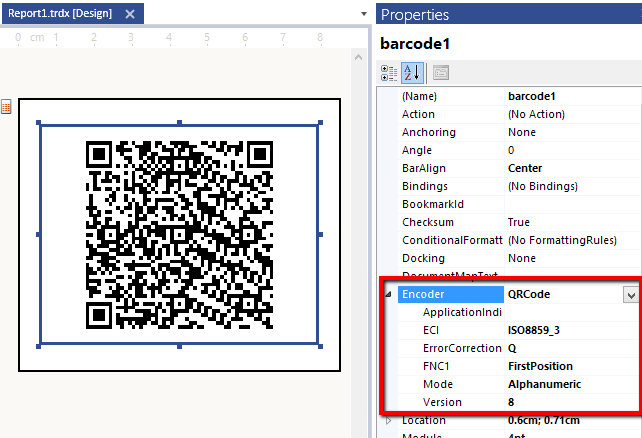
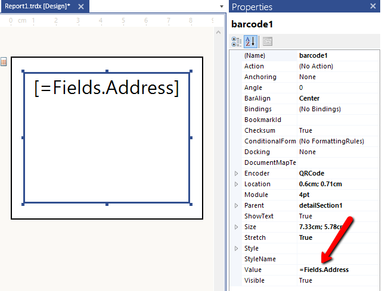
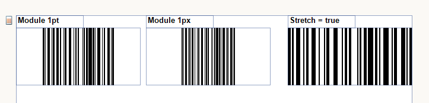
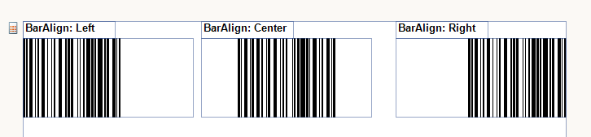
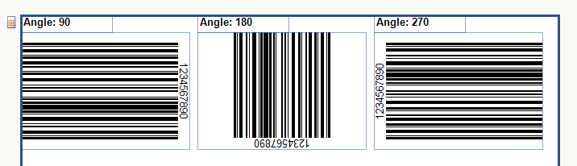

# Getting Started with the Barcode Report Item

This guide shows how to create and use the Telerik Reporting Barcode report item in reports. For an introduction to the supported symbologies and key features, see the [Barcode Report Item Overview](slug:telerikreporting/designing-reports/report-structure/barcode/overview).

* First, you will specify the type of the Barcode report item, configure its settings, and encode its value.
* Then, you will set the width of the Barcode elements and elaborate on the appearance of the report item.

After the completion of this guide, you will also be able to configure the Barcode with code and achieve the following result.

{{source=CodeSnippets\CS\API\Telerik\Reporting\BarcodeSnippets.cs region=Barcode_Common_Settings}}
{{source=CodeSnippets\VB\API\Telerik\Reporting\BarcodeSnippets.vb region=Barcode_Common_Settings}}

## Specifying the Barcode

1. To specify the type of the Barcode, use the [`Encoder`](/api/telerik.reporting.barcode#telerik_reporting_barcode_encoder) property. After setting the desired encoder, you can further adjust the specific settings you require.

	

1. Now, you need to encode the Barcode value through the [`Value`](/api/telerik.reporting.barcode#telerik_reporting_barcode_value) property. `Value` can be a static string or an expression that is evaluated at runtime.

	

## Setting the Size and Appearance

1. You may set the width of the Barcode elements through the [`Module`](/api/telerik.reporting.barcode#telerik_reporting_barcode_module) property. As an alternative, set the [`Stretch`](/api/telerik.reporting.barcode#telerik_reporting_barcode_stretch) property to `true` to automatically calculate the module width from the size of the report item. When `Stretch` is `true`, the `Module` value is ignored.

	

1. Align the bars to the edges of the item through the [`BarAlign`](/api/telerik.reporting.barcode#telerik_reporting_barcode_baralign) property.

	Note that `BarAlign` is not applicable when the [`Stretch`](/api/telerik.reporting.barcode#telerik_reporting_barcode_stretch) property is set to `true`.

	

1. Rotate the Barcode through the [`Angle`](/api/telerik.reporting.barcode#telerik_reporting_barcode_angle) property.

	Note that when the angle is not divisible by 90 degrees, and the [`Stretch`](/api/telerik.reporting.barcode#telerik_reporting_barcode_stretch) property is `true`, the Barcode will be scaled down so that it fits into the item bounds.

	

1. Include a checksum in the Barcode by using the [`Checksum`](/api/telerik.reporting.barcode#telerik_reporting_barcode_checksum) property.

	> note Some symbologies either do not provide a checksum or the checksum is part of the symbology specification. In these cases, `Checksum` will have no effect.

## Next Steps

* [One-Dimensional Barcodes Overview](slug:telerikreporting/designing-reports/report-structure/barcode/barcode-types/supported-types)
* [Two-Dimensional Barcodes Overview](slug:2d_barcodes_overview)
* [Configuring the MaxiCode Barcode in Reports](slug:barcode-maxicode-overview)
* [(Demo) Barcodes Report](https://demos.telerik.com/reporting/barcodes-report)
* [(Demo) Swiss QR Bill Report](https://demos.telerik.com/reporting/swiss-qr-bill-report)

## See Also

* [Barcode Report Item Overview](slug:telerikreporting/designing-reports/report-structure/barcode/overview)
* [(API) Telerik.Reporting.Barcode](/api/telerik.reporting.barcode)
* [(API) Encoder](/api/telerik.reporting.barcode#telerik_reporting_barcode_encoder)
* [(API) Value](/api/telerik.reporting.barcode#telerik_reporting_barcode_value)
* [(API) Module](/api/telerik.reporting.barcode#telerik_reporting_barcode_module)
* [(API) Stretch](/api/telerik.reporting.barcode#telerik_reporting_barcode_stretch)
* [(API) BarAlign](/api/telerik.reporting.barcode#telerik_reporting_barcode_baralign)
* [(API) Angle](/api/telerik.reporting.barcode#telerik_reporting_barcode_angle)
* [(API) Checksum](/api/telerik.reporting.barcode#telerik_reporting_barcode_checksum)
