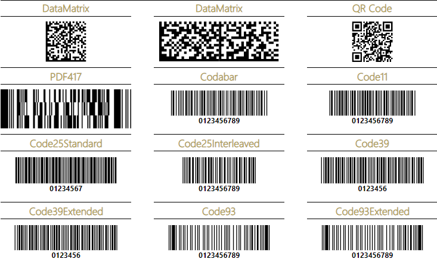

# Barcode Report Item Overview

The Barcode report item automatically generates barcodes directly from numeric or character data.

## Key Features 

* [Support for one-dimensional (1D) Barcodes]()—The Barcode report item supports linear barcode types such as EAN13, EAN8, UPC-A, UPC-E, and Code39.
* [Support for two-dimensional (2D) Barcodes]()—The Barcode report item also supports matrix barcode types such as Data Matrix, QR Code, Swiss QR Code, and PDF417.

## Next Steps

* [Getting Started with the Barcode Report Item]()
* [Demo Page for Telerik Reporting](https://demos.telerik.com/reporting)
* [Knowledge Base Section](/knowledge-base)

## See Also

* [Telerik Reporting Homepage](https://www.telerik.com/products/reporting)
* [Reporting Forums](https://www.telerik.com/forums/reporting)
* [Reporting Blog](https://www.telerik.com/blogs/tag/reporting)
* [Reporting Videos](https://www.telerik.com/videos/reporting)
* [Reporting Roadmap](https://www.telerik.com/support/whats-new/reporting/roadmap)
* [Reporting Pricing](https://www.telerik.com/purchase/individual/reporting)
* [Reporting Training](https://learn.telerik.com/learn/course/external/view/elearning/19/reporting-report-server-training)
