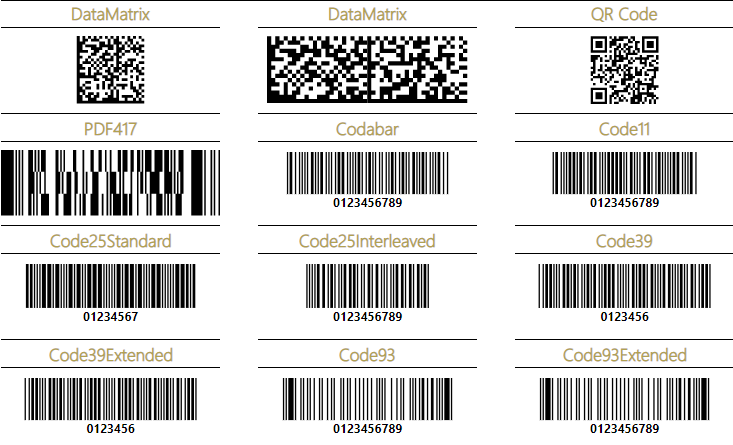

# Barcode Report Item Overview

The Barcode report item automatically generates barcodes directly from numeric or character data. The symbology is selected through the [`Encoder`](/api/telerik.reporting.barcode#Telerik_Reporting_Barcode_Encoder) property, the encoded payload is supplied through the [`Value`](/api/telerik.reporting.barcode#Telerik_Reporting_Barcode_Value) property as either a static string or a report expression, and the resulting symbol is rendered by all Telerik Reporting export formats&mdash;PDF, image, HTML/SVG, XAML, DOCX, and RTF.

> note The MaxiCode 2D encoder was introduced in [Telerik Reporting 2026 Q1 (20.0.26.424)](https://www.telerik.com/support/whats-new/reporting/release-history/progress-telerik-reporting-2026-q1-(20-0-26-424)). For details, refer to [Configuring the MaxiCode Barcode in Reports](slug:barcode-maxicode-overview).

## Key Features

* [Support for one-dimensional (1D) Barcodes](slug:telerikreporting/designing-reports/report-structure/barcode/barcode-types/supported-types)&mdash;The Barcode report item supports linear barcode types such as EAN13, EAN8, UPC-A, UPC-E, and Code39.
* [Support for two-dimensional (2D) Barcodes](slug:2d_barcodes_overview)&mdash;The Barcode report item also supports matrix barcode types such as Data Matrix, QR Code, Swiss QR Code, PDF417, and MaxiCode.
* **Configurable size and layout**&mdash;Set a fixed module width through the [`Module`](/api/telerik.reporting.barcode#Telerik_Reporting_Barcode_Module) property, or let the symbol scale to the bounds of the item by setting the [`Stretch`](/api/telerik.reporting.barcode#Telerik_Reporting_Barcode_Stretch) property to `true`. When `Stretch` is `false`, the [`BarAlign`](/api/telerik.reporting.barcode#Telerik_Reporting_Barcode_BarAlign) property aligns the symbol horizontally inside the item.
* **Rotation**&mdash;Rotate the rendered symbol through the [`Angle`](/api/telerik.reporting.barcode#Telerik_Reporting_Barcode_Angle) property.
* **Human-readable text and checksum**&mdash;Toggle the printed text under the symbol with the [`ShowText`](/api/telerik.reporting.barcode#Telerik_Reporting_Barcode_ShowText) property, and append a checksum (where the symbology supports it) with the [`Checksum`](/api/telerik.reporting.barcode#Telerik_Reporting_Barcode_Checksum) property.

## Next Steps

* [Getting Started with the Barcode Report Item](slug:barcode_item_get_started)
* [One-Dimensional Barcodes Overview](slug:telerikreporting/designing-reports/report-structure/barcode/barcode-types/supported-types)
* [Two-Dimensional Barcodes Overview](slug:2d_barcodes_overview)

## See Also

* [(API) Telerik.Reporting.Barcode](/api/telerik.reporting.barcode)
* [Demo Page for Telerik Reporting](https://demos.telerik.com/reporting)
* [Knowledge Base Section](/knowledge-base)
* [Telerik Reporting Homepage](https://www.telerik.com/products/reporting)
* [Reporting Forums](https://www.telerik.com/forums/reporting)
* [Reporting Blog](https://www.telerik.com/blogs/tag/reporting)
* [Reporting Videos](https://www.telerik.com/videos/reporting)
* [Reporting Roadmap](https://www.telerik.com/support/whats-new/reporting/roadmap)
* [Reporting Pricing](https://www.telerik.com/purchase/individual/reporting)
* [Reporting Training](https://learn.telerik.com/learn/course/external/view/elearning/19/reporting-report-server-training)
