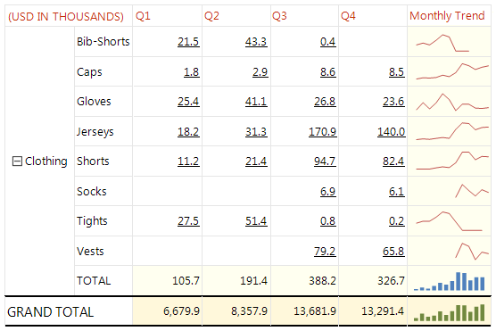

# (Obsolete) Chart Report Item Overview

>* The Chart report item is now superseded by the more advanced [Graph]() report item. The Graph is most often used for building powerful OLAP and Pivot charts. 
>* The Chart report item is not supported in .NET Core projects and in projects deployed on Azure. 
>* The complete Chart report item documentation is available as a `CHM` file up to Telerik Reporting version 8.2.14.1204, and can be downloaded from [your Telerik account](https://www.telerik.com/account/downloads/product-download?product=REPORTING).
>* If your reports utilize the Chart item, you need to add a [typeReference]() in your configuration to explicitly allow the element to be processed: `<add typeName="Telerik.Reporting.Processing.Chart" assemblyName="Telerik.Reporting" publicKeyToken="a9d7983dfcc261be" />`. This is required due to vulnerabilities in the item code.

The Chart report item is used to display a chart on a report. 



## Binding to Data

To bind the Chart report item, use either of the following approaches:

* From the Report Designer, set the `DataSource` property of the Chart.
* Use the `NeedDataSource` event of the Chart.

When you are in the `NeedDataSource` event, you have to process the Chart item, for example:

````C#
private void chart1_NeedDataSource(object sender, System.EventArgs e)
{
	Telerik.Reporting.Processing.Chart procChart = (Telerik.Reporting.Processing.Chart)sender;
	procChart.DataSource = your_datasource;
}
````
````VB.NET
Private Sub chart1_NeedDataSource(sender As Object, e As System.EventArgs)
	Dim procChart As Telerik.Reporting.Processing.Chart = DirectCast(sender, Telerik.Reporting.Processing.Chart)
	procChart.DataSource = your_datasource
End Sub
````

## Customizing the Chart 

To customize the Chart, right-click the item and select **Properties** from the context menu to open the Chart Wizard.

## Key Features

* Customizable Chart types&mdash;The Chart provides the Bar, Stacked Bar, Stacked Bar 100%, Pie, Gantt, Bezier, Spline, Spline Area, Stacked Spline Area, Stacked Spline Area 100%, Point, Bubble, Line, Area, Stacked Area, Stacked Area 100%, and CandleStick series.

* Automatic text-wrapping&mdash;Text elements in the Chart can be wrapped automatically.

* Data-binding&mdash;The obsolete Chart item is a [Data item]() and uses the [Data Source Components]() to bind to data. Once you define the data source, you can use the Property Editor or code to select which data columns will be used to populate the Chart.

* Wizard&mdash;The Chart Wizard provides the most commonly used properties of the Chart in an intuitive way and enables you to quickly set up the basic structure of the report item. To invoke the Chart Wizard, use the context menu that appears when you right-click the Chart report item and select **Properties**.

* Second Y axis&mdash;Except for the Pie Chart, all Chart series include an X and Y axis. Typically, the `ChartPlotArea.YAxis` displays values and the `ChartPlotArea.XAxis` displays categories. For example, the `ChartPlotArea.YAxis` may display **items sold** or **revenue**, while the `ChartPlotArea.XAxis` may indicate **Months** or **Products**. The X axis can also display values. The Chart provides a second `ChartPlotArea.YAxis2` Y-axis property for displaying a second scale of measurements.

* Empty values&mdash;The Chart automatically approximates missing values between known data points, simply by setting the _Empty_ property to _true_ on any chart series item. This works for bar, line and area based chart types. You also have complete control over the visual style of empty values. The empty value style can be articulated separately from the style for the main values.

* Scale breaks&mdash;The scale breaks allow you to "break off" large chunks of the axis so that graphs with large amplitude are easier to read. Scale breaks are available for both YAxis and YAxis2 of the plot area. You can tailor the maximum number of breaks, the minimum interval between data points before a break can occur, the visual size of the breaks, and the visual style of the breaks.

* Marked zones&mdash;PlotArea marked zones are ranges that you can label and fill with color to highlight areas of the Chart or to visually group data. By default, the `MarkedZones` property displays behind the chart series. You can create any number of members for the `MarkedZones` collection and each marked zone is defined by a starting and ending X and Y value pairs. You can also control the labeling and appearance for each zone independently.

* Styling&mdash;The Chart offers a set of [properties to modify the look and feel of its elements](/reporting/api/Telerik.Reporting.Chart).

## Next Steps

* [Telerik UI for ASP.NET AJAX Chart Documentation](https://docs.telerik.com/devtools/aspnet-ajax/controls/chart/overview)
* [(API) Chart](/reporting/api/Telerik.Reporting.Chart)
* [Demo Page for Telerik Reporting](https://demos.telerik.com/reporting)
* [Knowledge Base Section](/knowledge-base)

## See Also

* [Telerik Reporting Homepage](https://www.telerik.com/products/reporting)
* [Reporting Forums](https://www.telerik.com/forums/reporting)
* [Reporting Blog](https://www.telerik.com/blogs/tag/reporting)
* [Reporting Videos](https://www.telerik.com/videos/reporting)
* [Reporting Roadmap](https://www.telerik.com/support/whats-new/reporting/roadmap)
* [Reporting Pricing](https://www.telerik.com/purchase/individual/reporting)
* [Reporting Training](https://learn.telerik.com/learn/course/external/view/elearning/19/reporting-report-server-training)
