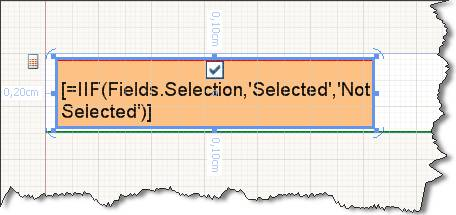
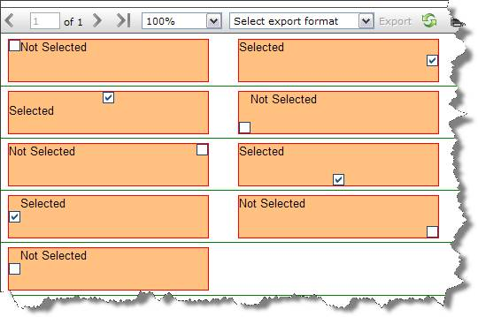
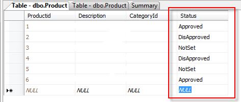
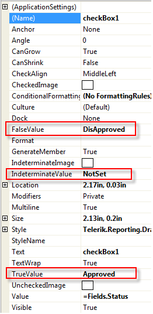
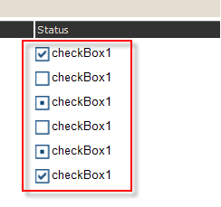

# Checkbox 

The CheckBox report item is used to display both text and a check mark on a report. 

The following image shows a CheckBox report item with its `CheckAlign` property set to `TopCenter` and its text aligned to `Top` and `left`.  

## Expanding and Shrinking

By default, the size of a CheckBox item is set. 

To allow a CheckBox to expand vertically based on its contents, set the [`CanGrow`](/reporting/api/Telerik.Reporting.TextItemBase#Telerik_Reporting_TextItemBase_CanGrow) property to its default `True` value. 

To allow a CheckBox to shrink based on its contents, set the [`CanShrink`](/reporting/api/Telerik.Reporting.TextItemBase#Telerik_Reporting_TextItemBase_CanShrink) property to `True`. By default, `CanShrink` is `False`. The CheckBox will always enlarge to accommodate the first line of text even when `CanGrow` is `False`. 

## Embedded Expressions

The textual part of the Checkbox report item supports [embedded expressions]() for mail merge functionality. 

Embedded expressions enable you to get and insert data-driven information directly into the `CheckBox.Text` property to produce customized reports and mail merging. 

In the following image, each CheckBox is initialized with the [`CheckAlign`](/api/Telerik.Reporting.CheckBox#Telerik_Reporting_CheckBox_CheckAlign) property varying from `TopLeft` to `BottomRight`. 

The check mark image depends on the value set in the `Value` property. By default, `Value` accepts `=true` or `=false`. At design time, you can initialize the `Value` property with an expression which later at runtime is evaluated to one of the `System.Windows.Forms.CheckState` values. For example, `=IsNull(Fields.Quantity, 0) > 100` will return `true` or `false` and will check and uncheck the check mark respectively. 

If your data fields return two or three distinctive values, which are not `true` or `false`, you can change the `TrueValue`, `FalseValue`, or `IndeterminateValue` properties to match your field values directly. 

## Example

The following example assumes that you have a `Status` field that has the `Approved`, `DisApproved`, and `NotSet` values.    

In this case, it is more convenient to use those values directly instead of trying to evaluate them as `true` or `false`. To use the values directly, utilize the `TrueValue`, `FalseValue`, and `IndeterminateValue` properties. 

The following image shows the final result.  

## See Also 

* [Using Embedded Expressions]()
* [Telerik.Reporting.CheckBox](/api/Telerik.Reporting.CheckBox)
* [CanGrow](/reporting/api/Telerik.Reporting.TextItemBase#Telerik_Reporting_TextItemBase_CanGrow)
* [CanShrink](/reporting/api/Telerik.Reporting.TextItemBase#Telerik_Reporting_TextItemBase_CanShrink)
* [CheckAlign](/api/Telerik.Reporting.CheckBox#Telerik_Reporting_CheckBox_CheckAlign)
