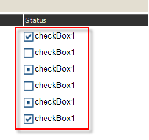

# Embedded Expressions

The textual part of the Checkbox report item supports [embedded expressions]() for mail merge functionality. 

Embedded expressions enable you to get and insert data-driven information directly into the `CheckBox.Text` property to produce customized reports and mail merging. 

In the following image, each CheckBox is initialized with the `CheckAlign` property varying from `TopLeft` to `BottomRight`. 

The check mark image depends on the value set in the `Value` property. By default, `Value` accepts `=true` or `=false`. At design time, you can initialize the `Value` property with an expression which later at runtime is evaluated to one of the `System.Windows.Forms.CheckState` values. For example, `=IsNull(Fields.Quantity, 0) > 100` will return `true` or `false` and will check and uncheck the check mark respectively. 

If your data fields return two or three distinctive values, which are not `true` or `false`, you can change the `TrueValue`, `FalseValue`, or `IndeterminateValue` properties to match your field values directly. 

The following example assumes that you have a `Status` field that has the `Approved`, `DisApproved`, and `NotSet` values.    

In this case, it is more convenient to use those values directly instead of trying to evaluate them as `true` or `false`. To use the values directly, utilize the `TrueValue`, `FalseValue`, and `IndeterminateValue` properties. 

The following image shows the final result.  

