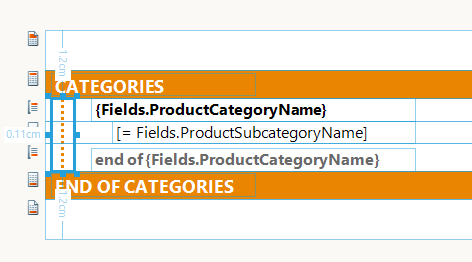

# Cross-Section Report Item Overview

The Cross-section report item is used to display a graphical primitive, such as a vertical line or a rectangle, across one or more report sections.

The report item is suitable if group sections, for example, need to be visually distinguished from each other. To create visual effects within a report, use visual shapes. The Cross-section report item provides a set of properties, such as `display`, which you can set from the **Properties** window.

The following screenshot shows a Cross-section report item in the Standalone Report Designer.

## Setting the Behavior

The following list contains the properties which define the behavior of the Cross-section report item:

* `BeginSection`&mdash;Defines the report section from which the cross-section item will start. It can be any instance of the [`ReportSectionBase`](/api/Telerik.Reporting.ReportSectionBase) class (`PageHeader`, `ReportHeader`, or `GroupHeader`).

* `BeginMargin`&mdash;Defines the offset from the top of the `BeginSection` measured in [`Unit`](/api/Telerik.Reporting.Drawing.Unit) values. The offset will be preserved if the `BeginSection` changes its size at runtime.

* `EndSection`&mdash;Defines the report section at which the cross-section item will end. It can also be any instance of the [`ReportSectionBase`](/api/Telerik.Reporting.ReportSectionBase) class (`PageFooter`, `ReportFooter`, or `GroupFooter`).

* `EndMargin`&mdash;Defines the offset from the bottom of the `EndSection` measured in [`Unit`](/api/Telerik.Reporting.Drawing.Unit) values. The offset will be preserved if the `EndSection` changes its size at runtime.

## Setting the Appearance

The following list contains the properties which define the appearance of the Cross-section report item:

* `Type`&mdash;Defines the graphical primitive type rendered by the Cross-section item. It can be `Line` (default) or `Rectangle`.

* `Position`&mdash;Defines whether the Cross-section item will be rendered under the rest of the report items or on top of them. It can be set to `Behind` (default) or `Front`.

The [`Location`](/api/Telerik.Reporting.ReportItem#Telerik_Reporting_ReportItem_Location) and [`Size`](/api/Telerik.Reporting.ReportItem#Telerik_Reporting_ReportItem_Size) properties are calculated based on the `BeginSection`, `BeginMargin`, `EndSection`, and `EndMargin` properties. Changing the [`Location`](/api/Telerik.Reporting.ReportItem#Telerik_Reporting_ReportItem_Location) values or the [`Size`](/api/Telerik.Reporting.ReportItem#Telerik_Reporting_ReportItem_Size)-related properties like [`Top`](/api/Telerik.Reporting.ReportItem#Telerik_Reporting_ReportItem_Top), [`Left`](/api/Telerik.Reporting.ReportItem#Telerik_Reporting_ReportItem_Left), [`Width`](/api/Telerik.Reporting.ReportItem#Telerik_Reporting_ReportItem_Width), or [`Height`](/api/Telerik.Reporting.ReportItem#Telerik_Reporting_ReportItem_Height) recalculate the values of `BeginSection`, `BeginMargin`, `EndSection`, and `EndMargin` properties.

In most scenarios, the `Begin` and `End` sections have matching types and hierarchy levels, for example, `ReportHeader` - `ReportFooter`, `GroupHeader` - `GroupFooter`. Choosing mismatching sections can produce unexpected rendering results.

## Instantiation and Design-Time Support

Since the Cross-section item can refer to more than one report sections, its parent is the [`Report`](/api/Telerik.Reporting.Report) item. Therefore, you can drag the Cross-section item from the designer toolbox onto the designer surface without selecting any report section before that. When the Cross-section item is moved or resized on the report designer surface, its `Begin`- and `End`-related properties are automatically calculated based on its current location and size, and are displayed in the **Properties** window.

You can select a Cross-section item through the [Report Explorer]() tool window or by clicking the graphical primitive displayed by the item. If its `Type` is set to `Line`, the selectable area of the item will be on both sides of the displayed vertical line and will span to at least six pixels. If `Type` is set to `Rectangle`, the selectable area can be any of its sides and will again span to at least six pixels.

>* In the Standalone Report Designer and Visual Studio Report Designer, the Cross-section report item provides complete design-time support.
>* Currently, the Web Report Designer delivers basic designing capabilities and some of the Cross-section properties cannot be edited through the dedicated property editors.

You can programmatically add the Cross-section report item to a report by using the following code. Note that you need to add the item to the `Items` collection of the report first and, then, assign its section-related properties. The order of assignments is important because setting any `Location`- or `Size`-related properties will:

* Iterate through the sections of the report.
* Determine which of its sections will be assigned to the `BeginSection` and `EndSection` properties.
* Set the corresponding margins.

{{source=CodeSnippets\CS\API\Telerik\Reporting\CrossSectionItemSnippets.cs region=CreateAndInitializeCrossSectionItemSnippet}}
{{source=CodeSnippets\VB\API\Telerik\Reporting\CrossSectionItemSnippets.vb region=CreateAndInitializeCrossSectionItemSnippet}}

## Processing and Rendering

The Cross-section item is rendered per each page based on the occurrences of the report sections that match its `Begin` and `End` section settings. If the `EndSection` is positioned on a following page or report column, the Cross-section item will generate a graphical primitive that will span to the end of the usable page area and that will continue from the top of the next page.

The Cross-section item uses the data context of the report and cannot be evaluated against detail or group data. The processing engine produces a single instance per each Cross-section item in the report definition. Therefore, its style or visibility cannot be changed based on data fields.

The Cross-section item is designed to aid the production of form-type reports and attempts to preserve its location and size that are set at design-time. The report item will not expand when the report or any report sections expand horizontally. Therefore, the Cross-section won't be rendered on a page that is generated as a result of such horizontal paging. However, in a multi-column report, the Cross-section item will be generated per each report column that is shown on a page.

Not all rendering extensions [support the Cross-section report item]().

## Next Steps

* [Pagination]()
* [Demo Page for Telerik Reporting](https://demos.telerik.com/reporting)
* [Knowledge Base Section](/knowledge-base)

## See Also

* [Telerik Reporting Homepage](https://www.telerik.com/products/reporting)
* [Reporting Forums](https://www.telerik.com/forums/reporting)
* [Reporting Blog](https://www.telerik.com/blogs/tag/reporting)
* [Reporting Videos](https://www.telerik.com/videos/reporting)
* [Reporting Roadmap](https://www.telerik.com/support/whats-new/reporting/roadmap)
* [Reporting Pricing](https://www.telerik.com/purchase/individual/reporting)
* [Reporting Training](https://learn.telerik.com/learn/course/external/view/elearning/19/reporting-report-server-training)
