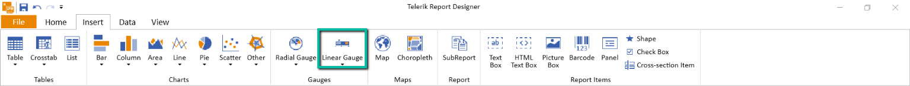
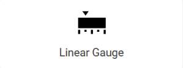

# Using the Linear Gauge Report Item

The steps below will demonstrate how to add the Telerik Reporting Linear Gauge report item to reports.

## Adding a Linear Gauge to the Report

* [Standalone Report Designer]() - The Gauge item can be inserted from the `Insert Ribbon`:

	

* [Web Report Designer]() - The Gauge item can be inserted using the `Components Tab`:

	

* [Visual Studio Report Designer]() - The Gauge item can be inserted from the [Visual Studio Toolbox](https://learn.microsoft.com/en-us/visualstudio/ide/reference/toolbox)

## Properties of the Gauge Report Item

The Gauge Report Item is a [data item]() and as such inherits the properties of the [Telerik.Reporting.DataItem](/api/telerik.reporting.dataitem) class.

### Properties specific to the Appearance

* [`Mirrored`](/api/Telerik.Reporting.LinearGauge#Telerik_Reporting_LinearGauge_Mirrored) - The Linear Gauge item generates a mirrored projection of its contents. The default layout for `Horizontal` is to display it below the ranges while for `Vertical`, it is rendered left of the gauge.
* [`Orientation`](/api/Telerik.Reporting.LinearGauge#Telerik_Reporting_LinearGauge_Orientation) - Determines whether the gauge will be rendered using a horizontal or vertical scale.
* [`Reversed`](/api/Telerik.Reporting.LinearGauge#Telerik_Reporting_LinearGauge_Reversed) - Determines the direction of the ranges and scale of the gauge. For `Horizontal` orientation, the default direction is left-to-right while for `Vertical` gauge, it is bottom-to-top. 
* [`Value`](/api/Telerik.Reporting.LinearGauge#Telerik_Reporting_LinearGauge_Value) - Represents the value of the gauge for the current instance. 

### Properties specific to the Presentation

* `Indicator` - The [LinearGaugeLabels](/api/telerik.reporting.Lineargaugelabels) collection associated with this gauge item.
	- [`Length`]() - Represents the length of the length of the indicator used to display the current value. The value is used as percentage ratio to the total gauge `Width`.
	- [`Offset`]() - Represents the length of the offset of the indicator used to display the current value relative to the gauge range. The value is used as percentage ratio to the total gauge `Width`. For example, if the value is 0, the indicator would start at the left border of the item and vice versa.
	- [`Style`]() - Represents a [Style](/api/telerik.reporting.drawing.style) instance, used to style indicator elemen
	- [`Thickness`]() - Represents a ratio of the value of the [Style.LineWidth](/api/telerik.reporting.drawing.style#Telerik_Reporting_Drawing_Style_LineWidth) of the indicator.
	- [`Type`]() - Represents the type of indicator to be displayed next to the linear guage. The available options are listen in the  enum.
* `Labels` - The [LinearGaugeLabels](/api/telerik.reporting.Lineargaugelabels) collection associated with this gauge item.
	- [`FirstVisibleValue`](/api/telerik.reporting.radialgaugelabels#Telerik_Reporting_RadialGaugeLabels_FirstVisibleValue) - Represents the value of the minimum value for which a label will be rendered. Can be used to restraint the label set. If left empty, all labels will be visible.
	- [`Format`]() - Represents the format that will be applied on the labels of the linear gauge.
	- [`Offset`]() - Represents the offset of the label strings from the gauge range. The value is used as percentage ratio to the total gauge `Width`.
	- [`RenderingType`]() - Represents the selected `RenderingType` options for the given label.
	- [`LastVisibleValue`](/api/telerik.reporting.radialgaugelabels#Telerik_Reporting_RadialGaugeLabels_LastVisibleValue) - Represents the value of the maximum value for which a label will be rendered. Can be used to restraint the label set. If left empty, all labels will be visible.
	- [`SegmentCount`](/api/telerik.reporting.Lineargaugelabels#Telerik_Reporting_LinearGaugeLabels_SegmentCount) - Represents the total count of labels that will be generated. It is recommended to be equal to the count of the `Ticks`.
	- [`Style`](/api/telerik.reporting.radialgaugerange#Telerik_Reporting_RadialGaugeRange_Style) - Represents a [Style](/api/telerik.reporting.drawing.style) instance, used to style the labels.
* `Ranges` - The [LinearGaugeRanges](/api/Telerik.Reporting.LinearGaugeRangeCollection) collection associated with this gauge item. A gauge can have multiple ranges. This is how the `Three-range` gauge is implemented.

	- [`End`]() - Represents the top value of the linear gauge's range.
	- [`EndWidth`]() - Represents the end width of the linear gauge item in a percentage of the total item `Width`. A value of 50 would mean that the last point of the gauge range area will be half the whole item's width.
	- [`Offset`]() - Represents the offset of the range area from the left/top border of the itme. The value is used as percentage ratio to the total gauge `Width`.
	- [`Start`]() - Represents the bottom value of the linear gauge's range.
	- [`StartWidth`]() - Represents the start width of the linear gauge item in a percentage of the total item `Width`. A value of 50 would mean that the first point of the gauge range area will be half the whole item's width.
	- [`Style`](/api/telerik.reporting.radialgaugerange#Telerik_Reporting_RadialGaugeRange_Style) - Represents a [Style](/api/telerik.reporting.drawing.style) instance, used to style the range area.
* `Scales` - The [LinearGaugeRanges](/api/Telerik.Reporting.LinearGaugeRangeCollection) collection associated with this gauge item. A gauge can have multiple ranges. This is how the `Three-range` gauge is implemented.

	- [`End`]() - Represents the top value of the linear gauge's scale line.
	- [`Offset`]() - Represents the offset of the scale line from the left/top border of the item. The value is used as percentage ratio to the total gauge `Width`.
	- [`Start`]() - Represents the bottom value of the linear gauge's scale line.
	- [`Style`](/api/telerik.reporting.radialgaugerange#Telerik_Reporting_RadialGaugeRange_Style) - Represents a [Style](/api/telerik.reporting.drawing.style) instance, used to style the scale line
* `Ticks` - The [LinearGaugeTicks](/api/telerik.reporting.Lineargaugeticks) collection associated with this gauge item.
	- [`FirstVisibleIndex`](/api/telerik.reporting.radialgaugeticks#Telerik_Reporting_RadialGaugeTicks_FirstVisibleIndex) - Represents the starting tick index from which ticks will be rendered. Can be used to constraint the tick set in a smaller range than the full scale. Ticks indexing starts at `0`.
	- [`LastVisibleIndex`](/api/telerik.reporting.radialgaugeticks#Telerik_Reporting_RadialGaugeTicks_LastVisibleIndex) - Represents the last tick index until which ticks will be rendered. Can be used to constraint the tick set in a smaller range than the full scale. Ticks indexing starts at `0`.
	- [`Length`](/api/telerik.reporting.radialgaugeticks#Telerik_Reporting_RadialGaugeTicks_Length) - Represents the size of the tick's visual element in percentage ratio to the gauge radius.
	- [`Offset`]() - Represents the offset of the range area from the left/top border of the itme. The value is used as percentage ratio to the total gauge `Width`.
	- [`SegmentCount`](/api/telerik.reporting.radialgaugeticks#Telerik_Reporting_RadialGaugeTicks_SegmentCount) - Represents the total count of ticks that will be generated for the given gauge range.
	- [`Type`]() - Represents the type of the shape that will be used for rendering the ticks.
	- [`Style`](/api/telerik.reporting.radialgaugeticks#Telerik_Reporting_RadialGaugeTicks_Style) - Represents a [Style](/api/telerik.reporting.drawing.style) instance, used to style range sectors.

## See Also

* [Gauge Report Item Overview]()
* [Radial Gauge Configuration and Usage]()
* [Data Items]()
