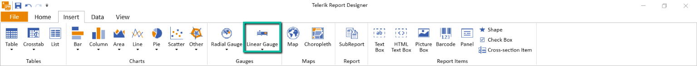
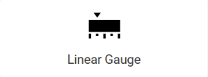

# Using the Linear Gauge Report Item

The steps below will demonstrate how to add the Telerik Reporting Linear Gauge report item to reports.

## Adding a Linear Gauge to the Report

* [Standalone Report Designer](slug:telerikreporting/designing-reports/report-designer-tools/desktop-designers/standalone-report-designer/overview) - The Gauge item can be inserted from the `Insert Ribbon`:

	

* [Web Report Designer](slug:telerikreporting/designing-reports/report-designer-tools/web-report-designer/overview) - The Gauge item can be inserted using the `Components Tab`:

	

* [Visual Studio Report Designer](slug:telerikreporting/designing-reports/report-designer-tools/desktop-designers/visual-studio-report-designer/overview) - The Gauge item can be inserted from the [Visual Studio Toolbox](https://learn.microsoft.com/en-us/visualstudio/ide/reference/toolbox)

## Properties of the Gauge Report Item

The Gauge Report Item is a [data item](slug:telerikreporting/designing-reports/connecting-to-data/data-items/overview) and as such inherits the properties of the [Telerik.Reporting.DataItem](/api/telerik.reporting.dataitem) class.

### Properties specific to the Appearance

* [`Mirrored`](/api/telerik.reporting.lineargauge#telerik_reporting_lineargauge_mirrored) - The Linear Gauge item generates a mirrored projection of its contents. The default layout for `Horizontal` is to display it below the ranges while for `Vertical`, it is rendered to the left of the gauge.
* [`Orientation`](/api/telerik.reporting.lineargauge#telerik_reporting_lineargauge_orientation) - Determines whether the gauge will be rendered using a horizontal or vertical scale.
* [`Reversed`](/api/telerik.reporting.lineargauge#telerik_reporting_lineargauge_reversed) - Determines the direction of the ranges and scale of the gauge. For `Horizontal` orientation, the default direction is left-to-right while for `Vertical` gauge, it is bottom-to-top.
* [`Value`](/api/telerik.reporting.lineargauge#telerik_reporting_lineargauge_value) - Represents the value of the gauge for the current instance.

### Properties specific to the Presentation

* [`Indicator`](/api/telerik.reporting.lineargauge#telerik_reporting_lineargauge_indicator) - Represents a [`LinearGaugeIndicator`](/api/telerik.reporting.lineargaugeindicator) instance defining the visual type of the indicator.
	- [`Length`](/api/telerik.reporting.lineargaugeindicator#telerik_reporting_lineargaugeindicator_length) - Represents the length of the indicator used to display the current value. The value is used as a percentage ratio to the total `Width` of the gauge.
	- [`Offset`](/api/telerik.reporting.lineargaugeindicator#telerik_reporting_lineargaugeindicator_offset) - Represents the offset of the indicator used to display the current value relative to the gauge range. The value is used as a percentage ratio to the total `Width` of the gauge. For example, if the value is `0`, the indicator would start at the left border of the item and vice versa.
	- [`Style`](/api/telerik.reporting.lineargaugeindicator#telerik_reporting_lineargaugeindicator_style) - Represents a [`Style`](/api/telerik.reporting.drawing.style) instance used to style indicator elements.
	- [`Thickness`](/api/telerik.reporting.lineargaugeindicator#telerik_reporting_lineargaugeindicator_thickness) - Represents a ratio of the value of the [`Style.LineWidth`](/api/telerik.reporting.drawing.style#telerik_reporting_drawing_style_linewidth) of the indicator.
	- [`Type`](/api/telerik.reporting.lineargaugeindicator#telerik_reporting_lineargaugeindicator_type) - Represents the type of indicator to be displayed next to the linear gauge. The available options are listed in the [`IndicatorType`](/api/telerik.reporting.indicatortype) enum.
* [`Labels`](/api/telerik.reporting.lineargauge#telerik_reporting_lineargauge_labels) - The [`LinearGaugeLabels`](/api/telerik.reporting.lineargaugelabels) collection associated with this gauge item.
	- [`FirstVisibleValue`](/api/telerik.reporting.gaugelabelsbase#telerik_reporting_gaugelabelsbase_firstvisiblevalue) - Represents the minimum value for which a label will be rendered. Can be used to restrict the label set. If left empty, all labels will be visible.
	- [`Format`](/api/telerik.reporting.gaugelabelsbase#telerik_reporting_gaugelabelsbase_format) - Represents the format that will be applied on the labels of the linear gauge.
	- [`Offset`](/api/telerik.reporting.lineargaugelabels#telerik_reporting_lineargaugelabels_offset) - Represents the offset of the label strings from the gauge range. The value is used as a percentage ratio to the total `Width` of the gauge.
	- [`RenderingType`](/api/telerik.reporting.lineargaugelabels#telerik_reporting_lineargaugelabels_renderingtype) - Represents the selected `RenderingType` options for the given label.
	- [`LastVisibleValue`](/api/telerik.reporting.gaugelabelsbase#telerik_reporting_gaugelabelsbase_lastvisiblevalue) - Represents the maximum value for which a label will be rendered. Can be used to restrict the label set. If left empty, all labels will be visible.
	- [`SegmentCount`](/api/telerik.reporting.gaugelabelsbase#telerik_reporting_gaugelabelsbase_segmentcount) - Represents the total count of labels that will be generated. It is recommended to be equal to the `Ticks` count.
	- [`Style`](/api/telerik.reporting.gaugelabelsbase#telerik_reporting_gaugelabelsbase_style) - Represents a [`Style`](/api/telerik.reporting.drawing.style) instance used to style the labels.
* [`Ranges`](/api/telerik.reporting.lineargauge#telerik_reporting_lineargauge_ranges) - The [`LinearGaugeRangeCollection`](/api/telerik.reporting.lineargaugerangecollection) associated with this gauge item. A gauge can have multiple ranges. This is how the `Multi-Range` gauge is implemented.

	- [`End`](/api/telerik.reporting.lineargaugerange#telerik_reporting_lineargaugerange_end) - Represents the top value of the linear gauge's range.
	- [`EndWidth`](/api/telerik.reporting.lineargaugerange#telerik_reporting_lineargaugerange_endwidth) - Represents the end width of the linear gauge item as a percentage of the total `Width` of the item. A value of `50` would mean that the last point of the gauge range area will be half the whole item's width.
	- [`Offset`](/api/telerik.reporting.lineargaugerange#telerik_reporting_lineargaugerange_offset) - Represents the offset of the range area from the left/top border of the item. The value is used as a percentage ratio to the total `Width` of the gauge.
	- [`Start`](/api/telerik.reporting.lineargaugerange#telerik_reporting_lineargaugerange_start) - Represents the bottom value of the linear gauge's range.
	- [`StartWidth`](/api/telerik.reporting.lineargaugerange#telerik_reporting_lineargaugerange_startwidth) - Represents the start width of the linear gauge item as a percentage of the total `Width` of the item. A value of `50` would mean that the first point of the gauge range area will be half the whole item's width.
	- [`Style`](/api/telerik.reporting.lineargaugerange#telerik_reporting_lineargaugerange_style) - Represents a [`Style`](/api/telerik.reporting.drawing.style) instance used to style the range area.
* [`Scales`](/api/telerik.reporting.lineargauge#telerik_reporting_lineargauge_scales) - The [`LinearGaugeScaleCollection`](/api/telerik.reporting.lineargaugescalecollection) associated with this gauge item. A gauge can have multiple scales. This is how the `Three-Range` gauge is implemented.

	- [`End`](/api/telerik.reporting.lineargaugescale#telerik_reporting_lineargaugescale_end) - Represents the top value of the linear gauge's scale line.
	- [`Offset`](/api/telerik.reporting.lineargaugescale#telerik_reporting_lineargaugescale_offset) - Represents the offset of the scale line from the left/top border of the item. The value is used as a percentage ratio to the total `Width` of the gauge.
	- [`Start`](/api/telerik.reporting.lineargaugescale#telerik_reporting_lineargaugescale_start) - Represents the bottom value of the linear gauge's scale line.
	- [`Style`](/api/telerik.reporting.lineargaugescale#telerik_reporting_lineargaugescale_style) - Represents a [`Style`](/api/telerik.reporting.drawing.style) instance used to style the scale line.
* [`Ticks`](/api/telerik.reporting.lineargauge#telerik_reporting_lineargauge_ticks) - The [`LinearGaugeTicks`](/api/telerik.reporting.lineargaugetickscollection) collection associated with this gauge item.
	- [`FirstVisibleIndex`](/api/telerik.reporting.gaugeticksbase#telerik_reporting_gaugeticksbase_firstvisibleindex) - Represents the starting tick index from which ticks will be rendered. Can be used to restrict the tick set to a smaller range than the full scale. Tick indexing starts at `0`.
	- [`LastVisibleIndex`](/api/telerik.reporting.gaugeticksbase#telerik_reporting_gaugeticksbase_lastvisibleindex) - Represents the last tick index until which ticks will be rendered. Can be used to restrict the tick set to a smaller range than the full scale. Tick indexing starts at `0`.
	- [`Length`](/api/telerik.reporting.gaugeticksbase#telerik_reporting_gaugeticksbase_length) - Represents the size of the tick's visual element as a percentage ratio to the gauge's range.
	- [`Offset`](/api/telerik.reporting.lineargaugeticks#telerik_reporting_lineargaugeticks_offset) - Represents the offset of the tick area from the left/top border of the item. The value is used as a percentage ratio to the total `Width` of the gauge.
	- [`SegmentCount`](/api/telerik.reporting.gaugeticksbase#telerik_reporting_gaugeticksbase_segmentcount) - Represents the total count of ticks that will be generated for the given gauge range.
	- [`TickType`](/api/telerik.reporting.gaugeticksbase#telerik_reporting_gaugeticksbase_ticktype) - Represents the type of the shape that will be used for rendering the ticks.
	- [`Style`](/api/telerik.reporting.gaugeticksbase#telerik_reporting_gaugeticksbase_style) - Represents a [`Style`](/api/telerik.reporting.drawing.style) instance used to style the ticks.

## See Also

* [Gauge Report Item Overview](slug:telerikreporting/designing-reports/report-structure/gauge/overview)
* [Radial Gauge Configuration and Usage](slug:telerikreporting/designing-reports/report-structure/gauge/radial-gauge)
* [Data Items](slug:telerikreporting/designing-reports/connecting-to-data/data-items/overview)
* [LinearGauge Class API Reference](/api/telerik.reporting.lineargauge)
