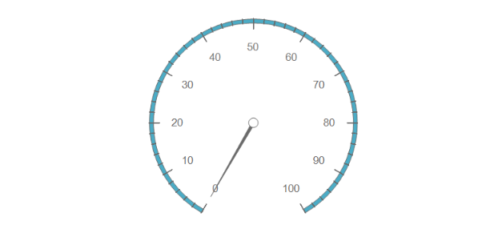
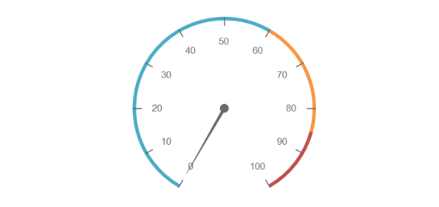
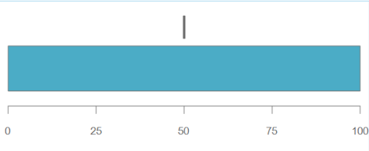
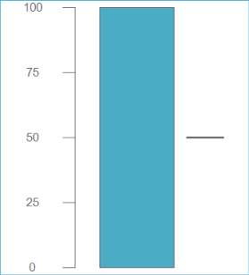
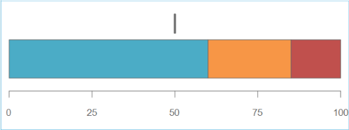
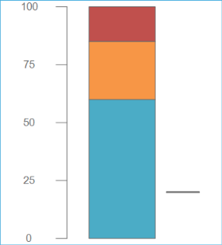

# Gauge Report Item Overview

>note The Gauge Report Item was added with the R2 2023 Release.

The Gauge report item is used to display the key performance indicators (KPIs) that track the amount of progress made towards achieving the targets or goals.

## Gauge Types

### Radial

Radial gauges are circular, or degrees of circular, and resemble speedometers. The gauge pointers are often needles but can be markers or bars too. The radial gauge is typically used when you want to express the data as a velocity.

Telerik Reporting provides the following Radial Gauge report item presets out of the box:

* Single-Range

	

* Multi-Range

	
	
### Linear

Linear gauges are characterized by a linear scale which can be horizontal or vertical. They typically display a metric as a percentage of the length of a linear scale.

Telerik Reporting provides the following Linear Gauge report item presets out of the box:

* Single-Range Horizontal

	

* Single-Range Vertical

	

* Multi-Range Horizontal

	

* Multi-Range Vertical

	

## Next Steps

* [Getting Started with the Radial Gauge Report Item]()
* [Getting Started with the Linear Gauge Report Item]()
* [RadialGauge Class API Reference](/api/Telerik.Reporting.RadialGauge)
* [LinearGauge Class API Reference](/api/Telerik.Reporting.LinearGauge)
* [Demo Page for Telerik Reporting](https://demos.telerik.com/reporting)
* [Knowledge Base Section](/knowledge-base)

## See Also

* [Telerik Reporting Homepage](https://www.telerik.com/products/reporting)
* [Reporting Forums](https://www.telerik.com/forums/reporting)
* [Reporting Blog](https://www.telerik.com/blogs/tag/reporting)
* [Reporting Videos](https://www.telerik.com/videos/reporting)
* [Reporting Roadmap](https://www.telerik.com/support/whats-new/reporting/roadmap)
* [Reporting Pricing](https://www.telerik.com/purchase/individual/reporting)
* [Reporting Training](https://learn.telerik.com/learn/course/external/view/elearning/19/reporting-report-server-training)
