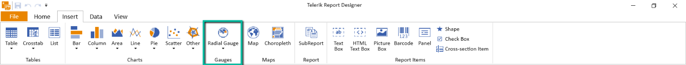
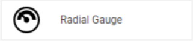

# Using the Radial Gauge Report Item

The steps below will demonstrate how to add the Telerik Reporting Radial Gauge report item to reports.

## Adding a Radial Gauge to the Report

* [Standalone Report Designer]() - The Gauge item can be inserted from the `Insert Ribbon`:

	

* [Web Report Designer]() - The Gauge item can be inserted using the `Components Tab`:

	

* [Visual Studio Report Designer]() - The Gauge item can be inserted from the [Visual Studio Toolbox](https://learn.microsoft.com/en-us/visualstudio/ide/reference/toolbox)

## Properties of the Gauge Report Item

The Gauge Report Item is a [data item]() and as such inherits the properties of the [Telerik.Reporting.DataItem](/api/telerik.reporting.dataitem) class.

### Properties specific to the Appearance

* [`NeedleLength`](/api/Telerik.Reporting.RadialGauge#Telerik_Reporting_RadialGauge_NeedleLength) - Represents a percentage ratio to the total gauge radius. When the value is `100`, the tip of the needle will touch the gauge range.
* [`NeedlePointRadius`](/api/Telerik.Reporting.RadialGauge#Telerik_Reporting_RadialGauge_NeedlePointRadius) - Represents the radius of the point from which the needle starts.
* [`NeedleStyle`](/api/Telerik.Reporting.RadialGauge#Telerik_Reporting_RadialGauge_NeedleStyle) - Represents a [`Style`](/api/telerik.reporting.drawing.style) object for the gauge needle.
* [`NeedleThickness`](/api/Telerik.Reporting.RadialGauge#Telerik_Reporting_RadialGauge_NeedleThickness)- Represents the thickness of the needle.
* [`StartAngle`](/api/Telerik.Reporting.RadialGauge#Telerik_Reporting_RadialGauge_StartAngle) - Represents the number of degrees at which the full gauge arc will start.
* [`SweepAngle`](/api/Telerik.Reporting.RadialGauge#Telerik_Reporting_RadialGauge_SweepAngle) - Represents the number of degrees, between `0` and `360` that the scale will sweep in a circle.

### Properties specific to the Presentation

* `Labels` - The [RadialGaugeLabels](/api/telerik.reporting.radialgaugelabels) collection associated with this gauge item.
	- [`SegmentCount`](/api/telerik.reporting.radialgaugelabels#Telerik_Reporting_RadialGaugeLabels_SegmentCount) - Represents the total count of labels that will be generated. It is recommended to be equal to the count of the `Ticks`.
	- [`FirstVisibleValue`](/api/telerik.reporting.radialgaugelabels#Telerik_Reporting_RadialGaugeLabels_FirstVisibleValue) - Represents the value of the minimum value for which a label will be rendered. Can be used to restraint the label set. If left empty, all labels will be visible.
	- [`LastVisibleValue`](/api/telerik.reporting.radialgaugelabels#Telerik_Reporting_RadialGaugeLabels_LastVisibleValue) - Represents the value of the maximum value for which a label will be rendered. Can be used to restraint the label set. If left empty, all labels will be visible.
	- [`Format`](/api/telerik.reporting.radialgaugelabels#Telerik_Reporting_RadialGaugeLabels_Format) - Represents the [Format](/api/telerik.reporting.textitembase#Telerik_Reporting_TextItemBase_Format) instance used to format the label text.
	- [`Radius`](/api/telerik.reporting.radialgaugelabels#Telerik_Reporting_RadialGaugeLabels_Radius) - Represents the radius at which the labels will be placed in a percentage ratio to the gauge's radius.
	- [`Style`](/api/telerik.reporting.radialgaugelabels#Telerik_Reporting_RadialGaugeLabels_Style) - Represents a [Style](/api/telerik.reporting.drawing.style) instance, used to style labels' elements.
* `Ranges` - The [RadialGaugeRanges](/api/Telerik.Reporting.RadialGaugeRangeCollection) collection associated with this gauge item. A gauge can have multiple ranges. This is how the `Three-range` gauge is implemented.
	- [`ArcRadius`](/api/telerik.reporting.radialgaugerange#Telerik_Reporting_RadialGaugeRange_ArcRadius) - Represents the outer radius of the Gauge arc.
	- [`ArcWidth`](/api/telerik.reporting.radialgaugerange#Telerik_Reporting_RadialGaugeRange_ArcWidth) - Represents in percentage ratio the distance between the inner and outer border of the gauge arc. It is measured in absolute units.
	- [`RangeStart`](/api/telerik.reporting.radialgaugerange#Telerik_Reporting_RadialGaugeRange_RangeStart) - Represents the value at which the given `RadialGaugeRange` will start.
	- [`RangeEnd`](/api/telerik.reporting.radialgaugerange#Telerik_Reporting_RadialGaugeRange_RangeEnd) - Represents the value at which the given `RadialGaugeRange` will end.
	- [`Style`](/api/telerik.reporting.radialgaugerange#Telerik_Reporting_RadialGaugeRange_Style) - Represents a [Style](/api/telerik.reporting.drawing.style) instance, used to style range sectors.
* `Ticks` - The [RadialGaugeTicks](/api/telerik.reporting.radialgaugeticks) collection associated with this gauge item.
	- [`SegmentCount`](/api/telerik.reporting.radialgaugeticks#Telerik_Reporting_RadialGaugeTicks_SegmentCount) - Represents the total count of ticks that will be generated. It is recommended to be equal to the count of the `Labels`.
	- [`FirstVisibleIndex`](/api/telerik.reporting.radialgaugeticks#Telerik_Reporting_RadialGaugeTicks_FirstVisibleIndex) - Represents the starting tick index from which ticks will be rendered. Ticks indexing starts at `0`.
	- [`LastVisibleIndex`](/api/telerik.reporting.radialgaugeticks#Telerik_Reporting_RadialGaugeTicks_LastVisibleIndex) - Represents the last tick index until which ticks will be rendered. Ticks indexing starts at `0`.
	- [`Length`](/api/telerik.reporting.radialgaugeticks#Telerik_Reporting_RadialGaugeTicks_Length) - Represents the size of the tick's visual element in percentage ratio to the gauge radius.
	- [`Radius`](/api/telerik.reporting.radialgaugeticks#Telerik_Reporting_RadialGaugeTicks_Radius) - Represents the radius at which the ticks will be placed in a percentage ratio to the gauge's radius. A value higher than `100` would have the engine render the ticks outside the gauge arc.
	- [`TickType`](/api/telerik.reporting.radialgaugeticks#Telerik_Reporting_RadialGaugeTicks_TickType) - Represents the type of the shape that will be used for rendering the ticks.
	- [`Style`](/api/telerik.reporting.radialgaugeticks#Telerik_Reporting_RadialGaugeTicks_Style) - Represents a [Style](/api/telerik.reporting.drawing.style) instance, used to style range sectors.

## See Also

* [Gauge Report Item Overview]()
* [Data Items]()
