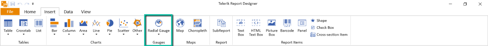
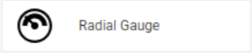

# Using the Radial Gauge Report Item

The steps below will demonstrate how to add the Telerik Reporting Radial Gauge report item to reports.

## Adding a Radial Gauge to the Report

* [Standalone Report Designer](slug:telerikreporting/designing-reports/report-designer-tools/desktop-designers/standalone-report-designer/overview) - The Gauge item can be inserted from the `Insert Ribbon`:

	

* [Web Report Designer](slug:telerikreporting/designing-reports/report-designer-tools/web-report-designer/overview) - The Gauge item can be inserted using the `Components Tab`:

	

* [Visual Studio Report Designer](slug:telerikreporting/designing-reports/report-designer-tools/desktop-designers/visual-studio-report-designer/overview) - The Gauge item can be inserted from the [Visual Studio Toolbox](https://learn.microsoft.com/en-us/visualstudio/ide/reference/toolbox)

## Properties of the Gauge Report Item

The Gauge Report Item is a [data item](slug:telerikreporting/designing-reports/connecting-to-data/data-items/overview) and as such inherits the properties of the [Telerik.Reporting.DataItem](/api/telerik.reporting.dataitem) class.

### Properties specific to the Appearance

* [`Value`](/api/telerik.reporting.radialgauge#telerik_reporting_radialgauge_value) - Represents the value of the gauge for the current instance.
* [`StartAngle`](/api/telerik.reporting.radialgauge#telerik_reporting_radialgauge_startangle) - Represents the number of degrees at which the full gauge arc will start.
* [`SweepAngle`](/api/telerik.reporting.radialgauge#telerik_reporting_radialgauge_sweepangle) - Represents the number of degrees, between `0` and `360`, that the scale will sweep in a circle.
* [`Needle`](/api/telerik.reporting.radialgauge#telerik_reporting_radialgauge_needle) - Represents the [`RadialGaugeNeedle`](/api/telerik.reporting.radialgaugeneedle) instance that defines the appearance of the gauge needle.

	- [`Length`](/api/telerik.reporting.radialgaugeneedle#telerik_reporting_radialgaugeneedle_length) - Represents the length of the needle as a percentage ratio to the total gauge radius. When the value is `100`, the tip of the needle touches the gauge range.
	- [`BackLength`](/api/telerik.reporting.radialgaugeneedle#telerik_reporting_radialgaugeneedle_backlength) - Represents the length of the needle's back (the part behind the pivot point) as a percentage ratio to the total gauge radius.
	- [`PointRadius`](/api/telerik.reporting.radialgaugeneedle#telerik_reporting_radialgaugeneedle_pointradius) - Represents the radius of the needle's pivot point as a percentage ratio to the total gauge radius.
	- [`Thickness`](/api/telerik.reporting.radialgaugeneedle#telerik_reporting_radialgaugeneedle_thickness) - Represents the thickness of the needle as a percentage ratio to the total gauge radius.
	- [`Style`](/api/telerik.reporting.radialgaugeneedle#telerik_reporting_radialgaugeneedle_style) - Represents a [`Style`](/api/telerik.reporting.drawing.style) object used to style the gauge needle.

> note Starting with [Telerik Reporting R2 2023 SP1 (17.1.23.718)](https://www.telerik.com/support/whats-new/reporting/release-history/progress-telerik-reporting-r2-2023-sp1-17-1-23-718), the needle settings are exposed in the `Needle` property through the dedicated [`RadialGaugeNeedle`](/api/telerik.reporting.radialgaugeneedle) class. The previous `NeedleLength`, `NeedlePointRadius`, `NeedleStyle`, and `NeedleThickness` properties on `RadialGauge` have been removed.

### Properties specific to the Presentation

* [Labels](/api/telerik.reporting.radialgauge#telerik_reporting_radialgauge_labels) - The [RadialGaugeLabels](/api/telerik.reporting.radialgaugelabels) collection associated with this gauge item.
	- [SegmentCount](/api/telerik.reporting.radialgaugelabels#telerik_reporting_radialgaugelabels_segmentcount) - Represents the total count of labels that will be generated. It is recommended to be equal to the count of the `Ticks`.
	- [FirstVisibleValue](/api/telerik.reporting.radialgaugelabels#telerik_reporting_radialgaugelabels_firstvisiblevalue) - Represents the minimum value for which a label will be rendered. Can be used to restrict the label set. If left empty, all labels will be visible.
	- [LastVisibleValue](/api/telerik.reporting.radialgaugelabels#telerik_reporting_radialgaugelabels_lastvisiblevalue) - Represents the maximum value for which a label will be rendered. Can be used to restrict the label set. If left empty, all labels will be visible.
	- [Format](/api/telerik.reporting.radialgaugelabels#telerik_reporting_radialgaugelabels_format) - Represents the [Format](/api/telerik.reporting.textitembase#telerik_reporting_textitembase_format) instance used to format the label text.
	- [Radius](/api/telerik.reporting.radialgaugelabels#telerik_reporting_radialgaugelabels_radius) - Represents the radius at which the labels will be placed as a percentage ratio to the gauge's radius.
	- [Style](/api/telerik.reporting.radialgaugelabels#telerik_reporting_radialgaugelabels_style) - Represents a [Style](/api/telerik.reporting.drawing.style) instance used to style the label elements.
* [Ranges](/api/telerik.reporting.radialgauge#telerik_reporting_radialgauge_ranges) - The [RadialGaugeRangeCollection](/api/telerik.reporting.radialgaugerangecollection) associated with this gauge item. A gauge can have multiple ranges. This is how the `Multi-Range` gauge is implemented.
	- [ArcRadius](/api/telerik.reporting.radialgaugerange#telerik_reporting_radialgaugerange_arcradius) - Represents the outer radius of the gauge arc.
	- [ArcWidth](/api/telerik.reporting.radialgaugerange#telerik_reporting_radialgaugerange_arcwidth) - Represents, as a percentage ratio, the distance between the inner and outer border of the gauge arc.
	- [RangeStart](/api/telerik.reporting.radialgaugerange#telerik_reporting_radialgaugerange_rangestart) - Represents the value at which the given `RadialGaugeRange` will start.
	- [RangeEnd](/api/telerik.reporting.radialgaugerange#telerik_reporting_radialgaugerange_rangeend) - Represents the value at which the given `RadialGaugeRange` will end.
	- [Style](/api/telerik.reporting.radialgaugerange#telerik_reporting_radialgaugerange_style) - Represents a [Style](/api/telerik.reporting.drawing.style) instance used to style range sectors.
* [Ticks](/api/telerik.reporting.radialgauge#telerik_reporting_radialgauge_ticks) - The [RadialGaugeTicks](/api/telerik.reporting.radialgaugeticks) collection associated with this gauge item.
	- [SegmentCount](/api/telerik.reporting.radialgaugeticks#telerik_reporting_radialgaugeticks_segmentcount) - Represents the total count of ticks that will be generated. It is recommended to be equal to the count of the `Labels`.
	- [FirstVisibleIndex](/api/telerik.reporting.radialgaugeticks#telerik_reporting_radialgaugeticks_firstvisibleindex) - Represents the starting tick index from which ticks will be rendered. Tick indexing starts at `0`.
	- [LastVisibleIndex](/api/telerik.reporting.radialgaugeticks#telerik_reporting_radialgaugeticks_lastvisibleindex) - Represents the last tick index until which ticks will be rendered. Tick indexing starts at `0`.
	- [Length](/api/telerik.reporting.radialgaugeticks#telerik_reporting_radialgaugeticks_length) - Represents the size of the tick's visual element as a percentage ratio to the gauge radius.
	- [Radius](/api/telerik.reporting.radialgaugeticks#telerik_reporting_radialgaugeticks_radius) - Represents the radius at which the ticks will be placed as a percentage ratio to the gauge's radius. A value higher than `100` would have the engine render the ticks outside the gauge arc.
	- [TickType](/api/telerik.reporting.radialgaugeticks#telerik_reporting_radialgaugeticks_ticktype) - Represents the type of the shape that will be used for rendering the ticks.
	- [Style](/api/telerik.reporting.radialgaugeticks#telerik_reporting_radialgaugeticks_style) - Represents a [Style](/api/telerik.reporting.drawing.style) instance used to style the ticks.

## See Also

* [Gauge Report Item Overview](slug:telerikreporting/designing-reports/report-structure/gauge/overview)
* [Linear Gauge Configuration and Usage](slug:telerikreporting/designing-reports/report-structure/gauge/linear-gauge)
* [Data Items](slug:telerikreporting/designing-reports/connecting-to-data/data-items/overview)
* [RadialGauge Class API Reference](/api/telerik.reporting.radialgauge)

