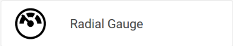

# Getting Started with the Radial Gauge Report Item

This guide shows how to add the Telerik Reporting Radial Gauge report item to reports.

## Adding a Radial Gauge to the Report

- [Standalone Report Designer]() - The Gauge item can be inserted using the `Insert Ribbon`:

- [Web Report Designer]() - The Gauge item can be inserted using the `Components Tab`:

- [Visual Studio Report Designer]() - The Gauge item can be inserted from the [Visual Studio Toolbox](https://learn.microsoft.com/en-us/visualstudio/ide/reference/toolbox)

## Properties of the Gauge Report Item

The Gauge Report Item is a data item and as such inherits the properties of the [Telerik.Reporting.DataItem](/api/telerik.reporting.dataitem) class.

### Properties specific to the Appearance

- `NeedleLength` - Represents a percentage ratio to the total gauge radius. When the valueis 100, the tip of the needle will touch the gauge range.
- `NeedlePointRadius` - Represents the radius of the point from which the needle starts.
- `NeedleStyle` - Represents a [`Style`](/api/telerik.reporting.drawing.style) object for the gauge needle.
- `NeedleThickness`- Represents the thickness of the needle
- `StartAngle` - Represents the number of degrees at which the full gauge arc will start.
- `SweepAngle` - Represents the number of degrees, between 0 and 360 that the scale will sweep in a circle

### Properties specific to the Presentation

- `Labels` - The [RadialGaugeLabels] collection associated with this gauge item.
	- `Count` - Represents the total count of labels that will be generated. It is recommended to be equal to the count of the `Ticks`.
	- `FirstVisibleValue` - Represents the value of the minimum value for which a label will be rendered. Can be used to restraint the label set. If left empty, all labels will be visible.
	- `LastVisibleValue` - Represents the value of the maximum value for which a label will be rendered. Can be used to restraint the label set. If left empty, all labels will be visible.
	- `Format` - Represents the [Format](/api/telerik.reporting.textitembase#Telerik_Reporting_TextItemBase_Format) instance used to format the label text.
	- `Radius` - Represents the radius at which the labels will be placed in a percentage ratio to the gauge's radius.
	- `Style` - Represents a [Style](/api/telerik.reporting.drawing.style) instance, used to style labels' elements.
- `Ranges` - The [RadialGaugeRanges] collection associated with this gauge item. A gauge can have multiple ranges, that is how the `Three-range` gauge is implemented.
	- `ArcRadius` - Represents the outer radius of the Gauge arc.
	- `ArcWidth` - Represents in percentage ratio the distance between the inner and outer border of the gauge arc.
	- `RangeEnd` - Represents the value at which the given `RadialGaugeRange` will end.
	- `RangeStart` - Represents the value at which the given `RadialGaugeRange` will start.
	- `Style` - Represents a [`Style`](/api/telerik.reporting.drawing.style) instance, used to style range sectors.
- `Ticks` - The [RadialGaugeTicks] collection associated with this gauge item.
	- `Count` - Represents the total count of ticks that will be generated. It is recommended to be equal to the count of the `Labels`.
	- `FirstVisibleIndex` - Represents the starting tick index from which ticks will be rendered. Ticks indexing starts at 0.
	- `LastVisibleIndex` - Represents the last tick index until which ticks will be rendered. Ticks indexing starts at 0.
	- `Length` - Represents the size of the tick's visual element in percentage ratio to the gauge radius.
	- `Radius` - Represents the radius at which the ticks will be placed in a percentage ratio to the gauge's radius. A value higher than 100 would have the engine render the ticks outside the gauge arc.
	- `Type` - Represents the type of the shape that will be used for rendering the ticks.
	- `Style` - Represents a [Style](/api/telerik.reporting.drawing.style) instance, used to style range sectors.