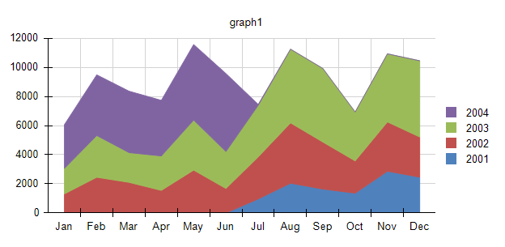
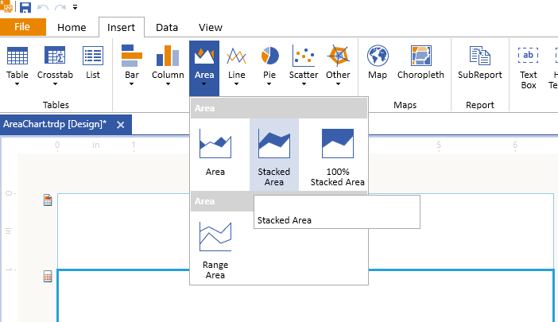
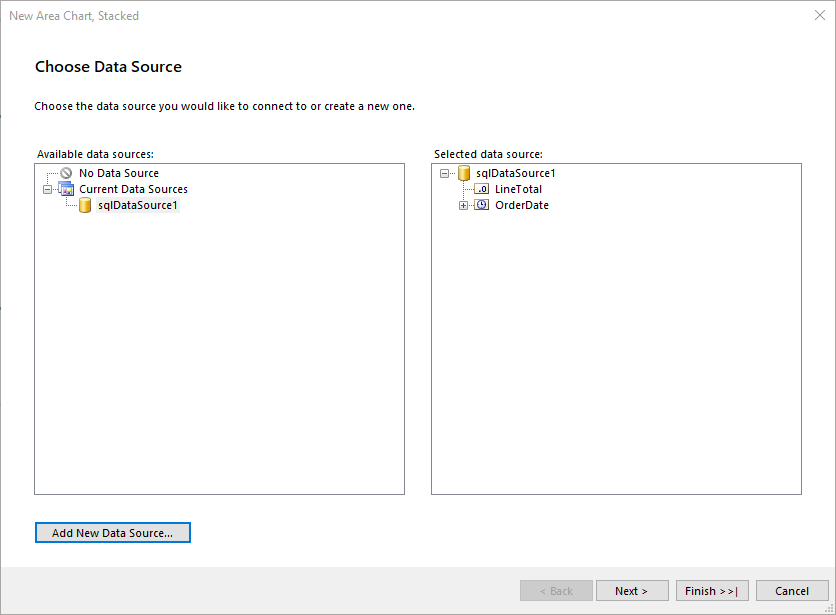
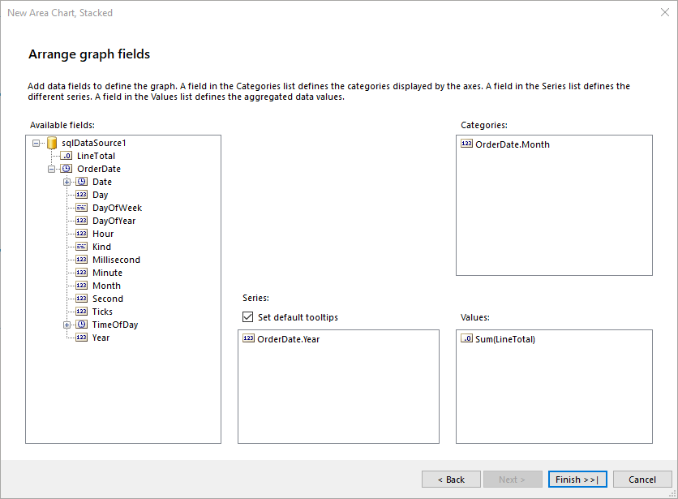

# Creating and Customizing Area Charts

An Area chart displays a series as a set of points connected by a line with the whole area filled in under the line.

Area charts are appropriate for visualizing data that fluctuates over a period of time and can be useful for emphasizing trends. Values with gradual variation work best for Area charts.

The following image shows an example of a Stacked Area chart:

## Types

The Graph supports the following Area chart types:

* **Stacked Area Charts**&mdash;An Area chart where multiple series are stacked vertically. If there is only one series in the chart, the Stacked Area chart appears the same as an Area chart.
* **100% Percent Stacked Area Charts**&mdash;An Area chart where multiple series are stacked vertically to fit the entire chart area. If there is only one series in the chart, the Stacked Area chart appears the same as an Area chart.
* **Smooth Area Charts**&mdash;An Area chart where data points are connected by a smooth line instead of a straight line. Smooth Area charts are suitable for displaying trends rather than individual data point values.

## Creating Area Charts with the Area Chart Wizard

The following steps demonstrate how to create a Stacked Area chart using the Area Chart Wizard. In this example, the chart compares total monthly sales by year.

The sample report uses a `SqlDataSource` connected to the AdventureWorks sample database. The query below returns the required fields:

{{source=CodeSnippets\CS\SQL\SelectSalesOrdersByDate.sql}}
To create the Stacked Area chart by using the Area Chart Wizard: 

1. Add a Stacked Area chart:

	

1. Select the SqlDataSource, or create it with the **Add New Data Source...** button and by using the query above:

	

1. Arrange the Area Chart:

	1. Drag the `OrderDate.Month` field to **Categories**.
	1. Drag the `OrderDate.Year` field to **Series**.
	1. Drag the `LineTotal` field to **Values**. The wizard automatically applies the `Sum` [aggregate function](slug:telerikreporting/designing-reports/connecting-to-data/expressions/expressions-reference/functions/aggregate-functions).

	

1. The `LineTotal` value is large. Change the `Data > Y` [expression](slug:telerikreporting/designing-reports/connecting-to-data/expressions/overview) of `areaSeries` from `=Sum(Fields.LineTotal)` to `=ISNULL(Sum(Fields.LineTotal), 0) / 1000.0`. The expression includes a null check that replaces null values with `0`.

1. Set the Graph Category's `Label` to `= Format("{0:MMM}", Fields.OrderDate)`. This formats the **Category** labels to show the month abbreviation instead of the month number.

For the full report implementation, see the [AreaChart.trdp sample on GitHub](https://github.com/telerik/reporting-samples/blob/master/graph-samples/AreaChart.trdp).

## Creating Area Charts Manually

The following steps create a Stacked Area chart without the wizard.

### 1. Add the Graph

Add a new Graph report item to the report as described in [Getting Started with the Graph Report Item](slug:graph_item_get_started).

### 2. Set the SeriesGroups Hierarchy

Set the **SeriesGroups** hierarchy:

1. Open the **SeriesGroups** collection editor and click **Add**.
1. Set **Groupings** to `=Fields.OrderDate.Year`.
1. Set **Sortings** to `=Fields.OrderDate.Year`.
1. Set **Name** to `seriesGroup1`.

### 3. Set the CategoryGroups Hierarchy

Define the **CategoryGroups** hierarchy:

1. Open the **CategoryGroups** collection editor and click **Add**.
1. Set **Groupings** to `=Fields.OrderDate.Month`.
1. Set **Sortings** to `=Fields.OrderDate.Month`.
1. Set **Name** to `categoryGroup1`.

### 4. Configure the Coordinate System

Specify the coordinate system details:

1. Open the **CoordinateSystems** collection editor and **Add** a new `CartesianCoordinateSystem`.
1. Leave **Name** as `cartesianCoordinateSystem1`.
1. Set **XAxis** to **New Axis with Category Scale**.
1. Set **YAxis** to **New Axis with Numerical Scale**.

### 5. Configure the Series

Configure the series:

1. Open the **Series** collection editor and **Add** a new `AreaSeries`.
1. Set **CategoryGroup** to `categoryGroup1`.
1. Set **SeriesGroup** to `seriesGroup1`.
1. Set **CoordinateSystem** to `cartesianCoordinateSystem1`.
1. Set **ArrangeMode** to **Stacked**.
1. Set the **Y** value to `=ISNULL(Sum(Fields.LineTotal), 0) / 1000.0`.

### 6. Style the Appearance

For color palette, label formatting, legend configuration, and other styling options, see [Formatting a Graph](slug:telerikreporting/designing-reports/report-structure/graph/formatting-a-graph/style-resolving-fallback-algorithm).

## See Also

* [(Demo) Employee Sales Report with Area Charts](https://demos.telerik.com/reporting/employee-sales)
* [(Demo) Crypto Dashboard Report with Area Charts](https://demos.telerik.com/reporting/crypto-dashboard)
* [(Demo TRDP Report) AreaChart.trdp](https://github.com/telerik/reporting-samples/blob/master/graph-samples/AreaChart.trdp)
