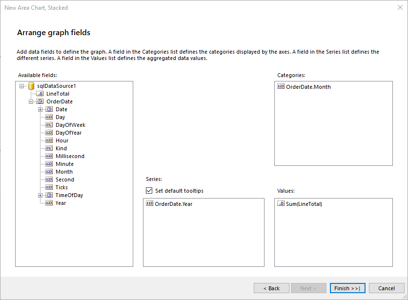

# Creating and Customizing Area Charts

An Area chart displays a series as a set of points connected by a line with the whole area filled in under the line.

Area charts are appropriate for visualizing data that fluctuates over a period of time and can be useful for emphasizing trends. Values that don't vary too wildly work best for Area charts.

The following image shows an example of a Stacked Area chart:


## Types

The Graph supports the following Area chart types:

* __Stacked Area Charts__&mdash;An Area chart where multiple series are stacked vertically. If there is only one series in the chart, the Stacked Area chart will appear in the same way as an Area chart.
* __100% Percent Stacked Area Charts__&mdash;An Area chart where multiple series are stacked vertically to fit the entire chart area. If there is only one series in the chart, the Stacked Area chart will appear in the same way as an Area chart.
* __Smooth Area Charts__&mdash;An Area chart where the data points are connected by a smooth line instead of a regular line. Smooth Area charts are suitable for displaying trends rather than values of individual data points.

## Creating Area Charts with the Area Chart Wizard

In this section, you will learn how to create an Area Chart with the Telerik Reporting Area Chart Wizard. For the purposes of this guide, the Area Chart will be Stacked and will compare the total monthly sales by years. The final report will look like the image above.

The sample report will use a pre-defined SqlDataSource that connects to the example AdventureWorks database. The query that returns the needed fields is the following:

````SQL
SELECT
	[Sales].[SalesOrderHeader].[OrderDate],
	[Sales].[SalesOrderDetail].[LineTotal]
FROM
	[Sales].[SalesOrderDetail] INNER JOIN
	[Sales].[SalesOrderHeader] ON [Sales].[SalesOrderDetail].[SalesOrderID] = [Sales].[SalesOrderHeader].[SalesOrderID]
````

To create the Stacked Area chart by using the Area Chart Wizard: 

1. Add a Stacked Area chart:

	

1. Select the SqlDataSource, or create it with the **Add New Data Source...** button and by using the query above:

	

1. Arrange the Area Chart:

	1. Drag the __OrderDate.Month__ field to **Categories**.
	1. Drag the __OrderDate.Year__ field to the **Series**.
	1. Drag the __LineTotal__ field to the **Values**. The wizard will automatically apply the `Sum` [aggregate function]().

	

1. The `LineTotal` value is large, so let's change the `Data > Y` [expression]() of `areaSeries` that is currently `=Sum(Fields.LineTotal)` to `=ISNULL(Sum(Fields.LineTotal), 0) / 1000.0`. Note that a `Null` check is also included and the `Null` values to be replaced with a `0` (zero).

1. Set the Graph Category's `Label` to `= Format("{0:MMM}", Fields.OrderDate)`. This action will force the **Category** labels that are months in this example to be displayed with the abbreviations of the month names rather than the default month number.

To see the full implementation of the sample report, refer to the [AreaChart.trdp](https://github.com/telerik/reporting-samples/blob/master/graph-samples/AreaChart.trdp) project on GitHub.

## Creating Area Charts Manually

This section will show how to manually create a Stacked Area chart.

### 1. Add the Graph

To add a new Graph report item to the report, refer to the article on [getting started with the Graph report item]().

### 2. Set the SeriesGroups Hierarchy 

Now you can set the **SeriesGropus** hierarchy of the Stacked Area chart:

1. Open the __SeriesGroups__ collection editor and click __Add__.
1. Set the __Groupings__ to `=Fields.OrderDate.Year`.
1. Set the __Sortings__ to `=Fields.OrderDate.Year`.
1. Set the __Name__ to `seriesGroup1`.

### 3. Set the CategoryGroups Hierarchy

Next, you will have to define the **CategoryGroups** hierarchy of the Stacked Area chart:

1. Open the __CategoryGroups__ collection editor and click __Add__.
1. Set the __Groupings__ to `=Fields.OrderDate.Month`.
1. Set the __Sortings__ to `=Fields.OrderDate.Month`.
1. Set the __Name__ to `categoryGroup1`.

### 4. Configure the Coordinate System

Here you will specify the coordinate system details:

1. Open the __CoordinateSystems__ collection editor and __Add__ a new __CartesianCoordinateSystem__.
1. Leave the __Name__ to `cartesianCoordinateSystem1`.
1. Set the __XAxis__ to __New Axis with Category Scale__.
1. Set the __YAxis__ to __New Axis with Numerical Scale__.

### 5. Configure the Series

In this step, you will configure the series of the chart:

1. Open the __Series__ collection editor and __Add__ new __AreaSeries__.
1. Set the __CategoryGroup__ to __categoryGroup1__.
1. Set the __SeriesGroup__ to __seriesGroup1__.
1. Set the __CoordinateSystem__ to __cartesianCoordinateSystem1__.
1. Set the __ArrangeMode__ to __Stacked__.
1. Set the __Y__ value to `=ISNULL(Sum(Fields.LineTotal), 0) / 1000.0`.

### 6. Style the Appearance

To set the color palette, format the labels, define the values of the legend, and elaborate on any other styling options, refer to the section on [formatting the Graph]().

## See Also

* [(Demo) Employee Sales Report with Area Charts](https://demos.telerik.com/reporting/employee-sales)
* [(Demo) Crypto Dashboard Report with Area Charts](https://demos.telerik.com/reporting/crypto-dashboard)
* [(Demo TRDP Report) AreaChart.trdp](https://github.com/telerik/reporting-samples/blob/master/graph-samples/AreaChart.trdp)
