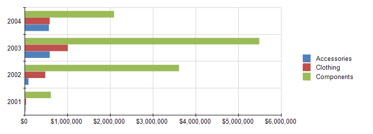

# Bar Charts Overview

A Bar chart displays data series as sets of horizontal bars, graphically summarizes and renders data categories, and enables users to easily compare amounts or values between different categories. 

Bar charts are also useful for comparing multiple series of data because they provide snapshots of data at specific times, and are popular for representing data that occurs over time, with a finite start and end date. Bar charts are also used to show categorical information because you can display the categories horizontally.

The following image shows a typical Bar chart which is well suited for the visualized data because all three series share a common time period and allow for valid comparisons. 

## Types

* __Clustered Bar Charts__&mdash;A Bar chart for displaying series as sets of horizontal bars.
* __Stacked Bar Charts__&mdash;A Bar chart where multiple series are stacked vertically. Stacked Bar charts compare contributions of values to a total across categories. If there is only one series in your chart, the Stacked Bar chart will display in the same way as a Bar chart. 
* __100% Stacked Bar Charts__&mdash;A Bar chart where multiple series are stacked vertically to fit 100% of the chart area. 100% Stacked Bar Charts are used for three or more data series when you want to compare distributions within categories and at the same time display the differences between categories. Each bar represents 100% of the amounts for that category. If there is only one series in your chart, all the bars will fit to 100% of the chart area. 

## Design Considerations

* Bar charts have reversed axes. The category axis is the vertical axis (Y axis) and the value axis is the horizontal axis (X axis). This means that in a Bar chart, you have more space for category labels to display along the Y axis as a list that reads from top to bottom.
* Commonly, Bar and Column charts show comparisons between groups. If more than three series are present on the chart, consider using a Stacked Bar or Column chart.
* A Bar chart displays values from left to right, which may be more intuitive when displaying data related to durations.
* When a Bar chart renders data point labels, the labels are placed on the outside end of each bar (**OutsideEnd**). This behavior may result in a label that is overlapped by its corresponding bar when the bar takes up all of the allotted space within the chart area. To change the position of the data point labels displayed for each bar, set the [`DataPointLabelAlignment`](/reporting/api/Telerik.Reporting.BarSeries#Telerik_Reporting_BarSeries_DataPointLabelAlignment) property in the **Properties** tool window.
* If there are many data points in your dataset that are relative to the size of your chart, the size of the bars and the spacing between them are reduced. To modify the width of the bars in a chart, consider changing the __SpacingSlotCount__ property of the __category__ axis scale. By default, the value is `1` which indicates equal widths of the bars and the free space. The greater the value, the more free space is reserved between the bars.
