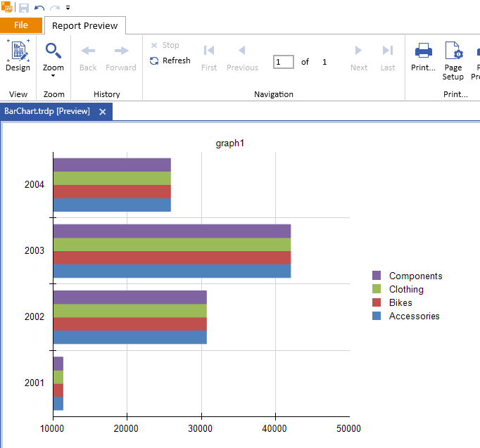
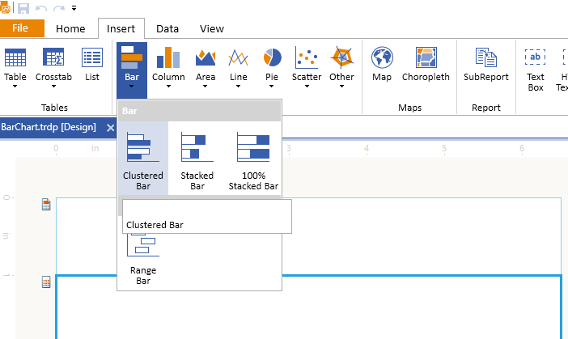
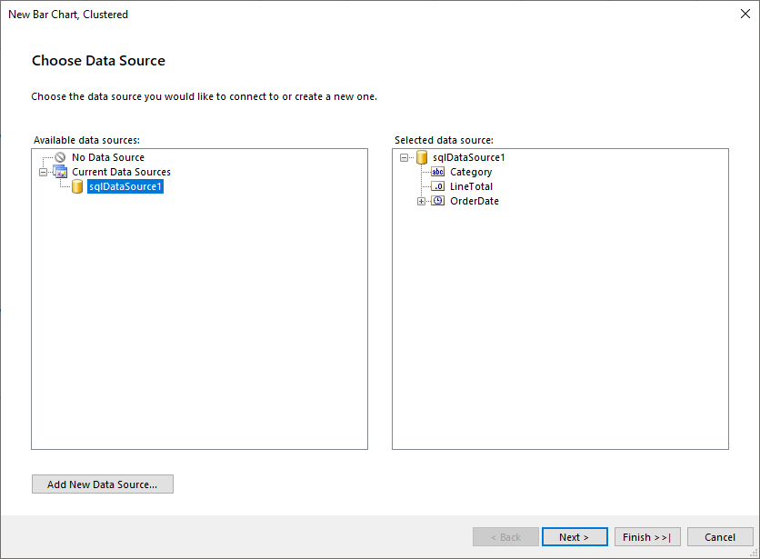
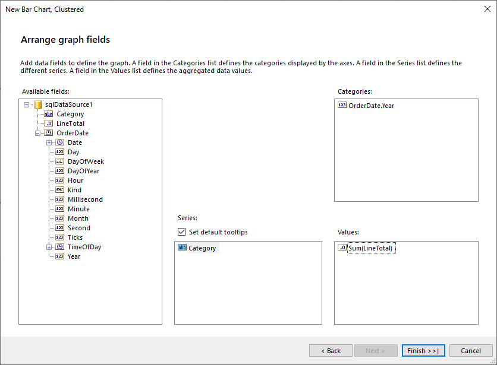

# Creating and Customizing Bar Charts

A bar chart displays data series as sets of horizontal bars. In Telerik Reporting, use a bar chart when you need to compare values across categories and the category labels need more horizontal space.

Bar charts work well for category comparisons, rankings, and time-based summaries. If the same data reads better with vertical bars, use [Column Charts](slug:telerikreporting/designing-reports/report-structure/graph/chart-types/column-charts/overview) instead.

The following preview shows a clustered bar chart built from product category sales by year:

## When to Use a Bar Chart

Use a bar chart when you need to:

- Compare values across categories.
- Display long category names that would be hard to read on a column chart.
- Compare multiple series that share the same set of categories.
- Emphasize ranking or magnitude from left to right.

## Types

The Graph item supports the following bar chart types:

| Type | Use it when | Result |
|---|---|---|
| Clustered Bar | You want to compare individual values across categories | Each series is displayed as a separate horizontal bar |
| Stacked Bar | You want to compare both totals and each series contribution | Each category shows one stacked horizontal bar |
| 100% Stacked Bar | You want to compare percentage distribution across categories | Each category fills 100% of the available bar length |

If you only need one series, a stacked bar chart looks the same as a standard bar chart. Choose a stacked variation only when the contribution of each series matters.

## Creating Bar Charts with the Bar Chart Wizard

This walkthrough creates a clustered bar chart that plots `LineTotal` by `Category` and `OrderDate.Year`. The same field mapping also works for stacked and 100% stacked bar charts.

### Before You Start

Before you run the wizard, make sure that:

- You have a report open in a Telerik Report Designer.
- Your data source returns `Category`, `OrderDate.Year`, and `LineTotal`.
- You know whether you want raw totals or values scaled to thousands for readability.

The sample report uses a predefined `SqlDataSource` that connects to the AdventureWorks sample database. The query that returns the required fields is:

{{source=CodeSnippets\CS\SQL\SelectSalesByCategoryAndDate.sql}}

### Create the Chart

To create the bar chart by using the Bar Chart Wizard:

1. In the designer, add a **Clustered Bar Chart**.

	

1. Select the existing `SqlDataSource`, or click **Add New Data Source...** and create one by using the query above.

	

1. Drag `Category` to **Series**.
1. Drag `OrderDate.Year` to **Categories**.
1. Drag `LineTotal` to **Values**. The wizard automatically applies the `Sum` [aggregate function](slug:telerikreporting/designing-reports/connecting-to-data/expressions/expressions-reference/functions/aggregate-functions).

	

1. Finish the wizard and preview the chart.
1. If you want the value axis to display totals in thousands, select `barSeries` and change `Data > X` from `=Sum(Fields.LineTotal)` to `=ISNULL(Sum(Fields.LineTotal), 0) / 1000.0`.

This configuration creates one series per product category and one category group per year. Because bar charts use horizontal bars, the numerical value is plotted on the X axis.

>tip
> If you want a stacked or 100% stacked bar chart, choose that chart type in the first wizard step. The data source and field mapping steps stay the same.

To see the full implementation of the sample report, refer to the [BarChart.trdp](https://github.com/telerik/reporting-samples/blob/master/graph-samples/BarChart.trdp) project on GitHub.

## Creating Bar Charts Manually

Manual setup is useful when you want full control over the group hierarchy, coordinate system, and series properties.

### 1. Add the Graph

To add a new Graph report item to the report, refer to [Getting Started with the Graph Report Item](slug:graph_item_get_started).

### 2. Set the SeriesGroups Hierarchy

Use the `SeriesGroups` hierarchy to split the chart into separate series for each product category:

1. Open the `SeriesGroups` collection editor and click **Add**.
1. Set `Groupings` to `=Fields.Category`.
1. Set `Sortings` to `=Fields.Category`.
1. Set `Name` to `seriesGroup1`.

If you want the output to match a filtered sample, add a group filter that excludes the category you do not want to display.

### 3. Set the CategoryGroups Hierarchy

Use the `CategoryGroups` hierarchy to create one group for each year:

1. Open the `CategoryGroups` collection editor and click **Add**.
1. Set `Groupings` to `=Fields.OrderDate.Year`.
1. Set `Sortings` to `=Fields.OrderDate.Year`.
1. Set `Name` to `categoryGroup1`.

### 4. Configure the Coordinate System

Bar charts use a numerical X axis and a categorical Y axis because the bars are horizontal:

1. Open the `CoordinateSystems` collection editor and click **Add** to create a new `CartesianCoordinateSystem`.
1. Leave `Name` set to `cartesianCoordinateSystem1`.
1. Set `XAxis` to **New Axis with Numerical Scale**.
1. Set `YAxis` to **New Axis with Category Scale**.

### 5. Configure the Series

Add a `BarSeries` that uses the group hierarchy and coordinate system you just defined:

1. Open the `Series` collection editor and click **Add** to create a new `BarSeries`.
1. Set `CategoryGroup` to `categoryGroup1`.
1. Set `SeriesGroup` to `seriesGroup1`.
1. Set `CoordinateSystem` to `cartesianCoordinateSystem1`.
1. Set `ArrangeMode` to `Clustered`.
1. Set `X` to `=ISNULL(Sum(Fields.LineTotal), 0) / 1000.0`.

### 6. Style the Appearance

To set the color palette, format the labels, define the legend values, and configure other styling options, refer to [Formatting the Graph](slug:telerikreporting/designing-reports/report-structure/graph/formatting-a-graph/style-resolving-fallback-algorithm).

## Design Considerations

Keep the following design considerations in mind:

- Bar charts reverse the usual chart axes. The category axis is the vertical Y axis, and the value axis is the horizontal X axis.
- Use a bar chart when category labels are long and would be hard to read on a column chart.
- If your chart contains more than three series, consider a stacked bar chart to reduce visual clutter.
- By default, data point labels are placed at the outside end of each bar. If labels overlap the bars, change [`DataPointLabelAlignment`](/api/Telerik.Reporting.BarSeries#Telerik_Reporting_BarSeries_DataPointLabelAlignment) in the **Properties** window.
- If the bars become too thin, increase `SpacingSlotCount` on the category axis scale to reserve more space between bars.

## See Also

- [Chart Types Overview](slug:telerikreporting/designing-reports/report-structure/graph/chart-types/overview)
- [Column Charts](slug:telerikreporting/designing-reports/report-structure/graph/chart-types/column-charts/overview)
- [Getting Started with the Graph Report Item](slug:graph_item_get_started)
- [Formatting the Graph](slug:telerikreporting/designing-reports/report-structure/graph/formatting-a-graph/style-resolving-fallback-algorithm)
- [(Demo) Product Line Sales Report with Bar Charts](https://demos.telerik.com/reporting/product-line-sales)
- [(Demo) Dashboard Report with Bar Charts](https://demos.telerik.com/reporting/dashboard)
- [(Demo TRDP Report) BarChart.trdp](https://github.com/telerik/reporting-samples/blob/master/graph-samples/BarChart.trdp)
