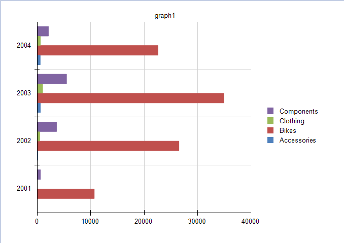

# Creating and Customizing Bar Charts

A Bar chart displays data series as sets of horizontal bars, graphically summarizes and renders data categories, and enables users to easily compare amounts or values between different categories.

Bar charts are also useful for comparing multiple series of data because they provide snapshots of data at specific times, and are popular for representing data that occurs over time, with a finite start and end date. Bar charts are also used to show categorical information because you can display the categories horizontally.

The following image shows a typical Bar chart which is well suited for the visualized data because all four series share a common time period and allow for valid comparisons.



## Types

The Graph supports the following Bar chart types: 

* __Clustered Bar Charts__&mdash;A Bar chart for displaying series as sets of horizontal bars.
* __Stacked Bar Charts__&mdash;A Bar chart where multiple series are stacked vertically. Stacked Bar charts compare contributions of values to a total across categories. If there is only one series in your chart, the Stacked Bar chart will display in the same way as a Bar chart.
* __100% Stacked Bar Charts__&mdash;A Bar chart where multiple series are stacked vertically to fit 100% of the chart area. 100% Stacked Bar Charts are used for three or more data series when you want to compare distributions within categories and at the same time display the differences between categories. Each bar represents 100% of the amounts for that category. If there is only one series in your chart, all the bars will fit to 100% of the chart area.

## Creating Bar Charts with the Bar Chart Wizard

In this section, you will learn how to create a Bar chart with the Telerik Reporting Bar Chart Wizard. You will create a Clustered Bar Chart that displays the **LineTotal** of the Product Categories by Years. The final report will look like the image above.

In the general case, you can select a Stacked Bar or a 100% Stacked Bar chart. The required settings are basically the same.

The sample report will use a pre-defined SqlDataSource that connects to the example AdventureWorks database. The query that returns the needed fields is the following:

````SQL
SELECT
	[Production].[ProductCategory].[Name] AS 'Category',
	[Sales].[SalesOrderHeader].[OrderDate],
	[Sales].[SalesOrderDetail].[LineTotal]
FROM
	[Production].[Product] INNER JOIN
	[Production].[ProductSubcategory] ON [Production].[Product].[ProductSubcategoryID] = [Production].[ProductSubcategory].[ProductSubcategoryID] INNER JOIN
	[Production].[ProductCategory] ON [Production].[ProductSubcategory].[ProductCategoryID] = [Production].[ProductCategory].[ProductCategoryID] INNER JOIN
	[Sales].[SalesOrderDetail] ON [Production].[Product].[ProductID] = [Sales].[SalesOrderDetail].[ProductID] INNER JOIN
	[Sales].[SalesOrderHeader] ON [Sales].[SalesOrderDetail].[SalesOrderID] = [Sales].[SalesOrderHeader].[SalesOrderID] AND [Sales].[SalesOrderDetail].[SalesOrderID] = [Sales].[SalesOrderHeader].[SalesOrderID] AND 
	[Sales].[SalesOrderDetail].[SalesOrderID] = [Sales].[SalesOrderHeader].[SalesOrderID]
````

To create the Bar chart by using the Bar Chart Wizard:

1. Add a Clustered Bar chart as shown in the image below:

	

1. Select the SqlDataSource, or create it with the **Add New Data Source...** button and by using the query above:

	

1. Arrange the Bar Chart:

	1. Drag the __Category__ field to **Series**.
	1. Drag the __OrderDate.Year__ field to **Categories**.
	1. Drag the __LineTotal__ field to the **Values**. The wizard will automatically apply the `Sum` [aggregate function]().

	

1. The `LineTotal` value is large, so let's change the `Data > X` [expression]() of `barSeries` that is currently `=Sum(Fields.LineTotal)` to `=ISNULL(Sum(Fields.LineTotal), 0) / 1000.0`. Note that a `Null` check is also included and the `Null` values to be replaced with a `0` (zero).

To see the full implementation of the sample report, refer to the [BarChart.trdp](https://github.com/telerik/reporting-samples/blob/master/graph-samples/BarChart.trdp) project on GitHub.

## Creating Bar Charts Manually

This section will show how to manually create a Bar chart.

### 1. Add the Graph

To add a new Graph report item to the report, refer to the article on [getting started with the Graph report item]().

### 2. Set the SeriesGroups Hierarchy

Now you can set the **SeriesGropus** hierarchy of the Bar chart:

1. Open the __SeriesGroups__ collection editor and click __Add__.
1. Set the __Groupings__ to `=Fields.Category`.
1. Set the __Sortings__ to `=Fields.Category`.
1. Set the __Filter__ to `=Fields.Category ```<>``` Bikes`.
1. Set the __Name__ to `seriesGroup1`.

### 3. Set the CategoryGroups Hierarchy

Next, you will have to define the **CategoryGroups** hierarchy of the Bar chart:

1. Open the __CategoryGroups__ collection editor and click __Add__.
1. Set the __Groupings__ to `=Fields.OrderDate.Year`.
1. Set the __Sortings__ to `=Fields.OrderDate.Year`.
1. Set the __Name__ to `categoryGroup1`.

### 4. Configure the Coordinate System

Here you will specify the coordinate system details:

1. Open the __CoordinateSystems__ collection editor and __Add__ a new __CartesianCoordinateSystem__.
1. Leave the __Name__ to `cartesianCoordinateSystem1`.
1. Set the __XAxis__ to __New Axis with Numerical Scale__.
1. Set the __YAxis__ to __New Axis with Category Scale__.

### 5. Configure the Series

In this step, you will configure the series of the chart:

1. Open the __Series__ collection editor and __Add__ new __BarSeries__.
1. Set the __CategoryGroup__ to __categoryGroup1__.
1. Set the __SeriesGroup__ to __seriesGroup1__.
1. Set the __CoordinateSystem__ to __cartesianCoordinateSystem1__.
1. Set the __ArrangeMode__ to __Clustered__.
1. Set the __X__ value to `=ISNULL(Sum(Fields.LineTotal), 0) / 1000.0`.

### 6. Style the Appearance

To set the color palette, format the labels, define the values of the legend, and elaborate on any other styling options, refer to the section on [formatting the Graph]().

## Design Considerations

* Bar charts have reversed axes. The category axis is the vertical axis (Y axis) and the value axis is the horizontal axis (X axis). This means that in a Bar chart, you have more space for category labels to display along the Y axis as a list that reads from top to bottom.
* Commonly, Bar and Column charts show comparisons between groups. If more than three series are present on the chart, consider using a Stacked Bar or Column chart.
* A Bar chart displays values from left to right, which may be more intuitive when displaying data related to durations.
* When a Bar chart renders data point labels, the labels are placed on the outside end of each bar (**OutsideEnd**). This behavior may result in a label that is overlapped by its corresponding bar when the bar takes up all of the allotted space within the chart area. To change the position of the data point labels displayed for each bar, set the [`DataPointLabelAlignment`](/api/Telerik.Reporting.BarSeries#Telerik_Reporting_BarSeries_DataPointLabelAlignment) property in the **Properties** tool window.
* If there are many data points in your dataset that are relative to the size of your chart, the size of the bars and the spacing between them are reduced. To modify the width of the bars in a chart, consider changing the __SpacingSlotCount__ property of the __category__ axis scale. By default, the value is `1` which indicates equal widths of the bars and the free space. The greater the value, the more free space is reserved between the bars.

## See Also

* [(Demo) Product Line Sales Report with Bar Charts](https://demos.telerik.com/reporting/product-line-sales)
* [(Demo) Dashboard Report with Bar Charts](https://demos.telerik.com/reporting/dashboard)
* [(Demo TRDP Report) BarChart.trdp](https://github.com/telerik/reporting-samples/blob/master/graph-samples/BarChart.trdp)
