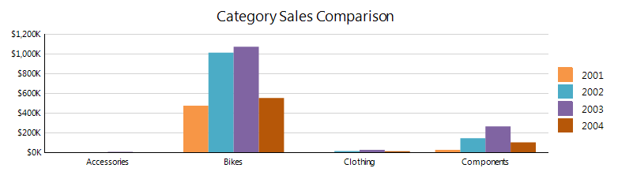

# Column Charts Overview

A Column chart displays data series as sets of vertical bars that are grouped by category. 

Column charts are useful for showing data changes over a period of time or for illustrating comparisons among items. The plain Column chart is closely related to the Bar chart, which displays series as sets of horizontal bars, and to the Range Column chart, which displays series as sets of vertical bars with varying beginning and end points. 

The following image shows a typical Column chart: 

## Types 

* __Clustered Column Charts__&mdash;The basic Column chart type for displaying series as sets of vertical bars that are grouped by category. 
* __Stacked Column Chart__&mdash;A Column chart where multiple series are stacked vertically. Stacked Column charts compare contributions of values to a total across categories. If there is only one series in your chart, the Stacked Column chart will display in the same way as a Column chart. 
* __100% Stacked Column Chart__&mdash;A Column chart where multiple series are stacked vertically to fit 100% of the chart area. 100% Stacked Column Charts are used when you have three or more data series and want to compare distributions within categories, and at the same time display the differences between categories. Each column bar represents 100% of the amounts for that category. If there is only one series in your chart, all the column bars will fit to 100% of the chart area. 

## Design Considerations

* Column charts are most commonly used to show comparisons between groups. If more than three series are present on the chart, consider using a Stacked Column chart. 
* In a Column chart, you have less space for the category axis labels to display horizontally. If you have longer category labels, consider using a Bar chart or changing the rotation angle of the label through the __LabelAngle__ property of the axis. 
* If there are many data points in your dataset that are relative to the size of your chart, the size of the columns and the spacing between them are reduced. To modify the width of the columns in a chart, consider changing the __SpacingSlotCount__ property of the __category__ axis scale. By default, the value is `1` which indicates equal widths of the column and the free space. The greater the value, the more free space is reserved between the columns. 
