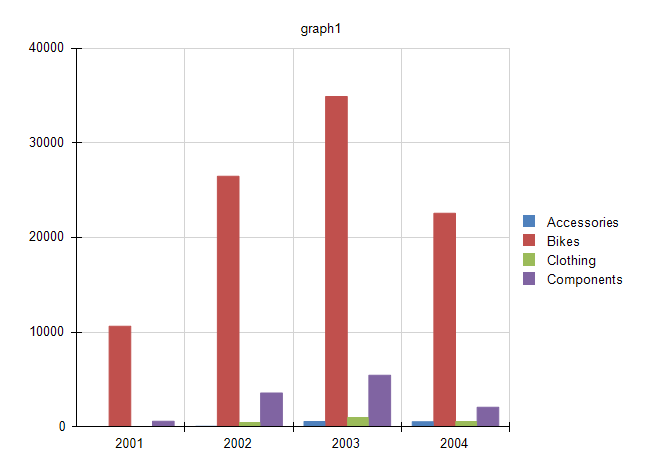
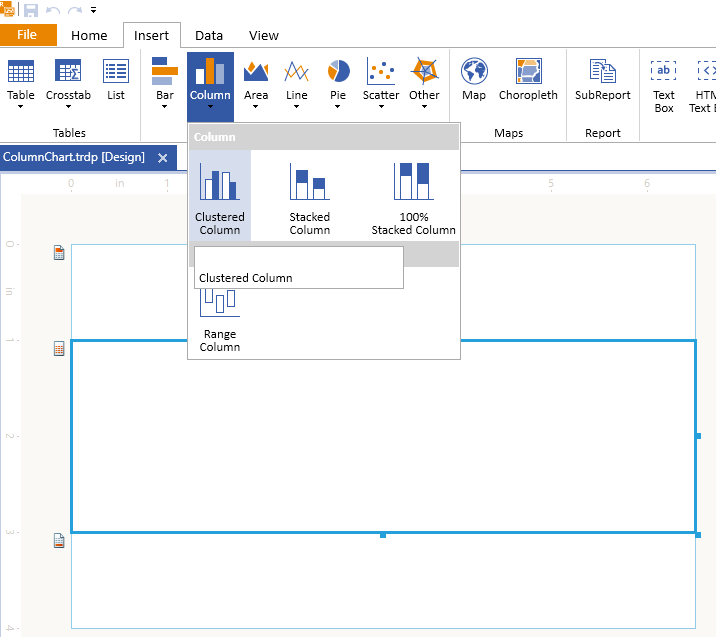
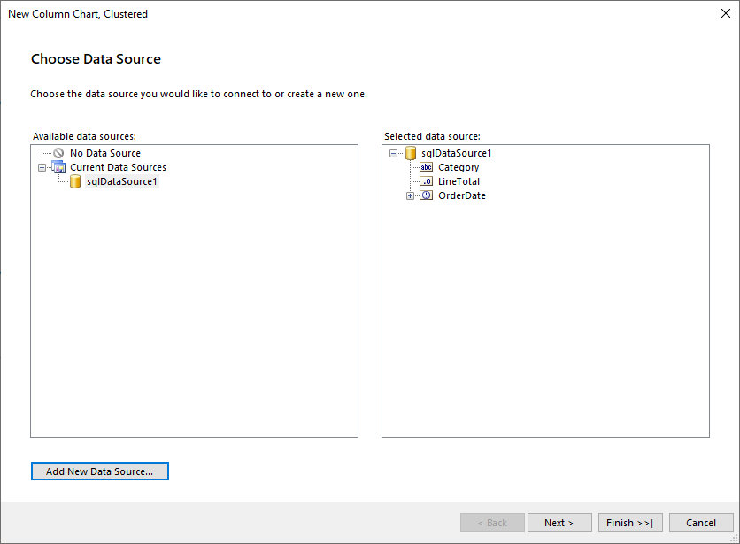
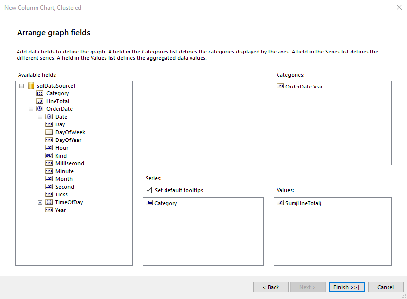

# Column Charts

A Column chart displays data series as sets of vertical bars that are grouped by category. 

Column charts are useful for showing data changes over a period of time or for illustrating comparisons among items. The plain Column chart is closely related to the Bar chart, which displays series as sets of horizontal bars, and to the Range Column chart, which displays series as sets of vertical bars with varying beginning and end points. 

The following image shows a typical Column chart: 



## Types 

* __Clustered Column Charts__&mdash;The basic Column chart type for displaying series as sets of vertical bars that are grouped by category. 
* __Stacked Column Chart__&mdash;A Column chart where multiple series are stacked vertically. Stacked Column charts compare contributions of values to a total across categories. If there is only one series in your chart, the Stacked Column chart will display in the same way as a Column chart. 
* __100% Stacked Column Chart__&mdash;A Column chart where multiple series are stacked vertically to fit 100% of the chart area. 100% Stacked Column Charts are used when you have three or more data series and want to compare distributions within categories, and at the same time display the differences between categories. Each column bar represents 100% of the amounts for that category. If there is only one series in your chart, all the column bars will fit to 100% of the chart area. 

## Creating Column Charts with the Column Chart Wizard

In this section, you will learn how to create a Column chart with our Column Chart Wizard.
We are going to create a `Clustered Column` Chart that displays the LineTotal of the Product Categories by Years. The final report will look like the image above.
In the general case, you may select `Stacked Column` or `100% Stacked Column`. The requiered settings are basically the same. 

We will use a pre-defined SqlDataSource connecting to the example AdventureWorks database. Here is the query that returns the needed fields:

````SQL
SELECT
	[Production].[ProductCategory].[Name] AS 'Category',
	[Sales].[SalesOrderHeader].[OrderDate],
	[Sales].[SalesOrderDetail].[LineTotal]
FROM
	[Production].[Product] INNER JOIN
	[Production].[ProductSubcategory] ON [Production].[Product].[ProductSubcategoryID] = [Production].[ProductSubcategory].[ProductSubcategoryID] INNER JOIN
	[Production].[ProductCategory] ON [Production].[ProductSubcategory].[ProductCategoryID] = [Production].[ProductCategory].[ProductCategoryID] INNER JOIN
	[Sales].[SalesOrderDetail] ON [Production].[Product].[ProductID] = [Sales].[SalesOrderDetail].[ProductID] INNER JOIN
	[Sales].[SalesOrderHeader] ON [Sales].[SalesOrderDetail].[SalesOrderID] = [Sales].[SalesOrderHeader].[SalesOrderID] AND [Sales].[SalesOrderDetail].[SalesOrderID] = [Sales].[SalesOrderHeader].[SalesOrderID] AND 
	[Sales].[SalesOrderDetail].[SalesOrderID] = [Sales].[SalesOrderHeader].[SalesOrderID]
````


1. Add Clustered Column Chart as shown in the image below:

	

1. Select the SqlDataSource, or create it with the button `Add New Data Source...` and the above query:

	

1. Arrange the Column Chart:

	* Drag the field _Category_ to the `Series`
	* Drag the field _OrderDate.Year_ to the `Categories`
	* Drag the field _LineTotal_ to the `Values`. The wizard automatically applies the `Sum` [aggregate function]().

	

1. The LineTotal value is large, so let's change the barSeries `Data > Y` [Expression]() that is currently _=Sum(Fields.LineTotal)_ to `=ISNULL(Sum(Fields.LineTotal), 0) / 1000.0`. Note that we included also a Null check, so that the Null values to be replaced with 0 (zero).

## Creating Column Charts Manually

In this section, you will create a Column chart.

### 1. Add the Graph

To add a new Graph report item to the report, refer to the article [getting started with the Graph report item](). 

### 2. Set the SeriesGroups Hierarchy 

Now you can set the **SeriesGropus** hierarchy of the Column chart: 

1. Open the __SeriesGroups__ collection editor and click __Add__.
1. Set the __Groupings__ to `=Fields.OrderDate.Year`.
1. Set the __Sortings__ to `=Fields.OrderDate.Year`. 
1. Set the __Name__ to `seriesGroup1`. 

### 3. Set the CategoryGroups Hierarchy

Next, you will have to define the **CategoryGroups** hierarchy of the Column chart:

1. Open the __CategoryGroups__ collection editor and click __Add__. 
1. Set the __Groupings__ to `=Fields.Category`.
1. Set the __Sortings__ to `=Fields.Category`.
1. Set the __Name__ to `categoryGroup1`. 
 
### 4. Configure the Coordinate System

Here you will specify the coordinate system details: 

1. Open the __CoordinateSystems__ collection editor and __Add__ a new __CartesianCoordinateSystem__. 
1. Leave the __Name__ to `cartesianCoordinateSystem1`. 
1. Set the __XAxis__ to __New Axis with Category Scale__. 
1. Set the __YAxis__ to __New Axis with Numerical Scale__. 
 
### 5. Configure the Series

In this step, you will configure the series of the chart:

1. Open the __Series__ collection editor and __Add__ new __BarSeries__. 
1. Set the __CategoryGroup__ to __categoryGroup1__. 
1. Set the __SeriesGroup__ to __seriesGroup1__. 
1. Set the __CoordinateSystem__ to __cartesianCoordinateSystem1__. 
1. Set the __ArrangeMode__ to __Clustered__. 
1. Set the __Y__ value to `=ISNULL(Sum(Fields.LineTotal), 0) / 1000.0`.

### 6. Style the Appearance   

To set the color palette, format the labels, define the values of the legend, and elaborate on any other styling options, refer to the section on [formatting the Graph](). 

## Design Considerations

* Column charts are most commonly used to show comparisons between groups. If more than three series are present on the chart, consider using a Stacked Column chart. 
* In a Column chart, you have less space for the category axis labels to display horizontally. If you have longer category labels, consider using a Bar chart or changing the rotation angle of the label through the __LabelAngle__ property of the axis. 
* If there are many data points in your dataset that are relative to the size of your chart, the size of the columns and the spacing between them are reduced. To modify the width of the columns in a chart, consider changing the __SpacingSlotCount__ property of the __category__ axis scale. By default, the value is `1` which indicates equal widths of the column and the free space. The greater the value, the more free space is reserved between the columns. 

## See Also 

* [(Demo) Olympic Medals Map with Column Charts Report](https://demos.telerik.com/reporting/olympic-medals-map)
* [(Demo) Employee Sales Report with Column Charts Report](https://demos.telerik.com/reporting/employee-sales)
