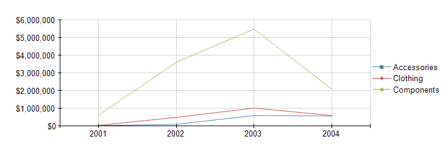
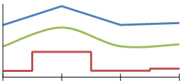

# Line Charts Overview

A Line chart displays series as sets of points connected by a single line and represents large amounts of data that occur over a continuous period of time. 

Line charts can also render series of data points to show trends over a period of time. They enable you to use one or more data series and to tailor the appearance for each series to enhance the data visualization by using unique colors, line thickness, pen style, and point marks. 

The following image displays a Line chart that contains three series. 

## Types

* __Straight Line Chart__&mdash;A Line chart that uses straight lines to connect the data points. 
* __Smooth Line Chart__&mdash;A Line chart that uses curved lines instead of regular ones. 
* __Stepped Line Chart__&mdash;A Line chart that uses horizontal and vertical lines to connect the data points and creates a step-like structure. 

## Design Considerations

* To improve the visual impact of the default Line chart, consider increasing the thickness of the series line to create a bolder line chart.
* A Line chart requires at least two points to draw a line.
* A series that is drawn as a line will not take up much space within a chart area. Therefore, Line charts are frequently combined with other chart types such as Column charts.

