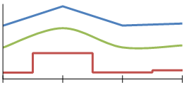

# Line Charts

A Line chart displays series as sets of points connected by a single line and represents large amounts of data that occur over a continuous period of time.

Line charts can also render series of data points to show trends over a period of time. They enable you to use one or more data series and to tailor the appearance for each series to enhance the data visualization by using unique colors, line thickness, pen style, and point marks.

The following image displays a Line chart that contains three series.

## Types

* __Straight Line Chart__&mdash;A Line chart that uses straight lines to connect the data points.
* __Smooth Line Chart__&mdash;A Line chart that uses curved lines instead of regular ones.
* __Stepped Line Chart__&mdash;A Line chart that uses horizontal and vertical lines to connect the data points and creates a step-like structure.

## Creating Line Charts

In this section, you will create a Line chart.

### 1. Add the Graph

To add a new Graph report item to the report, refer to the article [getting started with the Graph report item]().

### 2. Set the SeriesGroups Hierarchy

Now you can set the **SeriesGropus** hierarchy of the Stacked Area chart:

1. Open the __SeriesGroups__ collection editor and click __Add__.
1. Set the __Groupings__ to `=Fields.Category`.
1. Set the __Sortings__ to `=Fields.Category`.
1. Set the __Name__ to `seriesGroup1`.

### 3. Set the CategoryGroups Hierarchy

Next, you will have to define the **CategoryGroups** hierarchy of the Stacked Area chart:

1. Open the __CategoryGroups__ collection editor and click __Add__.
1. Set the __Groupings__ to `=Fields.OrderDate.Year`.
1. Set the __Sortings__ to `=Fields.OrderDate.Year`.
1. Set the __Name__ to `categoryGroup1`.

### 4. Configure the Coordinate System

Here you will specify the coordinate system details: 

1. Open the __CoordinateSystems__ collection editor and __Add__ a new __CartesianCoordinateSystem__.
1. Leave the __Name__ to `cartesianCoordinateSystem1`.
1. Set the __XAxis__ to __New Axis with Category Scale__.
1. Set the __YAxis__ to __New Axis with Numerical Scale__.

### 5. Configure the Series

In this step, you will configure the series of the chart:

1. Open the __Series__ collection editor and __Add__ new __LineSeries__.
1. Set the __CategoryGroup__ to __categoryGroup1__.
1. Set the __SeriesGroup__ to __seriesGroup1__.
1. Set the __CoordinateSystem__ to __cartesianCoordinateSystem1__.
1. Set the __Y__ value to `=Sum(Fields.LineTotal)`.

### 6. Style the Appearance

To set the color palette, format the labels, define the values of the legend, and elaborate on any other styling options, refer to the section on [formatting the Graph]().

## Design Considerations

* To improve the visual impact of the default Line chart, consider increasing the thickness of the series line to create a bolder line chart.
* A Line chart requires at least two points to draw a line.
* A series that is drawn as a line will not take up much space within a chart area. Therefore, Line charts are frequently combined with other chart types such as Column charts.

## See Also

* [Demo Page for Telerik Reporting](https://demos.telerik.com/reporting)
