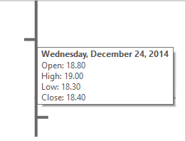

# OHLC Charts Overview

An OHLC chart displays a series of candlestick or bar markers that represent information about the price movement of a stock over a period of time. The price movement is determined by the open, high, low, and close mark values of the stock price which create the layout of the marker. 

Additionally, you can add colors to the markers depending on the movement of the price for this period. If the close level is lower than the open level, it's recognized as a **bearish** pattern and the color or the fill or the marker changes. In this way, it is easily distinguished from the **bullish** pattern where the close level is higher than the open level. 

The following image shows an example of a Candlestick OHLC chart: 

## Types 

You can modify the appearance of the OHLC series markers to cover the two most used types of OHLC charts, Candlestick and Bar. 

* __Candlestick marker__&mdash;The body of the Candlestick marker represents the open and close values of the stock price. The vertical lines (shadows or wicks) represent the high and low values. Based only on the shape of the marker, it is hard to tell if the stock price is rising or falling for the given period. In this case, you can add color to the marker body by using the conditional formatting rules of the data point. 

  

* __Bar marker__&mdash;The Bar markers represent the information about OHLC levels of the price using only lines. The low and high values are shown with a vertical line, and the open and close values are displayed with a horizontal lines. The horizontal line on the left side of the vertical line represents the opening price and the line on the right side represents the closing price. Although the bar marker doesn't need to be colored to understand the trend of the price, you can still apply additional conditional formatting for easier reading of the chart data. 

  

