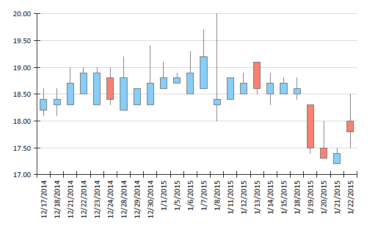

# Creating and Customizing OHLC Charts

An OHLC chart displays a series of candlestick or bar markers that represent information about the price movement of a stock over a period of time. The price movement is determined by the open, high, low, and close mark values of the stock price which create the layout of the marker.

Additionally, you can add colors to the markers depending on the movement of the price for this period. If the close level is lower than the open level, it's recognized as a **bearish** pattern and the color or the fill or the marker changes. In this way, it is easily distinguished from the **bullish** pattern where the close level is higher than the open level.

The following image shows an example of a Candlestick OHLC chart:



## Types

The Graph supports the following OHLC chart types. You can modify the appearance of the OHLC series markers to cover the two most used types of OHLC charts, Candlestick, and Bar.

* __Candlestick marker__&mdash;The body of the Candlestick marker represents the open and close values of the stock price. The vertical lines (shadows or wicks) represent the high and low values. Based only on the shape of the marker, it is hard to tell if the stock price is rising or falling for the given period. In this case, you can add color to the marker body by using the conditional formatting rules of the data point.

	

* __Bar marker__&mdash;The Bar markers represent the information about OHLC levels of the price using only lines. The low and high values are shown with a vertical line, and the open and close values are displayed with a horizontal lines. The horizontal line on the left side of the vertical line represents the opening price and the line on the right side represents the closing price. Although the bar marker doesn't need to be colored to understand the trend of the price, you can still apply additional conditional formatting for easier reading of the chart data.

	

## Creating OHLC Charts with the Candlestick Wizard

In this section, you will create a Candlestick chart with the Telerik Reporting Candlestick Wizard. The Wizard is located under the **Scatter/Financial Chart** menu item.

The report will display the daily changes in a financial marker and its final form will look like the following image:


The sample report will use a pre-defined CsvDataSource with the following data:

````CSV
date,open,high,low,close
03.07.2017,18.2,18.6,18.1,18.4
04.07.2017,18.3,18.6,18.1,18.4
05.07.2017,18.5,19,18.3,18.7
06.07.2017,18.9,19,18.2,18.3
07.07.2017,18.3,18.9,18.3,18.7
10.07.2017,18.8,19.2,18.3,18.4
11.07.2017,18.2,19.2,18.1,18.8
12.07.2017,18.3,18.6,18.2,18.6
13.07.2017,18.4,19.4,18.3,18.7
````

The `date` field is a DateTime with the `dd.MM.yyyy` format. The rest of the fields are decimal.

1. Add a Candlestick (OHLC) Chart as shown in the image below:

	

1. Select the CsvDataSource, or create it with the **Add New Data Source...** button and by using the inline CSV above:

	

1. Arrange the Candlestick (OHLC) Chart:

	1. Leave **Series** empty.
	1. Drag the __date__ field to **Categories**.
	1. Drag the __open__ field to **Open**. The wizard will automatically apply the `Sum` [aggregate function]().
	1. Drag the __high__ field to **High**.
	1. Drag the __low__ field to **Low**.
	1. Drag the __close__ field to **Close**.
	1. If you click the **Set default datapoint styling** checkbox, the wizard will add [conditional formatting]() rules that will change the color of the data point depending on the open-close values.

	

1. Do not configure the default DateTime scale settings.

1. Format the axis labels as follows:

	1. Set the **Misc** > **LabelAngle** of the GraphAxis to `270`. As a result, the axis labels will be displayed vertically for better appearance.
	1. Set the **Misc** > **Format** of the GraphAxis to `{0:d}`. As a result, the labels will be displayed as dates only.

To see the full implementation of the sample report, refer to the [OhlcChart.trdp](https://github.com/telerik/reporting-samples/blob/master/graph-samples/OhlcChart.trdp) project on GitHub.

The marker width is automatically calculated based on the following properties:

* The [`SpacingSlotCount`](/api/Telerik.Reporting.Scale#Telerik_Reporting_Scale_SpacingSlotCount) property of the X scale.
* The [`MinMarkerWidth`](/api/Telerik.Reporting.OhlcSeries#Telerik_Reporting_OhlcSeries_MinMarkerWidth) property of the series, which determines the minimum width of the marker, measured in [`Unit`](/api/Telerik.Reporting.Drawing.Unit), for example, `10px`, `1cm`, and so on.

By default, the Wizard sets the `MinMarkerWidth` to `6px`. Note the gaps between `07.07.2017` and `10.07.2017` where no data points are presented.

Since you are using a **DateTime** field to create the categories, the Wizard will automatically create a [`DateTimeScale`](/api/Telerik.Reporting.DateTimeScale) for your X axis. The `DateTime` scale represents the values in a continuous domain which is the reason for you to see axis labels for `08/07/2017` and `09/07/2017` even if there is no data for these dates.

If you do not want to have such gaps, use a [`CategoryScale`](/api/Telerik.Reporting.CategoryScale) for your X axis.

## See Also

* [Demo Page for Telerik Reporting](https://demos.telerik.com/reporting)
* [(Demo TRDP Report) OhlcChart.trdp](https://github.com/telerik/reporting-samples/blob/master/graph-samples/OhlcChart.trdp)
