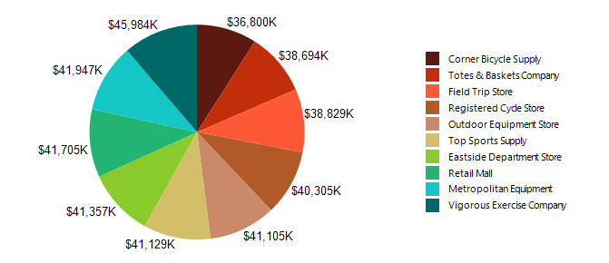

# Creating Pie Charts

This guide will demonstrate how to create a Pie chart when you are using the Graph report item. 

The following image shows a Pie chart.



## Adding the Graph 

To add a new Graph report item to the report: 

1. Set the __DataSource__ property to a new __[SqlDataSource]()__.
1. Set the connection string to the demo AdventureWorks database.
1. Set the query to the following one:

      ````sql
SELECT S.Name AS StoreName, SOH.SubTotal
FROM Sales.Customer AS CU
INNER JOIN Sales.SalesOrderHeader AS SOH ON CU.CustomerID = SOH.CustomerID
INNER JOIN Sales.Store AS S ON CU.CustomerID = S.CustomerID
````

1. Click __Execute Query...__ to check if everything is OK with the database connection. Click __Finish__ when you are ready. 
   
## Setting the SeriesGroups Hierarchy 

Now you can set the **SeriesGropus** hierarchy of the Pie chart: 

1. Open the __SeriesGroups__ collection editor and click __Add__.
1. Set the __Groupings__ to `=Fields.StoreName`.
1. Set the __Sortings__ to `=Sum(Fields.SubTotal)`. 
1. Set the __Filters__ to `=Sum(Fields.SubTotal) Top N =10`.
1. Set the __Name__ to `seriesGroup1`. 

## Setting the CategoryGroups Hierarchy

Next, you will have to define the **CategoryGroups** hierarchy of the Pie chart:

1. Open the __CategoryGroups__ collection editor and click __Add__. By default, this will add a new static group (group without grouping). 
1. Set the __Name__ to `categoryGroup1`. 

## Configuring the Coordinate System

Here you will specify the coordinate system details: 

1. Open the __CoordinateSystems__ collection editor and __Add__ a new __PolarCoordinateSystem__. 
1. Leave the __Name__ to `polarCoordinateSystem1`. 
1. Set the __RadialAxis__ to __New Axis with Category Scale__. 
1. Expand the **RadialAxis** node. Expand the **Scale** node. Set **SpacingSlotCount** to `0`. 
1. Expand the axis **Style** node. Set **Visible** to `False`.
1. Set the __AngularAxis__ to __New Axis with Numerical Scale__. 
1. Expand the **AngularAxis** node. Expand the axis **Style** node. Set **Visible** to `False`.

## Configuring the Series

In this step, you will configure the series of the chart:

1. Open the __Series__ collection editor and __Add__ new __BarSeries__. 
1. Set the __CategoryGroup__ to __categoryGroup1__. 
1. Set the __SeriesGroup__ to __seriesGroup1__. 
1. Set the __CoordinateSystem__ to __polarCoordinateSystem1__. 
1. Set the __ArrangeMode__ to __Stacked100__. 
1. Set the __X__ value to `=Sum(Fields.SubTotal)`.
1. Set the __DataPointLabel__ to `=Sum(Fields.SubTotal)/1000.0`. 
1. Set the __DataPointLabelFormat__ to `{0:C0}K`.

## Styling the Appearance   

To set the color palette, format the labels, define the values of the legend, and elaborate on any other styling options, refer to the section on [formatting the Graph](). 


