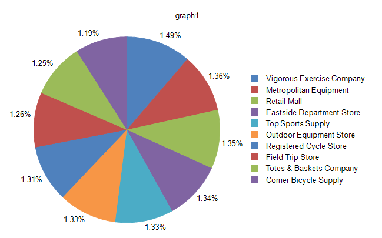
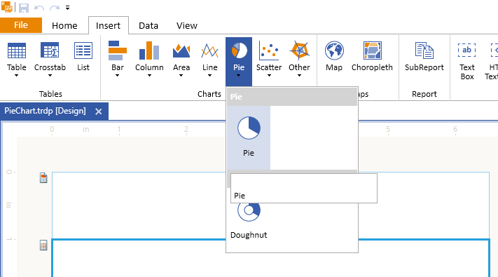
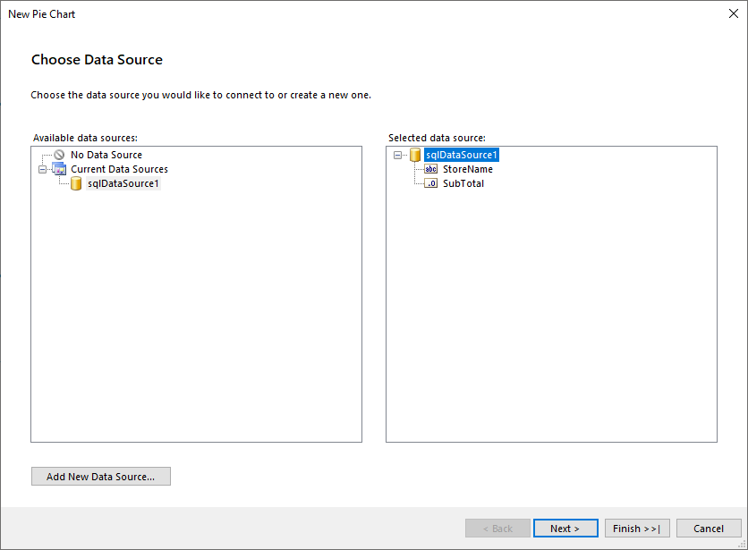
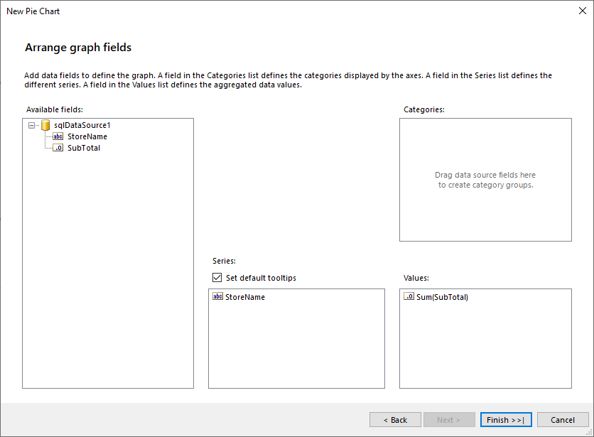
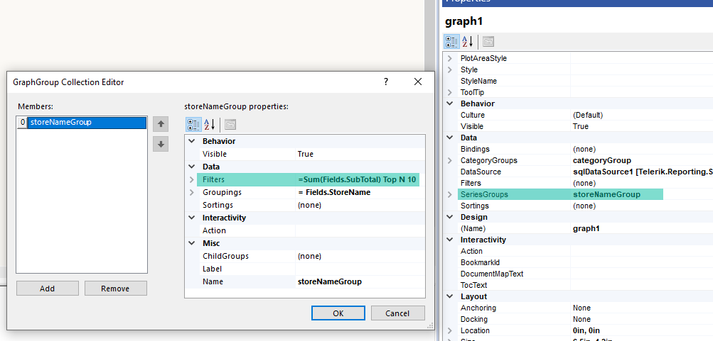
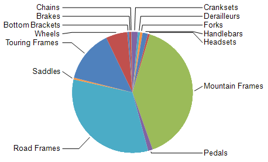

# Creating and Customizing Pie Charts

A Pie chart displays the contribution of fractional parts to a whole and is most commonly used to make comparisons between groups.

Pie charts have no axes. When you use a numeric field, the chart can calculate the percentage of each value to the total.

The following image displays a Pie chart with a legend:



## Types

The Pie chart supports the __Doughnut__ type which has an open space in the center. To control the width of the open space, use the [`PolarCoordinateSystem.InnerRadiusRatio`](/api/telerik.reporting.polarcoordinatesystem#Telerik_Reporting_PolarCoordinateSystem_InnerRadiusRatio) property.

## Creating Pie Charts with the Pie Chart Wizard

In this section, you will learn how to create a Pie chart with our Pie Chart Wizard.
We are going to displays the SubTotal for the Top 10 performing Stores as a percentage of the SubTotal for all Stores. The final report will look like the image above.

The sample report will use a pre-defined SqlDataSource that connects to the example AdventureWorks database. The query that returns the needed fields is the following:

````SQL
SELECT
	[Sales].[Store].[Name] AS 'StoreName',
	[Sales].[SalesOrderHeader].[SubTotal]
FROM
	[Sales].[SalesOrderDetail] INNER JOIN
	[Sales].[SalesOrderHeader] ON [Sales].[SalesOrderDetail].[SalesOrderID] = [Sales].[SalesOrderHeader].[SalesOrderID] INNER JOIN
	[Sales].[Store] ON [Sales].[SalesOrderHeader].[CustomerID] = [Sales].[Store].[CustomerID]
````

To create the Pie chart by using the Pie Chart Wizard:

1. Add Pie Chart as shown in the image below:

	

1. Select the SqlDataSource, or create it with the **Add New Data Source...** button and by using the query above:

	

1. Arrange the Pie Chart:

	1. Drag the __StoreName__ field to **Series**.
	1. Leave **Categories** empty.
	1. Drag the __SubTotal__ field to **Values**. The wizard will automatically apply the `Sum` [aggregate function]().

	

1. The total number of the Series in the Graph, that is, the **Stores**, is too large, which results in a very segmented Pie Chart. To provide better visual experience, limit the **Stores** to the top 10 performing ones. For this purpose, let's introduce filtering to the Graph Series Group:
	1. Select **Graph** > **Data** > **SeriesGroups** and click on the ellipses (**...**) beside the property. This action will open the **GraphGroup Collection Editor**.
	1. Select the **Filters** property and click on the ellipses (**...**). This action opens the **Edit Filters** dialog.
	1. Enter the following filtering rule:
		* For `Expression`, use `=Sum(Fields.SubTotal)`.
		* For `Operator`, select `Top N`.
		* For `Value`, use `10`.

	The following image with the proper fields highlighted shows how the above settings look in the designer:

	

To see the full implementation of the sample report, refer to the [PieChart.trdp](https://github.com/telerik/reporting-samples/blob/master/graph-samples/PieChart.trdp) project on GitHub.

## Creating Pie Charts Manually

This section will show how to manually create a Pie chart.

### 1. Add the Graph

To add a new Graph report item to the report, refer to the article on [getting started with the Graph report item]().

### 2. Set the SeriesGroups Hierarchy

Now you can set the **SeriesGropus** hierarchy of the Pie chart:

1. Open the __SeriesGroups__ collection editor and click __Add__.
1. Set the __Groupings__ to `=Fields.StoreName`.
1. Set the __Sortings__ to `=Sum(Fields.SubTotal)`.
1. Set the __Filters__ to `=Sum(Fields.SubTotal) Top N =10`.
1. Set the __Name__ to `seriesGroup1`.

### 3. Set the CategoryGroups Hierarchy

Next, you will have to define the **CategoryGroups** hierarchy of the Pie chart:

1. Open the __CategoryGroups__ collection editor and click __Add__. By default, this will add a new static group (group without grouping).
1. Set the __Name__ to `categoryGroup1`.

### 4. Configure the Coordinate System

Here you will specify the coordinate system details:

1. Open the __CoordinateSystems__ collection editor and __Add__ a new __PolarCoordinateSystem__.
1. Leave the __Name__ to `polarCoordinateSystem1`.
1. Set the __RadialAxis__ to __New Axis with Category Scale__.
1. Expand the **RadialAxis** node. Expand the **Scale** node. Set **SpacingSlotCount** to `0`.
1. Expand the axis **Style** node. Set **Visible** to `False`.
1. Set the __AngularAxis__ to __New Axis with Numerical Scale__.
1. Expand the **AngularAxis** node. Expand the axis **Style** node. Set **Visible** to `False`.

### 5. Configure the Series

In this step, you will configure the series of the chart:

1. Open the __Series__ collection editor and __Add__ new __BarSeries__.
1. Set the __CategoryGroup__ to __categoryGroup1__.
1. Set the __SeriesGroup__ to __seriesGroup1__.
1. Set the __CoordinateSystem__ to __polarCoordinateSystem1__.
1. Set the __ArrangeMode__ to __Stacked100__.
1. Set the __X__ value to `=Sum(Fields.SubTotal)`.
1. Set the __DataPointLabel__ to `=Sum(Fields.SubTotal)/1000.0`.
1. Set the __DataPointLabelFormat__ to `{0:C0}K`.

### 6. Style the Appearance

To set the color palette, format the labels, define the values of the legend, and elaborate on any other styling options, refer to the section on [formatting the Graph]().

## Displaying Percentage Values

Pie charts represent proportions of the total. As a result, it is common to format Pie chart labels as percentages. For consistency with other chart types, the Pie chart does not display percentage labels by default.

To show Pie chart labels with percentages:

1. Select the series by clicking anywhere on the pie.
1. From the **Properties** window, set the __DataPointLabelStyle.Visible__ property of the series to __true__.
1. Set the __DataPointLabel__ property of the series to an expression adjusted to your specific needs and similar to `=Sum(Fields.LineTotal)/Exec('graph1', Sum(Fields.LineTotal))` where `graph1` is the name of the Graph item.
1. Select the series labels. From the **Graph Tools** > **Format** contextual tab, select **Percent** for the label format.
1. Adjust the precision according to your needs.
1. Position the labels through the __DataPointLabelAlignment__ property of the series.

## Preventing Overlapped Labels

By default, the layout engine will try to arrange the data labels so they do not overlap. When the bounds of two or more labels overlap, the engine will move them and their adjacent labels vertically, trying to find them a proper non-overlapping positions.

During this rearrangement, a label can be moved aside from its original location, which may produce a hard to read chart. Additionally, if the plot area doesn't provide enough space and there are many data points, the labels will overlap.

To prevent the Pie chart labels from overlapping, use any of the following approaches:

* Decrease the font size of the data point labels.
* Increase the width and height of your chart to allow more room for the labels.
* Change the position of the Pie labels through the __DataPointLabelAlignment__ property of the series.
* Set the [`DataPointLabelOffset`](/api/Telerik.Reporting.BarSeries#Telerik_Reporting_BarSeries_DataPointLabelOffset) to a greater value so that the labels are arranged around a circle with a greater radius.

For Pie charts with many data points, the best approach is to use a combination of the above-mentioned approaches. The following image shows a Pie chart series that has its [`DataPointLabelAlignment`](/api/Telerik.Reporting.BarSeries#Telerik_Reporting_BarSeries_DataPointLabelAlignment) set to `OutsideColumn`, [`DataPointLabelOffset`](/api/Telerik.Reporting.BarSeries#Telerik_Reporting_BarSeries_DataPointLabelOffset) set to `0.5cm` and [DataPointLabelConnectorStyle](/api/Telerik.Reporting.BarSeries#Telerik_Reporting_BarSeries_DataPointLabelConnectorStyle) `.Visible` set to `true`.

> The algorithm that moves the data point labels, preventing them from overlapping, is activated only when the labels have their [`DataPointLabelAngle`](/api/Telerik.Reporting.GraphSeriesBase#Telerik_Reporting_GraphSeriesBase_DataPointLabelAngle) set to a multiple of `2*π` radians in degrees, for example, `0`, `360`, and so on.



## Merging Pie Slices

Based on the data, a Pie chart may produce too many slices, resulting in unreadable data presentation. To overcome this data presentation, you can merge slices that are considered insignificant into a single slice on the Pie chart.

To control the merging setup, use the [`Telerik.Reporting.BarSeries.MergedDataPoints`](/api/Telerik.Reporting.BarSeries#Telerik_Reporting_BarSeries_MergedDataPoints) property from the **Layout** properties category of the Bar series.

To turn on the merge logic:

1. Change the [`Telerik.Reporting.MergedDataPoints.MergeMode`](/api/Telerik.Reporting.MergedDataPoints#Telerik_Reporting_MergedDataPoints_MergeMode) property from `None` to `SingleSlice`.
1. Choose between four different modes (algorithms) for splitting the slices or data points to significant ones and small ones. To control this behavior, use the [`Telerik.Reporting.MergedDataPoints.ThresholdMode`](/api/Telerik.Reporting.MergedDataPoints#Telerik_Reporting_MergedDataPoints_ThresholdMode) property values in the [`Telerik.Reporting.ThresholdMode`](/api/Telerik.Reporting.ThresholdMode) enumeration.
1. Based on the selected mode, set an appropriate [`Telerik.Reporting.MergedDataPoints.ThresholdValue`](/api/Telerik.Reporting.MergedDataPoints#Telerik_Reporting_MergedDataPoints_ThresholdValue). The value of each slice for merging is evaluated over the [`Telerik.Reporting.BarSeries.X`](/api/Telerik.Reporting.BarSeries#Telerik_Reporting_BarSeries_X) property. [`Telerik.Reporting.MergedDataPoints.ThresholdMode`](/api/Telerik.Reporting.MergedDataPoints#Telerik_Reporting_MergedDataPoints_ThresholdMode) supports expressions and the expression must evaluate to the needed number type.

By default, the merged slice is labeled in the legend of the chart as __Others__. To modify the name, set the [`Telerik.Reporting.MergedDataPoints.LegendItemLabel`](/api/Telerik.Reporting.MergedDataPoints#Telerik_Reporting_MergedDataPoints_LegendItemLabel). `Telerik.Reporting.MergedDataPoints.LegendItemLabel` supports expressions.

To customize the styling of the merged data point, its label, or the corresponding legend item, use the corresponding Conditional Formatting property by using the `= IsMergedData() | Operator.Equals | = True` filter.

## Design Considerations

* Pie charts are popular in reports because of their visual impact. However, Pie charts are a very simplified chart type that may not best represent your data. Consider using a Pie chart only after the data has been aggregated to seven data groups or less.
* Pie charts display each data group as a separate slice on the chart. You must add at least one data field and one series field to the pie chart. If more than one data field is added to a Pie chart, the Pie chart will display both data fields in the same chart.
* If you are defining your own colors on a Pie chart with a custom palette, be sure that you have enough colors in your palette to display each data point with its own unique color.
* A Pie chart requires at least two values to make a valid comparison between proportions. If your Pie chart contains only one color, verify that you have added a series field by which to group the data. When the Pie chart does not contain series, it aggregates the values from your data field into one value for display.

## See Also

* [(Demo) Crypto Currencies with Nested Pie Charts Report](https://demos.telerik.com/reporting/crypto-currencies)
* [(Demo) Sales Dashboard Report with Pie Charts in Geographical Context](https://demos.telerik.com/reporting/sales-dashboard)
* [(Demo) Dashboard Report with Pie Charts](https://demos.telerik.com/reporting/dashboard)
* [(Demo) Product Line Sales Report with Pie Charts](https://demos.telerik.com/reporting/product-line-sales)
* [(Demo TRDP Report) PieChart.trdp](https://github.com/telerik/reporting-samples/blob/master/graph-samples/PieChart.trdp)
