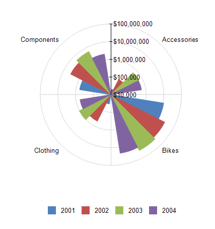

# Polar Charts Overview

A polar chart displays a series as a set of points that are grouped by category on a 360-degree circle. Values are represented by the distance of the point as measured from the center of the circle. The farther the       point is from the center, the greater is its value. Category labels are displayed on the perimeter of the chart. 

The following image displays a Rose polar chart: 

  

## Polar Chart Variations

* __Line Polar Chart__. A polar chart in which the data points are connected by a line.

* __Area Polar Chart__. A polar chart in which the data points are connected by a line with the area below the line filled with color.

* __Rose Polar Chart__. A polar chart in which the data points are represented by bars drawn in a polar coordinate system.

## Design Considerations for Polar Charts

* Polar charts are most commonly used to graph polar data, where each data point is determined by an angle and a distance.
