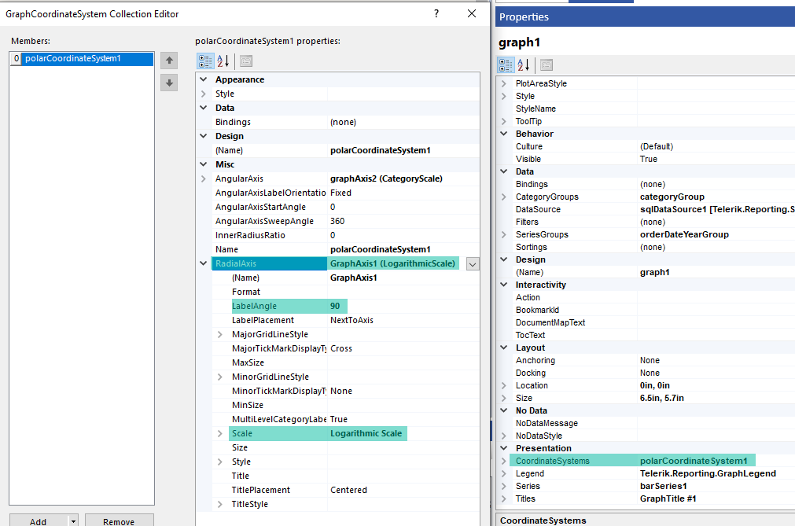

# Polar Charts

A Polar chart displays series as sets of data points that are grouped by category on a 360-degree circle and represent the values by the distance of the point as measured from the center of the circle. 

The farther the data point is from the center, the greater its value is. Category labels are displayed on the perimeter of the chart. 

The following image displays a Rose Polar chart: 


## Types 

* __Line Polar Charts__&mdash;A Polar chart in which the data points are connected by a line.
* __Area Polar Charts__&mdash;A Polar chart in which the data points are connected by a line with the area below the line filled with color.
* __Rose Polar Charts__&mdash;A Polar chart in which the data points are represented by bars drawn in a polar coordinate system.

## Creating Polar (Radar) Charts with the Radar Chart Wizard

In this section, you will learn how to create a Rose chart with our Rose Chart Wizard. This is a variation of the Polar (Radar) Chart type and is located under the `Other` Charts in the main menu.
We are going to display the LineTotal of the Product Categories by Years. The final report will look like the image above.

We will use a pre-defined SqlDataSource connecting to the example AdventureWorks database. Here is the query that returns the needed fields:

````SQL
SELECT
	[Production].[ProductCategory].[Name] AS 'Category',
	[Sales].[SalesOrderHeader].[OrderDate],
	[Sales].[SalesOrderDetail].[LineTotal]
FROM
	[Production].[Product] INNER JOIN
	[Production].[ProductSubcategory] ON [Production].[Product].[ProductSubcategoryID] = [Production].[ProductSubcategory].[ProductSubcategoryID] INNER JOIN
	[Production].[ProductCategory] ON [Production].[ProductSubcategory].[ProductCategoryID] = [Production].[ProductCategory].[ProductCategoryID] INNER JOIN
	[Sales].[SalesOrderDetail] ON [Production].[Product].[ProductID] = [Sales].[SalesOrderDetail].[ProductID] INNER JOIN
	[Sales].[SalesOrderHeader] ON [Sales].[SalesOrderDetail].[SalesOrderID] = [Sales].[SalesOrderHeader].[SalesOrderID] AND [Sales].[SalesOrderDetail].[SalesOrderID] = [Sales].[SalesOrderHeader].[SalesOrderID] AND 
	[Sales].[SalesOrderDetail].[SalesOrderID] = [Sales].[SalesOrderHeader].[SalesOrderID]
````


1. Add Rose Chart as shown in the image below:

	

1. Select the SqlDataSource, or create it with the button `Add New Data Source...` and the above query:

	

1. Arrange the Rose Chart:

	* Drag the field _Category_ to the `Categories`
	* Drag the field _OrderDate.Year_ to the `Series`
	* Drag the field _LineTotal_ to the `Values`. The wizard automatically applies the `Sum` [aggregate function]().

	

1. The LineTotal value is large, so let's change the barSeries `Data > Y` [Expression]() that is currently _=Sum(Fields.LineTotal)_ to `=ISNULL(Sum(Fields.LineTotal), 0) / 1000.0`. Note that we included also a Null check, so that the Null values to be replaced with 0 (zero).

1. The _LineTotal_ values for the _Bikes_ category are significantly higher than the other three categories, so let's use a Logarithmic Scale for the _RadialAxis_ to improve the user experience:
	1. Select the `Graph` > `Presentation` > `CoordinateSystems` and click on the ellipses (`...`) beside the property. This will open the _GraphCoordinateSystem Collection Editor_.
	1. Go to the `RadialAxis` property and select `<New Axis with Logarithmic Scale>` from the dropdown.
	1. Expand the `RadialAxis1` property and change the `LabelAngle` to `90` degrees for better appearance.

	Here is how the above settings should look in the designer, with the proper fields highlighted:

	

## Creating Polar (Radar) Charts Manually

In this section, you will create a Polar chart.

### 1. Add the Graph

To add a new Graph report item to the report, refer to the article [getting started with the Graph report item](). 

### 2. Set the SeriesGroups Hierarchy 

Now you can set the **SeriesGropus** hierarchy of the Stacked Area chart: 

1. Open the __SeriesGroups__ collection editor and click __Add__.
1. Set the __Groupings__ to `=Fields.OrderDate.Year`.
1. Set the __Sortings__ to `=Fields.OrderDate.Year`.
1. Set the __Name__ to `seriesGroup1`. 

### 3. Set the CategoryGroups Hierarchy

Next, you will have to define the **CategoryGroups** hierarchy of the Stacked Area chart:

1. Open the __CategoryGroups__ collection editor and click __Add__. 
1. Set the __Groupings__ to `=Fields.Category`.
1. Set the __Sortings__ to `=Fields.Category`.
1. Set the __Name__ to `categoryGroup1`. 

### 4. Configure the Coordinate System

Here you will specify the coordinate system details: 

1. Open the __CoordinateSystems__ collection editor and __Add__ a new __PolarCoordinateSystem__. 
1. Leave the __Name__ to `polarCoordinateSystem1`. 
1. Set the __RadialAxis__ to __New Axis Logarithmic Scale__. 
1. Set the __AngularAxis__ to __New Axis with Category Scale__. 

### 5. Configure the Series

In this step, you will configure the series of the chart:

1. Open the __Series__ collection editor and __Add__ new __BarSeries__. 
1. Set the __CategoryGroup__ to __categoryGroup1__. 
1. Set the __SeriesGroup__ to __seriesGroup1__. 
1. Set the __CoordinateSystem__ to __polarCoordinateSystem1__. 
1. Set the __ArrangeMode__ to __Clustered__. 
1. Set the __Y__ value to `=ISNULL(Sum(Fields.LineTotal), 0) / 1000.0`.

### 6. Style the Appearance   

To set the color palette, format the labels, define the values of the legend, and elaborate on any other styling options, refer to the section on [formatting the Graph](). 

## Design Considerations

Polar charts are most commonly used to graph polar data where each data point is determined by an angle and a distance.

## See Also 

* [Demo Page for Telerik Reporting](https://demos.telerik.com/reporting) 
