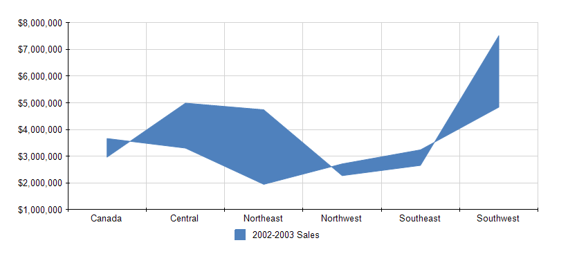

# Creating Range Charts

This guide will demonstrate how to create a Range Area chart when you are using the Graph report item. 

The following image shows a Range Area chart.



## Adding the Graph 

To add a new Graph report item to the report: 

1. Set the __DataSource__ property to a new __[SqlDataSource]()__.
1. Set the connection string to the demo AdventureWorks database.
1. Set the query to the following one:
  
      ````sql
SELECT ST.Name, SOH.TotalDue, SOH.OrderDate
FROM Sales.SalesOrderHeader AS SOH
INNER JOIN Sales.SalesTerritory AS ST ON SOH.TerritoryID = ST.TerritoryID
````


1. Click __Execute Query...__ to check if everything is OK with the database connection. Click __Finish__ when you are ready. 
   
## Setting the SeriesGroups Hierarchy 

Now you can set the **SeriesGropus** hierarchy of the Range Area chart: 

1. Open the __SeriesGroups__ collection editor and click __Add__. By default, this will add a new static group (group without grouping).
1. Set the __Name__ to `seriesGroup1`. 

## Setting the CategoryGroups Hierarchy

Next, you will have to define the **CategoryGroups** hierarchy of the Range Area chart:

1. Open the __CategoryGroups__ collection editor and click __Add__. 
1. Set the __Groupings__ to `=Fields.Name`.
1. Set the __Sortings__ to `=Fields.Name`.
1. Set the __Name__ to `categoryGroup1`. 

## Configuring the Coordinate System

Here you will specify the coordinate system details: 

1. Open the __CoordinateSystems__ collection editor and __Add__ a new __CartesianCoordinateSystem__. 
1. Leave the __Name__ to `cartesianCoordinateSystem1`. 
1. Set the __XAxis__ to __New Axis with Category Scale__. 
1. Set the __YAxis__ to __New Axis with Numerical Scale__. 

## Configuring the Series

In this step, you will configure the series of the chart:

1. Open the __Series__ collection editor and __Add__ new __AreaSeries__. 
1. Set the __CategoryGroup__ to __categoryGroup1__. 
1. Set the __SeriesGroup__ to __seriesGroup1__. 
1. Set the __CoordinateSystem__ to __cartesianCoordinateSystem1__. 
1. Set the __Y__ value to `=Sum(IIF(Fields.OrderDate.Year=2002, Fields.TotalDue, 0))`.
1. Set the __Y0__ value to `=Sum(IIF(Fields.OrderDate.Year=2003, Fields.TotalDue, 0))`.

## Styling the Appearance   

To set the color palette, format the labels, define the values of the legend, and elaborate on any other styling options, refer to the section on [formatting the Graph](). 
