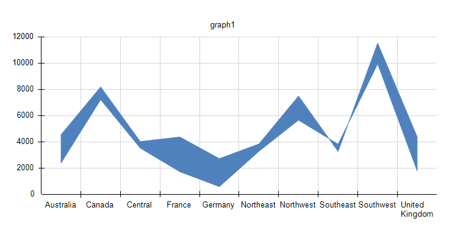
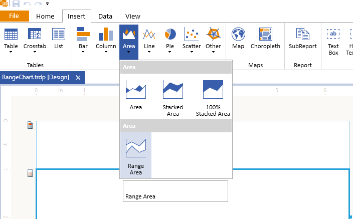
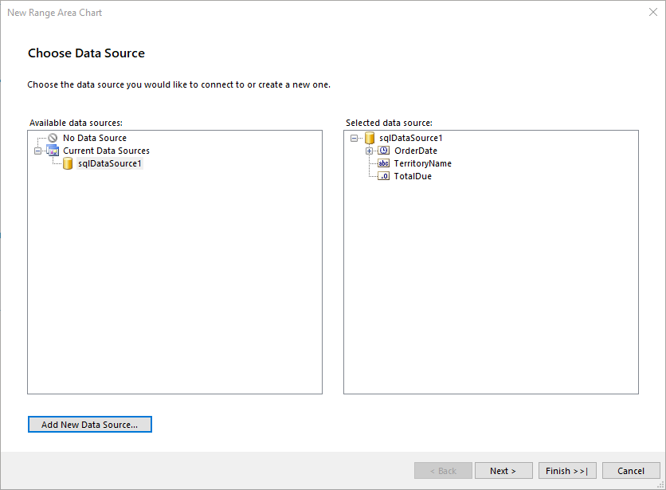
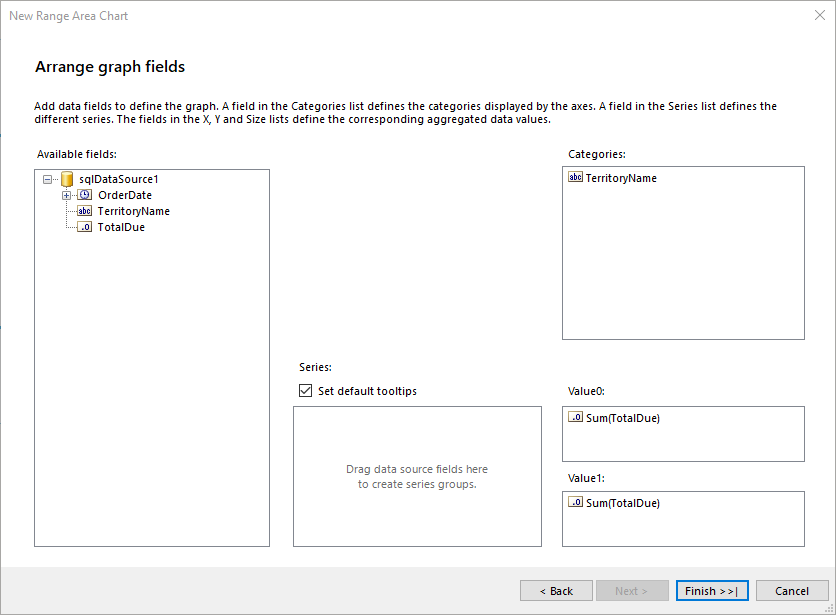

# Creating and Customizing Range Area Charts

A Range chart displays sets of data points, each of which is defined by multiple values for the same category, and emphasizes the distance between the two values.

The category labels are displayed on the category axis. The plain Range chart fills in the area between the top and the bottom value for each data point.

The following image displays a plain Range chart with one Range Area series:



## Types

The Graph supports the following Range chart types:

* __Column range__&mdash;The Column Range chart uses columns to represent the range.
* __Bar range__&mdash;The Bar Range chart uses bars to represent the range.
* __Smooth range__&mdash;A Smooth Range chart uses curved lines to connect data points rather than straight ones.

## Creating Range Charts with the Range Chart Wizard

In this section, you will learn how to create a Range Area Chart with our Range Chart Wizard.
The Range Chart is a modification of the more general Area Chart. That's why, its Wizard is under the Area Charts menu item. Our Range Chart will display the difference between years 2002 and 2003 for the earnings (field _TotalDue_ from the below query) for the sales territories. The range value will be displayed as a Column range. The final report will look like the image above.

The sample report will use a pre-defined SqlDataSource that connects to the example AdventureWorks database. The query that returns the needed fields is the following:

````SQL
SELECT
	[Sales].[SalesTerritory].[Name] AS 'TerritoryName',
	[Sales].[SalesOrderHeader].[OrderDate],
	[Sales].[SalesOrderHeader].[TotalDue]
FROM
	[Sales].[SalesOrderHeader] INNER JOIN
	[Sales].[SalesTerritory] ON [Sales].[SalesOrderHeader].[TerritoryID] = [Sales].[SalesTerritory].[TerritoryID]
WHERE
	YEAR([Sales].[SalesOrderHeader].[OrderDate]) IN (2002, 2003)
````

To create the Range chart by using the Range Chart Wizard:

1. Add Range Chart as shown in the image below:

	

1. Select the SqlDataSource, or create it with the **Add New Data Source...** button and by using the query above:

	

1. Arrange the Range Chart:

	1. Leave **Series** empty.
	1. Drag the __TerritoryName__ field to **Categories**.
	1. Drag the __TotalDue__ field to **Value0**. The wizard will automatically apply the `Sum` [aggregate function]().
	1. Drag the __TotalDue__ field also to **Value1**. Later, you will edit both **Value** fields manually to display the required information.

	

1. Select the areaSeries and change its properties `Y` and `Y0` in the Properties Data tab from the current `=Sum(Fields.TotalDue)` to the following values:

	* `Y`:	`=Sum(IIF(Fields.OrderDate.Year=2002, Fields.TotalDue, 0)) / 1000.0`
	* `Y0`:	`=Sum(IIF(Fields.OrderDate.Year=2003, Fields.TotalDue, 0)) / 1000.0`

	The above [expressions]() set the range value of the Range Area Chart to be the difference between years 2002 and 2003.

	The `TotalDue` value is large, so you have to also change the areaSeries to display the value in thousands.

1. Select the Graph **Legend** and set its **Style** > **Visible** to `False`. As a result, the legend will be hidden and will free space for the Chart itself as having only one series and the legend is not very informative.

1. If the Category labels that represent territory names in the example are still too long and wrap on a new line, you can either shorten the names, or increase the Graph width.

To see the full implementation of the sample report, refer to the [RangeChart.trdp](https://github.com/telerik/reporting-samples/blob/master/graph-samples/RangeChart.trdp) project on GitHub.

## Creating Range Charts Manually

This section will show how to manually create a Range Area chart.

### 1. Add the Graph

To add a new Graph report item to the report, refer to the article [getting started with the Graph report item]().

### 2. Set the SeriesGroups Hierarchy

Now you can set the **SeriesGropus** hierarchy of the Range Area chart:

1. Open the __SeriesGroups__ collection editor and click __Add__. By default, this will add a new static group (group without grouping).
1. Set the __Name__ to `seriesGroup1`.

### 3. Set the CategoryGroups Hierarchy

Next, you will have to define the **CategoryGroups** hierarchy of the Range Area chart:

1. Open the __CategoryGroups__ collection editor and click __Add__.
1. Set the __Groupings__ to `=Fields.TerritoryName`.
1. Set the __Sortings__ to `=Fields.TerritoryName`.
1. Set the __Name__ to `categoryGroup1`.

### 4. Configure the Coordinate System

Here you will specify the coordinate system details:

1. Open the __CoordinateSystems__ collection editor and __Add__ a new __CartesianCoordinateSystem__.
1. Leave the __Name__ to `cartesianCoordinateSystem1`.
1. Set the __XAxis__ to __New Axis with Category Scale__.
1. Set the __YAxis__ to __New Axis with Numerical Scale__.

### 5. Configure the Series

In this step, you will configure the series of the chart:

1. Open the __Series__ collection editor and __Add__ new __AreaSeries__.
1. Set the __CategoryGroup__ to __categoryGroup1__.
1. Set the __SeriesGroup__ to __seriesGroup1__.
1. Set the __CoordinateSystem__ to __cartesianCoordinateSystem1__.
1. Set the __Y__ value to `=Sum(IIF(Fields.OrderDate.Year=2002, Fields.TotalDue, 0))`.
1. Set the __Y0__ value to `=Sum(IIF(Fields.OrderDate.Year=2003, Fields.TotalDue, 0))`.

### 6. Style the Appearance

To set the color palette, format the labels, define the values of the legend, and elaborate on any other styling options, refer to the section on [formatting the Graph]().

## Design Considerations

* Range charts require two values per data point. These values represent a high value and a low value that define the range for each data point.
* If only one value is specified, the Range chart will display as if it were a regular Area, Bar, or Column chart with a single value per data point.
* Range charts are often used to graph data that contains minimum and maximum values for each category group in the dataset.
* It is not recommended to display markers on each data point in a Range chart.
* Like the Area chart, in a plain Range chart, if the values in multiple series are similar, the series will overlap. In this scenario, you may want to use a Column Range or Bar Range chart instead of a plain Range chart.
* You can create Gantt charts by using a Range Bar chart.

## See Also

* [Demo Page for Telerik Reporting](https://demos.telerik.com/reporting)
* [(Demo TRDP Report) RangeChart.trdp](https://github.com/telerik/reporting-samples/blob/master/graph-samples/RangeChart.trdp)
