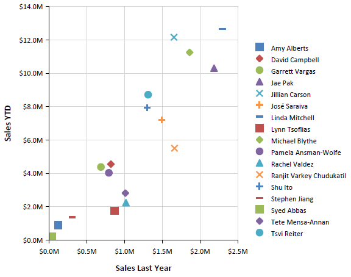
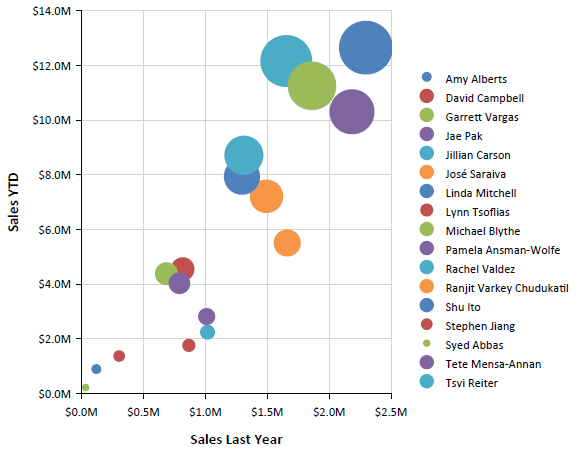

# Scatter Charts Overview

A Scatter (Point) chart shows correlations between two sets of values, enables users to observe the dependence of one value to another, and is often used for scientific data modeling. 

Scatter charts are typically not used with time-dependent data where a Line chart is more suited. A common usage of the Scatter chart is to compare aggregated data across categories. 

Scatter charts are different from other chart types because, instead of using the category values as X-values, they have explicit X-values for the data points. Consequently, the data can be grouped and aggregated into a different category than the value that is shown on the X-axis. For example, to show last year's sales for individual salespersons along the X-axis, you will not aggregate Y-values if two salespersons have identical X-values. 

The following image illustrates a Satter chart: 

## Types

Bubble charts are a variation of the Scatter charts in which the data points are replaced with bubbles. This chart type displays the differences between data points based on the size of the bubble. The larger the bubble is, the larger the difference between the two data points is. 

The following Bubble chart sample report has a category set to a sales person so that it aggregates sales data per sales person. However, the value of last year's sales is shown on the X-axis. 

## Design Considerations 

* Scatter charts usually display and compare numeric values, such as scientific, statistical, and engineering data.
* A typical usage of the Scatter chart is when you want to compare large numbers of data points not related to time. The more data you include in a scatter chart, the better the comparisons that you can make.
* The bubble chart requires an additional value per data point, the **Size** of the bubble. 
* Scatter charts are most suitable for handling the distribution of values and clusters of data points. This is the best chart type if your dataset contains many points, for example, several thousand points. Displaying multiple series on a Point chart is visually distracting, and you have to avoid it and consider using a Line chart.

