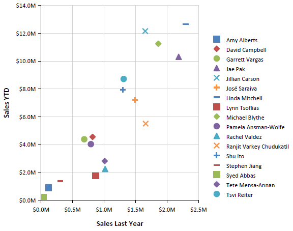
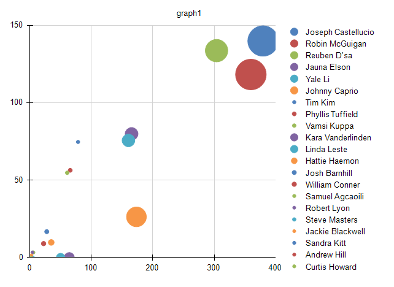
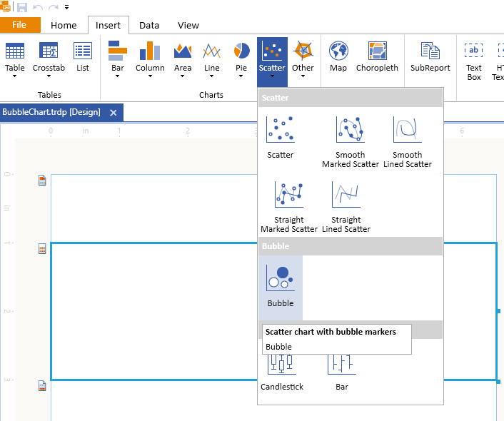
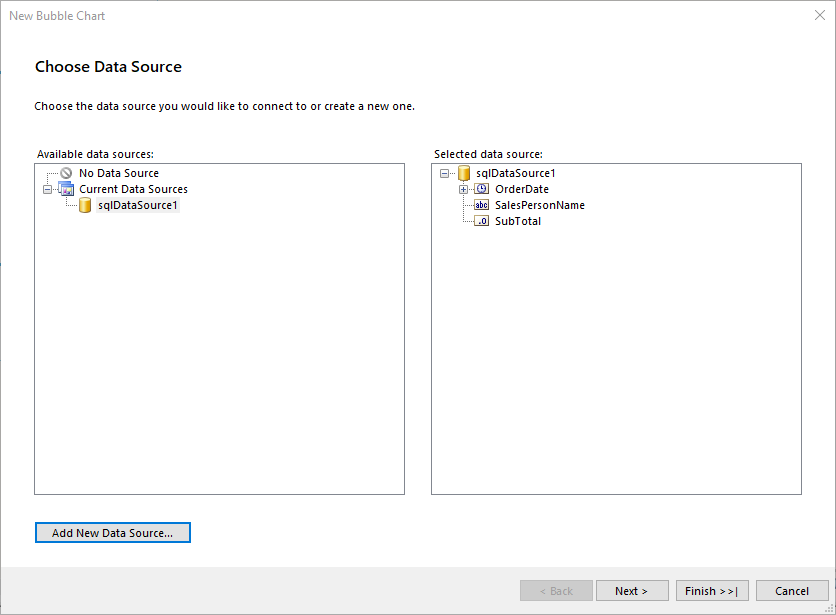
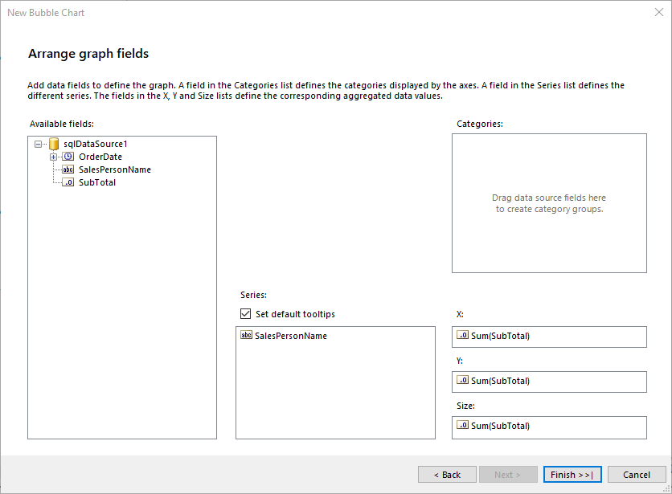
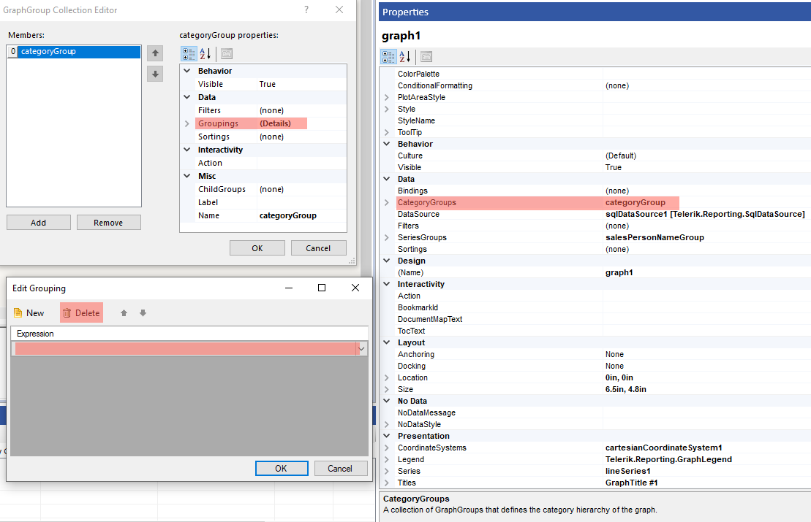

# Creating and Customizing Scatter Charts

A Scatter (Point) chart shows correlations between two sets of values, enables users to observe the dependence of one value to another, and is often used for scientific data modeling.

Scatter charts are typically not used with time-dependent data where a Line chart is more suited. A common usage of the Scatter chart is to compare aggregated data across categories.

Scatter charts are different from other chart types because, instead of using the category values as X-values, they have explicit X-values for the data points. Consequently, the data can be grouped and aggregated into a different category than the value that is shown on the X-axis. For example, to show last year's sales for individual salespersons along the X-axis, you will not aggregate Y-values if two salespersons have identical X-values.

The following image illustrates a Scatter chart:



## Types

Bubble charts are a variation of the Scatter charts in which the data points are replaced with bubbles. This chart type displays the differences between data points based on the size of the bubble. The larger the bubble is, the larger the difference between the two data points is.

The following Bubble chart sample report has a category set to a sales person so that it aggregates sales data per sales person. However, the value of last year's sales is shown on the X-axis.



## Creating Bubble with the Bubble Chart Wizard

In this section, you will learn how to create a Bubble chart with our Bubble Chart Wizard.
The Bubble Chart is a variation of the more general Scatter Chart and its wizard is under the Scatter Chart menu item. Our Bubble Chart will display the decrease in the sales from 2003 to 2004 in Toronto for the employees from the region.

The sample report will use a pre-defined SqlDataSource that connects to the example AdventureWorks database. The query that returns the needed fields is the following:

````SQL
SELECT
	[Person].[Contact].[FirstName] + ' ' + [Person].[Contact].[LastName] AS 'SalesPersonName',
	[Sales].[SalesOrderHeader].[OrderDate],
	[Sales].[SalesOrderHeader].[SubTotal]
FROM
	[Person].[Address] INNER JOIN
	[Sales].[SalesOrderHeader] ON [Person].[Address].[AddressID] = [Sales].[SalesOrderHeader].[BillToAddressID] AND 
		[Person].[Address].[AddressID] = [Sales].[SalesOrderHeader].[ShipToAddressID] INNER JOIN
	[Person].[Contact] ON [Sales].[SalesOrderHeader].[ContactID] = [Person].[Contact].[ContactID] 
WHERE
	YEAR([Sales].[SalesOrderHeader].[OrderDate]) IN (2003, 2004) AND
	[Person].[Address].[City] = 'Toronto'
````

To create the Scatter chart by using the Scatter Chart Wizard: 

1. Add Bubble Chart as shown in the image below:

	

1. Select the SqlDataSource, or create it with the **Add New Data Source...** button and by using the query above:

	

1. Arrange the Bubble Chart:

	1. Drag the __SalesPersonName__ field to **Series**.
	1. Leave **Categories** empty.
	1. Drag the __SubTotal__ field to **X**. The wizard will automatically apply the `Sum` [aggregate function]()
	1. Drag the __SubTotal__ field to **Y**.
	1. Drag the __SubTotal__ field to **Size**.

	

1. In the Graph properties, select the **CategoryGroups** and if the **Groupings** property is different from **Static**, click the ellipses (**...**) beside the property and delete the group as shown in the image below:

	

1. You need to modify `X`, `Y`, and `Size` with the values they need to display for the purposes of this sample report.

	Select the LineSeries and change the properties as specified below:

	* `X`: `=Sum(IIF(Fields.OrderDate.Year=2003, Fields.SubTotal, 0))/1000.0`
	* `Y`: `=Sum(IIF(Fields.OrderDate.Year=2004, Fields.SubTotal, 0))/1000.0`
	* `Size`: `=Sum(IIF(Fields.OrderDate.Year=2003, Fields.SubTotal, 0)) - Sum(IIF(Fields.OrderDate.Year=2004, Fields.SubTotal, 0))`

	Note that since the **SubTotal** value is large, you need to configure the Graph to display it in thousands.

To see the full implementation of the sample report, refer to the [BubbleChart.trdp](https://github.com/telerik/reporting-samples/blob/master/graph-samples/BubbleChart.trdp) project on GitHub.

## Creating Bubble Scatter Charts Manually

This section will show how to manually create a Bubble chart.

### 1. Add the Graph

To add a new Graph report item to the report, refer to the article on [getting started with the Graph report item]().

### 2. Set the SeriesGroups Hierarchy

Now you can set the **SeriesGropus** hierarchy of the Bubble chart:

1. Open the __SeriesGroups__ collection editor and click __Add__.
1. Set the __Groupings__ to `=Fields.SalesPersonName`.
1. Set the __Sortings__ to `=Sum(Fields.SubTotal)` with `Desc` order.
1. Set the __Name__ to `seriesGroup1`.

### 3. Set the CategoryGroups Hierarchy

Next, you will have to define the **CategoryGroups** hierarchy of the Bubble chart:

1. Open the __CategoryGroups__ collection editor and click __Add__. By default, this will add a new static group (group without grouping).
1. Set the __Name__ to `categoryGroup1`.

### 4. Configure the Coordinate System

Here you will specify the coordinate system details:

1. Open the __CoordinateSystems__ collection editor and __Add__ a new __CartesianCoordinateSystem__.
1. Leave the __Name__ to `cartesianCoordinateSystem1`.
1. Set the __XAxis__ to __New Axis with Numerical Scale__.
1. Set the __YAxis__ to __New Axis with Numerical Scale__.

### 5. Configure the Series

In this step, you will configure the series of the chart:

1. Open the `Series` collection editor and __Add__ new `LineSeries`.
1. Set the `CategoryGroup` to __categoryGroup1__.
1. Set the `SeriesGroup` to __seriesGroup1__.
1. Set the `CoordinateSystem` to __cartesianCoordinateSystem1__.
1. Set the `X` value to `=Sum(IIF(Fields.OrderDate.Year=2003, Fields.SubTotal, 0))/1000.0`.
1. Set the `Y` value to `=Sum(IIF(Fields.OrderDate.Year=2004, Fields.SubTotal, 0))/1000.0`.
1. Set the `Size` expression to `=Sum(IIF(Fields.OrderDate.Year=2003, Fields.SubTotal, 0)) - Sum(IIF(Fields.OrderDate.Year=2004, Fields.SubTotal, 0))`.
1. Set the `LineStyle.Visible` to `False`.
1. Set the `DataPointStyle.Visible` to `True`.
1. Set the `MarkerType` to `Circle`.

### 6. Style the Appearance

To set the color palette, format the labels, define the values of the legend, and elaborate on any other styling options, refer to the section on [formatting the Graph]().

## Design Considerations 

* Scatter charts usually display and compare numeric values, such as scientific, statistical, and engineering data.
* A typical usage of the Scatter chart is when you want to compare large numbers of data points not related to time. The more data you include in a scatter chart, the better the comparisons that you can make.
* The bubble chart requires an additional value per data point, the **Size** of the bubble.
* Scatter charts are most suitable for handling the distribution of values and clusters of data points. This is the best chart type if your dataset contains many points, for example, several thousand points. Displaying multiple series on a Point chart is visually distracting, and you have to avoid it and consider using a Line chart.

## See Also 

* [Demo Page for Telerik Reporting](https://demos.telerik.com/reporting)
* [(Demo TRDP Report) BubbleChart.trdp](https://github.com/telerik/reporting-samples/blob/master/graph-samples/BubbleChart.trdp)
