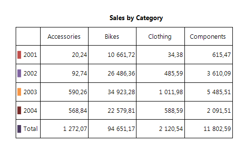
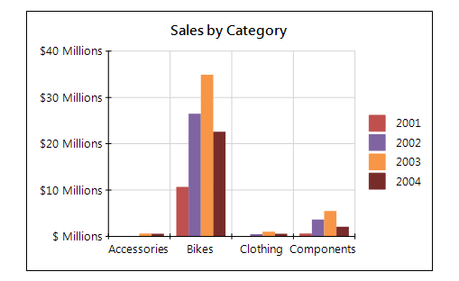

# Connecting to Data

The Graph is a data report item and, similarly to the [Table]() item, allows you to summarize data by the __CategoryGroups__ and __SeriesGroups__ hierarchical dimensions. 

Depending on its series type, the Graph enables you to display one or more measures. Like the other data-based report items, the Graph connects to a single data source and provides additional options for sorting and filtering the input data, binding, conditional formatting, and so on.

## Graph vs. Table 

The following images visually compare the data representation offered by the Graph and Table report items: 

    

  

Conceptually, both report items use the same multidimensional data model:

* The __ColumnGroups__ in the __Table__ are identical to the __CategoryGroups__ of the __Graph__.

* The __RowGroups__ in the __Table__ are identical to the __SeriesGroups__ of the __Graph__.

* The __Cells__ in the body of the __Table__ definition are identical to the __Series__ definitions of the __Graph__.

## Category Group Hierarchy

The **CategoryGroups** hierarchy defines the data points in the Graph series. For example, if you have a group by product categories in the **CategoryGroups** hierarchy, the number of the different categories will determine how many data points the series will have at runtime. If the product categories consist of **Accessories**, **Bikes**, **Components**, and **Clothing** categories, the series in the Graph will have four data points. 

## Series Group Hierarchy

The **SeriesGroups** hierarchy defines the series at runtime. For example, if you have a group by the **Year** field in the **SeriesGroups** hierarchy, the number of the different years will determine how many series will appear on the Graph. If the **Year** field contains the years **2001**, **2002**, **2003**, and **2004**, the Graph will display four series for every series definition that is bound to this group. 

## Series Data

The Graph series display aggregated data to visualize one or more measures. At runtime, the intersection between the **SeriesGroups** and the **CategoryGroups** hierarchy members defines the data points in the series. For each data point, one or more aggregate functions are calculated to define the value or coordinates of the data points. 

Depending on the series type, the Graph can visualize one or more measures:

* The __Bar__ and __Area__ series, including all derived subtypes, such as Pie, Doughnut, Bar, Column, and so on, represent single measures.

* The **Range** series, such as the Range Bar and Range Area, emphasize the distance between two values or measures.

* The __Line__ series including all derived subtypes, such as Scatter, show the correlation between three different measures.
