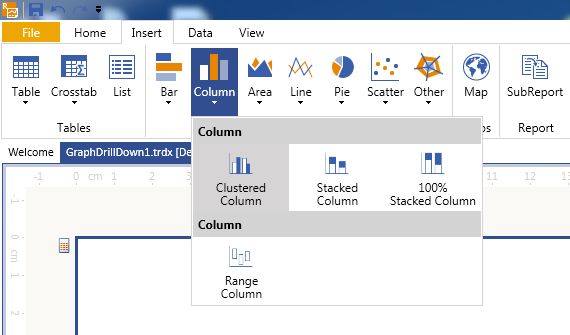
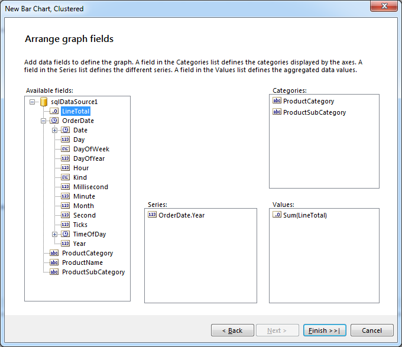

# How to add Drilldown action to the Graph item

In this article we will show you how to create a [Column chart]() and add [drill-down capabilities]() on its category groups using the [Graph](/reporting/api/Telerik.Reporting.Graph) item and the [AdventureWorks](http://msftdbprodsamples.codeplex.com/releases/view/55330) sample database. The chart will display the amount of sales by product categories per year, and the attached drill-down actions will give you a more detailed view over the sales, showing the subcategories for the selected product category. 

You can use a report designer of your choice - the described approach is valid for both [Standalone Telerik Report Designer]() and [Integrated Visual Studio Report Designer](). 

## How to: Add a drill-down action to the Graph Item

1. Start the report designer and create a new report: 

   + In Standalone Report Designer: *File - New - Blank Report;* 

   + In Visual Studio Report Designer: *File - New Project - Telerik Report Library [VERSION] - Blank Report*. 

1. Add a new [SqlDataSource component]() by double-clicking on the SqlDataSource item in the VS Toolbox for VS Report Designer, or on the SqlDataSource in the __Data tab__ of the Stabndalone Report Designer. This should start the [SqlDataSource Wizard](). 

1. On the “*Choose Data Connection* ” page, you need to either select an existing connection to the __AdventureWorks__ database, or create a new one by specifying the SqlClient Data Provider and a valid connection string to an AdventureWorks database. On the "*Data Connection options* " page, the newly created connection string can be saved by name in the current project's CONFIG file or it can be embedded with all details in the __SqlDataSource.ConnectionString property__  On the "*Configure Data Source Command* " page, paste the following SQL query in the “*Select Statement* ” window: 
    
    ````sql
SELECT
	PC.Name AS ProductCategory
	, PS.Name AS ProductSubCategory
	, P.Name AS ProductName
	, SOD.LineTotal
	, SOH.OrderDate
	FROM
	Production.Product AS P
	INNER JOIN Production.ProductSubcategory AS PS
	INNER JOIN Production.ProductCategory AS PC
	ON PS.ProductCategoryID = PC.ProductCategoryID
	ON P.ProductSubcategoryID = PS.ProductSubcategoryID
	INNER JOIN Sales.SalesOrderDetail AS SOD
	ON P.ProductID = SOD.ProductID
	INNER JOIN Sales.SalesOrderHeader AS SOH
	ON SOD.SalesOrderID = SOH.SalesOrderID
````


    Click Next, and then on __Execute Query...__ button to make sure that everything is fine with your data connection and data is fetched from the database. Click __Finish__ when you are ready. This will close the __SqlDataSource Wizard__. 

1. Select the report in the Report Designer and increase its Width to 11in. Open the report's [PageSettings properties]() and set: 

   + Landscape to True

   + Margins (Top, Right, Bottom, Left) to 0(zero) units.
     The purpose is to provide more space for content in the desined report.

1. Now that the data source is configured, you should set up the __Graph__ item: 

   + If you are using [Visual Studio Report Designer](), from the VS Toolbox drag and drop the __Graph Wizard__ icon to the Detail section of your report, and select __Column -> Clustered Column__ from the first page. 

   + In case you are using the [Standalone Telerik Report Designer](), select the report’s Detail section, and click on __Charts - Column - Clustered Column__ from the __Insert__ tab: 

   
     
   This will bring up the __Graph Wizard__ which will do the rest of the work for you.

1. Select the data source you’ve created in __step 3__ and click __Next__. On the “*Arrange graph fields* ” page, drag the __ProductCategory__ and __ProductSubCategory__ fields consecutively to the “*Categories* ” box. The wizard will determine the master-detail relations between them and will create automatically the toggle visibility actions. To display the sales amount by year, expand the __OrderDate__ field and drag its __Year__ field to the “*Series* ” box. At last, drag the __LineTotal__ field to the *Values* box, where it will be displayed as __Sum(LineTotal)__, as the __Sum()__ is the default aggregate function. Now the “*Arrange graph fields* ” page should look like the one shown below: 

  

1. Your chart is done. When you click __Finish__, you will see the graph displaying the product categories grouped by year. You can increase the Graph item in Width for better preview. When you click on __Preview__, you will see that every category has a small toggle mark that shows its subcategories when clicked, as shown below: 

  

1. To see what the __Graph Wizard__ has done, you can examine the Graph’s [CategoryGroups](/reporting/api/Telerik.Reporting.Graph#Telerik_Reporting_Graph_CategoryGroups). You will notice that the Graph wizard created one __CategoryGroup__ instance for the product categories and has added a child group to it for the product subcategories - __CategoryGroups -> ChildGroups__. The wizard has also created a [ToggleVisibilityAction](/reporting/api/Telerik.Reporting.ToggleVisibilityAction) and set its  [Targets](/reporting/api/Telerik.Reporting.ToggleVisibilityAction#Telerik_Reporting_ToggleVisibilityAction_Targets) to the __ProductSubCategoryGroup__, providing the ability to show or hide this group by clicking its parent’s toggle mark. Initially the __ProductSubCategoryGroup.Visible property__ is set to false to provide more compact view. The expanded view of the Graph’s __CategoryGroups__ should look like this: 

  


## See Also 

* [Graph Structure]()

* [Drilldown Report Action]()

* [Graph Item Actions]()

* [Graph](/reporting/api/Telerik.Reporting.Graph)
