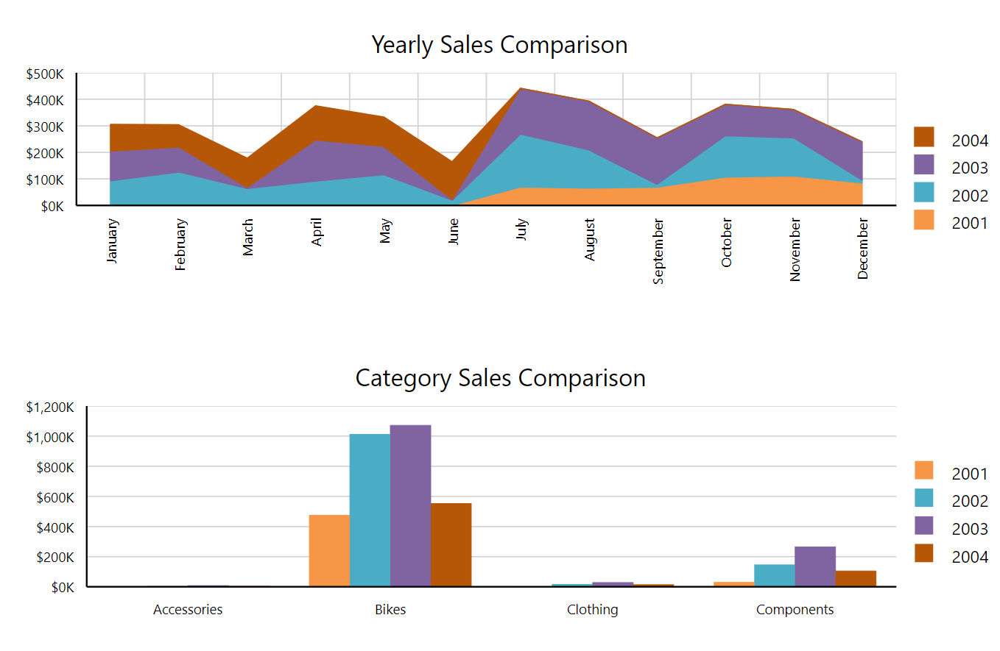

# Overview of the Graph Report Item

The Graph report item is a native Telerik Reporting item that allows you to generate different [Chart types (objects)]() and visually present large volumes of aggregated information.

The Graph is most often used for building powerful OLAP and Pivot charts and provides powerful mechanisms for using expressions for data points, conditional formatting, and styling options, including interactivity. A chart produced by the Graph report item can have multiple and different chart series and coordinate systems.

>* As of Telerik Reporting Q1 2013, the Graph has superseded the Chart report item being the more advanced of the two.
>* As of Telerik Reporting Q2 2013, the [Chart report item has been deprecated]() and is now obsolete.

||
|:--:|
|[Column Chart from the Employee Sales Online Demo](https://demos.telerik.com/reporting/employee-sales)|

## Key Features

* [Structure and elements]()&mdash; You can utilize all available elements the visual structure of the Graph report item supports.
* [Connecting to data]()&mdash; The Graph report item allows you to bind it to a single data object where you can control what data and in what way is visualized through the Telerik Reporting Expression engine.
* [Chart types]()&mdash; The Graph comes with rich design-time support, and enables you to create different charts and add a series of different chart types.
* [Styling and formatting]()&mdash; The Graph delivers extensive settings for configuring the rendering of its axes, gridlines, legends, and other elements.

## Next Steps

* [Getting Started with the Graph Report Item]()
* [Graph Structure and Elements]()
* [Graph Class API Reference](/api/telerik.reporting.graph)
* [Demo Page for Telerik Reporting](https://demos.telerik.com/reporting)
* [Knowledge Base Section](/knowledge-base)

## See Also

* [Telerik Reporting Homepage](https://www.telerik.com/products/reporting)
* [Reporting Forums](https://www.telerik.com/forums/reporting)
* [Reporting Blog](https://www.telerik.com/blogs/tag/reporting)
* [Reporting Videos](https://www.telerik.com/videos/reporting)
* [Reporting Roadmap](https://www.telerik.com/support/whats-new/reporting/roadmap)
* [Reporting Pricing](https://www.telerik.com/purchase/individual/reporting)
* [Reporting Training](https://learn.telerik.com/learn/course/external/view/elearning/19/reporting-report-server-training)
