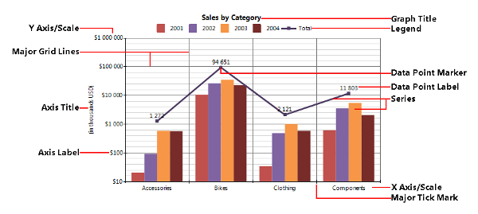
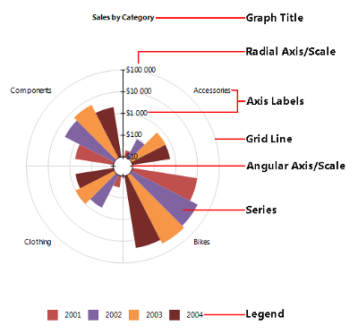

# Structure and Elements of the Graph

The Graph is a powerful and complex report item which displays a variety of elements to adequately display visual information as required.   

## Visual Structure

The following image displays combined Column and Line charts in a Graph item with a Cartesian coordinate system .

The following image shows a Rose (Bar) chart in a Graph item with a Polar coordinate system. 

## Coordinate Systems

The Graph item uses a two-dimensional [coordinate system](http://en.wikipedia.org/wiki/Coordinate_system) that uniquely identifies the position of each data point. Each coordinate system consists of two reference lines called "coordinate axes" (or just "axes") and an "origin". 

The Graph provides support for the Cartesian and Polar two-dimensional coordinate systems. Since there is a direct conversion between the two coordinate systems, they are interchangeable in the Graph report item. The coordinates of the data points in the Graph are represented by the `(x, y)` pair that for the Polar coordinate system is converted to `(ϴ, r)`, that is, `(x, y)` ⇔ `(ϴ, r)`.

The coordinate system also defines the default appearance and style of the two axes.

### Cartesian 

In a [Cartesian coordinate system](http://en.wikipedia.org/wiki/Cartesian_coordinate_system), each point is defined by an ordered pair of two coordinates which are the distances of the point to the two perpendicular axes.

The Cartesian coordinate system provides the following axes: 

+ __X axis__&mdash;The horizontal axis.
+ __Y axis__&mdash;The vertical axis. The data point in the Cartesian coordinate system is represented by an ordered pair of two coordinates (x, y).

### Polar 

A [Polar coordinate system](http://en.wikipedia.org/wiki/Polar_coordinate_system) is used where each point on a plane is determined by a distance from the origin (called the radial coordinate or radius) and an angle from a fixed direction (the angular coordinate, polar angle, or azimuth). 

The Polar coordinate system provides the following axes: 

+ __Angular axis__&mdash;The circular axis for the angular coordinate.
+ __Radial axis__&mdash;The axis for the radial coordinate. The data point in the Polar coordinate system is represented by an ordered pair of two coordinates (`r`, `ϴ`).

## Axes

The coordinate axis represents a single dimension of the coordinate system.

An axis consists of the following elements:

* __Scale__&mdash;Defines how the data is projected on the axis.
* __Tick marks__&mdash;Major and minor, represent the periodic graduations.
* __Labels__&mdash;The numerical or categorical indications accompanying the tick marks.
* __Title__&mdash;The title of the axis, usually a brief description of the dimension.
* __Grid lines__&mdash;Within the Graph, a grid of lines may appear to aid the visual alignment of data. You can enhance the grid by visually emphasizing the lines at regular or significant graduations. The emphasized lines are then called major grid lines and the remainder are minor grid lines.

## Scales

Scales define how the data is projected on the corresponding axis, that is, how the data from the user domain is converted to coordinates. 

According to the type of the input data, the Graph supports the following scale types: 

* __NumericalScale__&mdash;Represents a scale with a continuous domain of numbers, such as, integer numbers (Int16, Int32, Int64) or floating point numbers (Single, Double), and so on.
* __LogarithmicScale__&mdash;A numerical scale that applies a logarithmic transformation with a given base to the input data.
* __DateTimeScale__&mdash;Represents a scale with a continuous domain of DateTime values.
* __CategoryScale__&mdash;Represents an ordinal scale with a discrete domain such as names and categories.

## Series

A series represents a series of data points that represents individual measurements. 

The Graph item supports the following series types:

* [Bar](http://en.wikipedia.org/wiki/Bar_chart)&mdash;Displays data points as bars to show comparisons between categories. One axis of the chart shows the specific categories being compared, and the other axis represents a discrete value. 

  You can arrange the Bar series in different ways to emphasize various aspects of the data:

   + __Clustered Bar Graphs__&mdash;Bars are clustered in groups two or more series.
   + __Stacked, Stacked 100% Bar Graphs__&mdash;Show the bars divided into subparts to display a cumulative effect. 
   
   In a Cartesian coordinate system the bars have a rectangular shape and can be horizontal (Bar chart) or vertical (sometime called Column chart). 
   
   In a Polar coordinate system the bars appears in a wedge shape. If the series are arranged on the radial axis, that is, the wedges start from the radial axis and goes by the angular axis, the result is a Pie chart. Otherwise, if the bars are arranged by the angular axis, the result is a Rose chart.

* [Line](http://en.wikipedia.org/wiki/Line_chart)&mdash;Displays a series of data points connected by straight or smooth line segments. Data points are represented by markers that can vary by shape (circle, square, diamond, cross, and so on) and can display a third variable or measure with its size (also known as Bubble charts). 

  When a Line series is projected on a Polar coordinate system, the result is also known as a Radar or Spider Line chart. Line series may be stacked to show a cumulative effect (stacked or stacked 100%).

* [Area](http://en.wikipedia.org/wiki/Area_chart)&mdash;Similar to the Line series. Area series display series of data points connected by straight or smooth line segments too but the area below the line is colored to indicate the volume. 

  When an Area series is projected on a Polar coordinate system, the result is also known as a Radar or Spider Area chart. Area series may be stacked to show a cumulative effect (stacked or stacked 100%).

* __Range Bar__&mdash;Similar to the Bar series. However, the bars do not start from the axis but at a given value. The Range Bar emphasizes the distance between two values or measures.

* __Range Area__&mdash;Similar to the Area series. However, the bottom point does not start from the axis but at a given value. The Range Area emphasizes the distance between two values/measures.

## Legend

When the data appearing in a chart contains multiple variables, the chart may include a legend. The legend contains a list of the displayed chart variables and an example of their appearance. Legend content allows the user to identify the data from each variable in the Graph.

## Title

The Graph report item can have one or more titles that provide a brief description of what the displayed data refers to.
