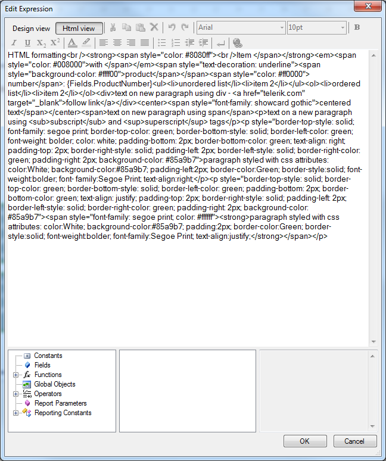

# Editing

The HtmlTextBox supports data-driven in-line fields, which are editable either in-place or through a design-time editor, which is available in Visual Studio and the Standalone Report Designer. 

The in-place editor for the HtmlTextBox report item allows you to quickly enter text directly into the designer rather than having to look for a property in the property grid. To activate the in-place editor, double-click the HtmlTextBox or select it and press F2. Once the in-place editor is activated: 

* Enter accepts all changes.

* Esc discards all changes.

* Moving focus away from the HtmlTextBox also accepts all changes. 

The screenshot below shows an HtmlTextBox with the in-place editor active. 

  

The design time editor supports two modes:

1. Interactive (__Design view__) - you can select a portion of the text and make it bold, change its font, size, color, etc. using appropriate controls like comboboxes and buttons (WYSIWYG editor). Internally, the designer generates a valid HTML source and stores it in the Value property of the item. Adding embedded expressions is possible, but the entire HTML value cannot be an expression. You can switch to __HTML view__ at any time if needed. 

   >Pressing the Enter key inserts a new paragraph or new list item depending on the current context. Note that it does NOT insert ` ` (new line). To insert new line, use the button on the toolbar) 

  

1. Expression (__Html view__) - the user enters raw HTML tags and text into the source editor. The value can be an expression or text containing embedded expressions. The user can switch to __Design view__ unless the value is an expression. 

  

> MultiLine and TextWrap concepts are always true for HtmlTextBox. The __subscript__ and __superscript__ tags can be nested (i.e. `subscript1subscript2`), resulting in gradually smaller font sizes and offsets. However, the corresponding toolbar buttons only toggles the __subscript__ or __superscript__ feature, so if nested tags are needed, the appropriate code should be added manually using the editor's __Html view__. 

