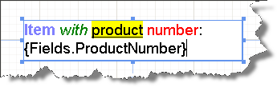
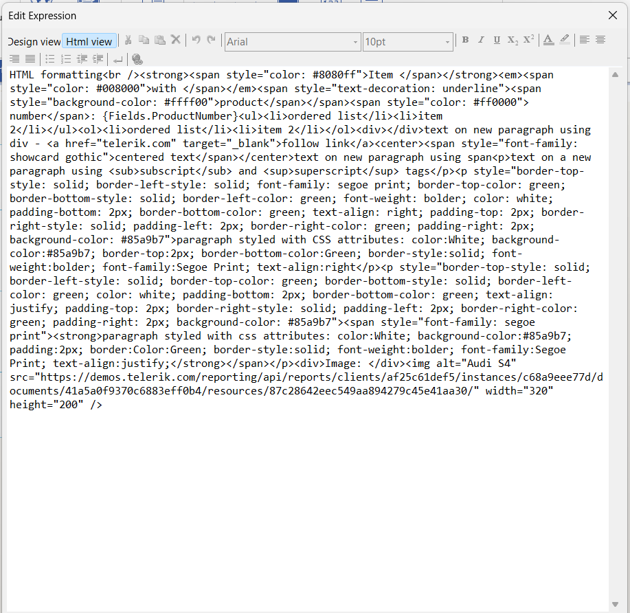

# Editing in HtmlTextBox

The HtmlTextBox supports data-driven inline fields that are editable in-place or through a design-time editor.

## Using the In-Place Editor

The in-place editor for the HtmlTextBox report item allows you to quickly enter text directly into the designer instead of looking for a property in the **Property** grid.

To activate the in-place editor: 

1. Double-click the HtmlTextBox, or select the report item and press `F2`. As a result, the in-place editor is activated.
1. To accept all changes, press `Enter` or move the focus from the HtmlTextBox.
1. To discard all changes, press `Esc`.

The screenshot below shows an HtmlTextBox with its in-place editor activated.

## Using the Design-Time Editor

The design-time editor is available in the Telerik Reporting Visual Studio and Standalone Report Designers and supports the following modes of operation:

* Interactive (__Design view__)&mdash;Allows you to select a portion of the text and make it bold, change its font, size, color, and so on by using the appropriate controls such as combo-boxes and buttons (WYSIWYG editor). 

	Internally, the Report Designer generates a valid HTML source and stores it in the `Value` property of the item. Adding embedded expressions is possible, but the entire HTML value cannot be an expression. You can switch to the __HTML view__ anytime if needed.

	Pressing the `Enter` key inserts a new paragraph or a new list item depending on the current context. Note that it does not insert a ` ` (new line) element. To insert a new line, use the button on the toolbar.

	

* Expression (__Html view__)&mdash;Enables the user to enter raw HTML tags and text into the source editor. The value can be an expression or text, which contains embedded expressions. The user can switch to the __Design view__ anytime unless the value is an expression.

	The `MultiLine` and `TextWrap` concepts are always true for the HtmlTextBox. You can nest the subscript and superscript tags, for example `subscript1subscript2`, which will result in gradually smaller font sizes and offsets. However, the corresponding toolbar buttons only toggle the subscript or superscript feature and if you need nested tags, you need to manually add the appropriate code by using the __Html view__ of the editor.
	>tip Starting with the 2026 Q1 release, you can embed images in the HTML content using the `` tag. Use the __Html view__ to add image tags with `src`, `width`, `height`, `alt` attributes, and CSS styling. For more information, see [Image Support](#image-support).
	

## See Also

* [HtmlTextBox Class API Reference](/api/telerik.reporting.htmltextbox)
* [Demo Page for Telerik Reporting](https://demos.telerik.com/reporting)
* [Knowledge Base Section](/knowledge-base)
