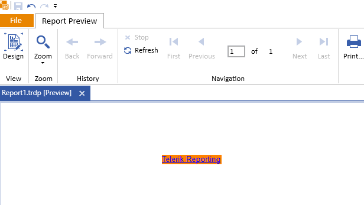
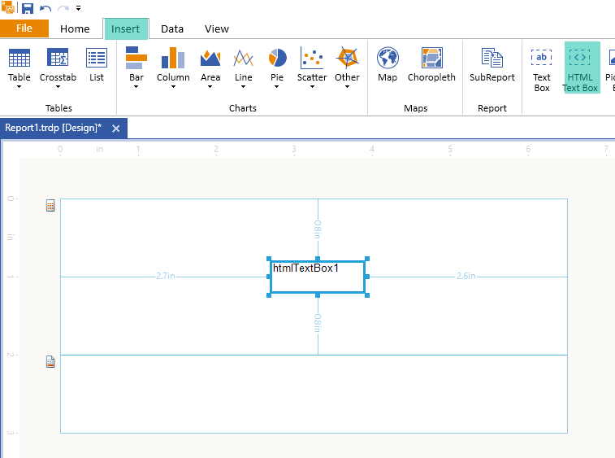
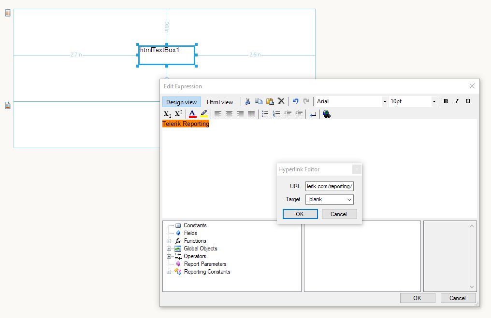

# Getting Started with the HtmlTextBox

This guide shows how to create and use the Telerik Reporting HtmlTextBox report item in reports with the [Standalone Report Designer]().

- First, you will add an HtmlTextBox item in an empty Report created with the Standalone Designer.
- Then, you will fill the HtmlTextBox with some styled content.

After the completion of this guide, you will also be able to configure the HtmlTextBox in the Standalone Designer and achieve the following result:



## Adding the HtmlTextBox

1. Select the [Report Section](#report-sections) where you want to add the HtmlTextBox. For the purposes of this guide, you will choose the `Detail` section.

1. From the **Designer** menu, select the `Insert` tab. As a result, the available items will be displayed in the toolbar below the main menu.

1. Click the **HTML Text Box** item to add it in the middle of the Report section you selected in the first step.

The following image shows the result:



## Adding Some Styled Content

The HtmlTextBox you have just created contains the default text that is the item name. When this HtmTextBox is the first HtmlTextBox you add to your report, its default value will be **htmlTextBox1**.

Now, you'll add some styled content to your HtmlTextBox report item:

1. Change the HtmlTextBox content by either of the following ways:

   - Go to the property `Value` of the item in the **Properties** pane and click the ellipses.

   - Right-click the item and select `Expression...` form the popped-up context menu.

   As a result, the **Edit Expression** dialog of the HtmTextBox will open in the **Design** view.

1. In the **Design** view of the editor, type **Telerik Reporting**.

1. Select the text and use the background color button from the toolbox to set an orange background.

1. Use the last button from the toolbar of the editor to add a link to the Telerik Reporting online demos. As a result, a **Hyperlink Editor** will open and you can now type **https://demos.telerik.com/reporting/** as a **URL**, and select **\_blank** as **Target** to open the web page on a new browser tab like shown in the following image:

   

1. Switch to the **Html** view of the editor to see the generated HTML code. The code will look like he following:

   ```HTML
   <span style="background-color: #ff8000"><a href="https://demos.telerik.com/reporting/">Telerik Reporting</a></span>
   ```

1. Click **OK** to close the HtmlTextBox editor dialog.

1. Preview the report and test the link by clicking the **Telerik Reporting** orange text.

## Next Steps

- [HtmlTextBox Class API Reference](/api/telerik.reporting.htmltextbox)
- [Demo Page for Telerik Reporting](https://demos.telerik.com/reporting)
- [Knowledge Base Section](/knowledge-base)

## See Also

- [Editing]()
- [Styling and Formatting]()
- [Embedded Expressions]()
- [Known Limitations]()
