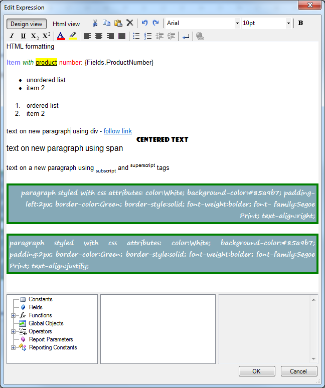

# HtmlTextBox Overview

The HtmlTextBox report item enables you to insert HTML-formatted text into a report.

You can specify the HTML value at design time either through a WYSIWYG editor or through an expression editor, or retrieve it from a data source by using any simple or complex expression that evaluates to correctly formatted HTML.

|Design View of the HtmlTextBox Editor|
|:---:|
||

## Key Features

* [XHTML validation]()&mdash;The HtmlTextBox allows you to validate its defined content as valid XHTML.
* [Formatting with the Telerik AJAX Editor]()&mdash;You can filter the HTML tags or CSS attributes that are not supported by the HtmlTextBox by using the Telerik UI for ASP.NET AJAX Editor.
* [Editing]()&mdash;The HtmlTextBox supports data-driven inline fields which you can edit in place or through a design-time editor.
* [Styling and formatting]()&mdash;The HtmlTextBox enables you to control the presentation style of its text through the supported CSS attributes and HTML tags.
* [Growing and shrinking]()&mdash;You can accommodate the content of the HtmlTextBox by allowing it to grow or shrink correspondingly.
* [Embedded expressions]()&mdash;With the HtmlTextBox, you can create a mail-merge functionality or a template for the text in your report.

## Next Steps

* [Getting Started with the HtmlTextBox Report Item]()
* [(KB) Anchor Tags vs. Hyperlink Actions in the HtmlTextBox]()
* [(KB) Error while Parsing EntityName]()
* [(w3.org) Full List of Special Entities](https://www.w3.org/TR/xhtml1/DTD/xhtml-special.ent)
* [Demo Page for Telerik Reporting](https://demos.telerik.com/reporting) 
* [Knowledge Base Section](/knowledge-base)

## See Also

* [Telerik Reporting Homepage](https://www.telerik.com/products/reporting)
* [Reporting Forums](https://www.telerik.com/forums/reporting)
* [Reporting Blog](https://www.telerik.com/blogs/tag/reporting)
* [Reporting Videos](https://www.telerik.com/videos/reporting)
* [Reporting Roadmap](https://www.telerik.com/support/whats-new/reporting/roadmap)
* [Reporting Pricing](https://www.telerik.com/purchase/individual/reporting)
* [Reporting Training](https://learn.telerik.com/learn/course/external/view/elearning/19/reporting-report-server-training)
